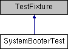

do not remove this div, it is closed by doxygen! 
|  |
| --- |
| NSCL DDAS1.0Support for XIA DDAS at the NSCL |

 end header part 
 Generated by Doxygen 1.8.8 

- [[Main Page|https://github.com/FRIBDAQ/docs/tree/main/ddas-1.1/index.md]]
- [[Related Pages|https://github.com/FRIBDAQ/docs/tree/main/ddas-1.1/pages.md]]
- [[Namespaces|https://github.com/FRIBDAQ/docs/tree/main/ddas-1.1/namespaces.md]]
- [[Classes|https://github.com/FRIBDAQ/docs/tree/main/ddas-1.1/annotated.md]]
- [[Files|https://github.com/FRIBDAQ/docs/tree/main/ddas-1.1/files.md]]
- 
  [[|https://github.com/FRIBDAQ/docs/tree/main/ddas-1.1/javascript:searchBox.CloseResultsWindow().md]]

- [[Class List|https://github.com/FRIBDAQ/docs/tree/main/ddas-1.1/annotated.md]]
- [[Class Index|https://github.com/FRIBDAQ/docs/tree/main/ddas-1.1/classes.md]]
- [[Class Hierarchy|https://github.com/FRIBDAQ/docs/tree/main/ddas-1.1/hierarchy.md]]
- [[Class Members|https://github.com/FRIBDAQ/docs/tree/main/ddas-1.1/functions.md]]

 window showing the filter options 
[[All|https://github.com/FRIBDAQ/docs/tree/main/ddas-1.1/javascript:void(0).md]][[Classes|https://github.com/FRIBDAQ/docs/tree/main/ddas-1.1/javascript:void(0).md]][[Namespaces|https://github.com/FRIBDAQ/docs/tree/main/ddas-1.1/javascript:void(0).md]][[Files|https://github.com/FRIBDAQ/docs/tree/main/ddas-1.1/javascript:void(0).md]][[Functions|https://github.com/FRIBDAQ/docs/tree/main/ddas-1.1/javascript:void(0).md]][[Variables|https://github.com/FRIBDAQ/docs/tree/main/ddas-1.1/javascript:void(0).md]][[Macros|https://github.com/FRIBDAQ/docs/tree/main/ddas-1.1/javascript:void(0).md]][[Pages|https://github.com/FRIBDAQ/docs/tree/main/ddas-1.1/javascript:void(0).md]]

 iframe showing the search results (closed by default)

 top 
[Public Member Functions](#pub-methods) |
[Public Attributes](#pub-attribs) |
[[List of all members|https://github.com/FRIBDAQ/docs/tree/main/ddas-1.1/classSystemBooterTest-members.md]]

SystemBooterTest Class Reference

header
Tests for the ModEvtFileParser class.  
 [[More...|https://github.com/FRIBDAQ/docs/tree/main/ddas-1.1/classSystemBooterTest.md#details]]

Inheritance diagram for SystemBooterTest:

|  |  |
| --- | --- |
| Public Member Functions |
|  | CPPUNIT_TEST_SUITE(SystemBooterTest) |
|  |
|  | CPPUNIT_TEST(boot_0) |
|  |
|  | CPPUNIT_TEST(boot_1) |
|  |
|  | CPPUNIT_TEST(boot_2) |
|  |
|  | CPPUNIT_TEST(boot_3) |
|  |
|  | CPPUNIT_TEST(boot_4) |
|  |
|  | CPPUNIT_TEST(boot_5) |
|  |
|  | CPPUNIT_TEST(boot_6) |
|  |
|  | CPPUNIT_TEST(boot_7) |
|  |
|  | CPPUNIT_TEST_SUITE_END() |
|  |
| void | setUpConfiguration() |
|  |
| void | setUp() |
|  |
| void | tearDown() |
|  |
| void | boot_0() |
|  |
| void | boot_1() |
|  |
| void | boot_2() |
|  |
| void | boot_3() |
|  |
| void | boot_4() |
|  |
| void | boot_5() |
|  |
| void | boot_6() |
|  |
| void | boot_7() |
|  |

|  |  |
| --- | --- |
| Public Attributes |
| Configuration | m_config |
|  |
| std::vector< std::string > | m_activityLog |
|  |

## Detailed Description

Tests for the ModEvtFileParser class.

---

The documentation for this class was generated from the following file:- booter/SystemBooterTest.cpp

 contents 
 start footer part 

---

Generated on Tue Mar 31 2020 13:10:45 for NSCL DDAS by   1.8.8
