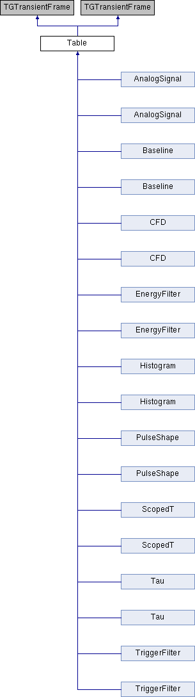

do not remove this div, it is closed by doxygen! 
|  |
| --- |
| NSCL DDAS1.0Support for XIA DDAS at the NSCL |

 end header part 
 Generated by Doxygen 1.8.8 

- [[Main Page|index]]
- [[Related Pages|pages]]
- [[Namespaces|namespaces]]
- [[Classes|annotated]]
- [[Files|files]]
- 
  [[|javascript:searchBox.CloseResultsWindow()]]

- [[Class List|annotated]]
- [[Class Index|classes]]
- [[Class Hierarchy|hierarchy]]
- [[Class Members|functions]]

 window showing the filter options 
[[All|javascript:void(0)]][[Classes|javascript:void(0)]][[Namespaces|javascript:void(0)]][[Files|javascript:void(0)]][[Functions|javascript:void(0)]][[Variables|javascript:void(0)]][[Macros|javascript:void(0)]][[Pages|javascript:void(0)]]

 iframe showing the search results (closed by default)

 top 
[Public Types](#pub-types) |
[Public Member Functions](#pub-methods) |
[Public Attributes](#pub-attribs) |
[[List of all members|classTable-members]]

Table Class Reference

header
Inheritance diagram for Table:

|  |  |
| --- | --- |
| Public Types |
| enum | Commands{LOAD,APPLY,CANCEL,MODNUMBER,FILTER,COPYBUTTON,LOAD,APPLY,CANCEL,MODNUMBER,FILTER,COPYBUTTON} |
|  |
| enum | Commands{LOAD,APPLY,CANCEL,MODNUMBER,FILTER,COPYBUTTON,LOAD,APPLY,CANCEL,MODNUMBER,FILTER,COPYBUTTON} |
|  |

|  |  |
| --- | --- |
| Public Member Functions |
|  | Table(const TGWindow *p, const TGWindow *main, int columns, int rows, string name, int NumModules=13) |
|  |
| virtual int | LoadInfo(Long_t mod, TGNumberEntryField ***NumEntry, int column, char *parameter) |
|  |
|  | Table(const TGWindow *p, const TGWindow *main, int columns, int rows, string name, int NumModules=13) |
|  |
| virtual int | LoadInfo(Long_t mod, TGNumberEntryField ***NumEntry, int column, char *parameter) |
|  |

|  |  |
| --- | --- |
| Public Attributes |
| TGVerticalFrame * | mn_vert |
|  |
| TGHorizontalFrame * | mn |
|  |
| int | Rows |
|  |
| TGVerticalFrame ** | Column |
|  |
| TGTextEntry * | cl0 |
|  |
| TGTextEntry ** | CLabel |
|  |
| TGNumberEntryField *** | NumEntry |
|  |
| TGTextEntry ** | Labels |
|  |
| int | numModules |
|  |
| TGNumberEntry * | numericMod |
|  |
| TGHorizontalFrame * | Buttons |
|  |

---

The documentation for this class was generated from the following files:- nscope/[[Table.h|Table_8h_source]]
- nscope/Table.cpp

 contents 
 start footer part 

---

Generated on Tue Mar 31 2020 13:10:45 for NSCL DDAS by   1.8.8
