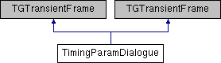

do not remove this div, it is closed by doxygen! 
|  |
| --- |
| NSCL DDAS1.0Support for XIA DDAS at the NSCL |

 end header part 
 Generated by Doxygen 1.8.8 

- [[index]]
- [[pages]]
- [[namespaces]]
- [[annotated]]
- [[files]]
- 
  [[javascript:searchBox.CloseResultsWindow()]]

- [[annotated]]
- [[classes]]
- [[hierarchy]]
- [[functions]]

 window showing the filter options 
[[javascript:void(0)]][[javascript:void(0)]][[javascript:void(0)]][[javascript:void(0)]][[javascript:void(0)]][[javascript:void(0)]][[javascript:void(0)]][[javascript:void(0)]]

 iframe showing the search results (closed by default)

 top 
[Public Member Functions](#pub-methods) |
[Public Attributes](#pub-attribs) |
[Protected Member Functions](#pro-methods) |
[[classTimingParamDialogue-members]]

TimingParamDialogue Class Reference

header
Inheritance diagram for TimingParamDialogue:

|  |  |
| --- | --- |
| Public Member Functions |
|  | TimingParamDialogue(const TGWindow *p, const TGWindow *main, int NumModules=13) |
|  |
| Bool_t | ProcessMessage(Long_t msg, Long_t parm1, Long_t parm2) |
|  |
| int | change_values(Long_t mod) |
|  |
| int | load_info(Long_t mod) |
|  |
| void | SetModuleNumber(int moduleNr) |
|  |
| void | UpdateChanCoincWidthColumn() |
|  |
|  | TimingParamDialogue(const TGWindow *p, const TGWindow *main, int NumModules=13) |
|  |
| Bool_t | ProcessMessage(Long_t msg, Long_t parm1, Long_t parm2) |
|  |
| int | change_values(Long_t mod) |
|  |
| int | load_info(Long_t mod) |
|  |
| void | SetModuleNumber(int moduleNr) |
|  |
| void | UpdateChanCoincWidthColumn() |
|  |

|  |  |
| --- | --- |
| Public Attributes |
| short int | chanNumber |
|  |
| short int | modNumber |
|  |
| TGNumberEntry * | chanCopy |
|  |
| bool | Load_Once |
|  |
| char | tmp[10] |
|  |
| float | tdelay |
|  |
| float | twidth |
|  |

|  |  |
| --- | --- |
| Protected Member Functions |
| void | MakeTable(TGFrame *parent, int columns, int rows, int NumModules) |
|  |
| void | DoCopy() |
|  |
| void | MakeTable(TGFrame *parent, int columns, int rows, int NumModules) |
|  |
| void | DoCopy() |
|  |

## Member Function Documentation

|  |  |  |  |
| --- | --- | --- | --- |
| Bool_t TimingParamDialogue::ProcessMessage | ( | Long_t | msg, |
|  |  | Long_t | parm1, |
|  |  | Long_t | parm2 |
|  | ) |  |  |

Cancel Button

---

The documentation for this class was generated from the following files:- nscope/[[TimingParamDialogue_8h_source]]
- nscope/TimingParamDialogue.cpp

 contents 
 start footer part 

---

Generated on Tue Mar 31 2020 13:10:45 for NSCL DDAS by   1.8.8
