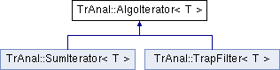

do not remove this div, it is closed by doxygen! 
|  |
| --- |
| NSCL DDAS1.0Support for XIA DDAS at the NSCL |

 end header part 
 Generated by Doxygen 1.8.8 

- [[Main Page|https://github.com/FRIBDAQ/docs/tree/main/ddas-1.1/index.md]]
- [[Related Pages|https://github.com/FRIBDAQ/docs/tree/main/ddas-1.1/pages.md]]
- [[Namespaces|https://github.com/FRIBDAQ/docs/tree/main/ddas-1.1/namespaces.md]]
- [[Classes|https://github.com/FRIBDAQ/docs/tree/main/ddas-1.1/annotated.md]]
- [[Files|https://github.com/FRIBDAQ/docs/tree/main/ddas-1.1/files.md]]
- 
  [[|https://github.com/FRIBDAQ/docs/tree/main/ddas-1.1/javascript:searchBox.CloseResultsWindow().md]]

- [[Class List|https://github.com/FRIBDAQ/docs/tree/main/ddas-1.1/annotated.md]]
- [[Class Index|https://github.com/FRIBDAQ/docs/tree/main/ddas-1.1/classes.md]]
- [[Class Hierarchy|https://github.com/FRIBDAQ/docs/tree/main/ddas-1.1/hierarchy.md]]
- [[Class Members|https://github.com/FRIBDAQ/docs/tree/main/ddas-1.1/functions.md]]

 window showing the filter options 
[[All|https://github.com/FRIBDAQ/docs/tree/main/ddas-1.1/javascript:void(0).md]][[Classes|https://github.com/FRIBDAQ/docs/tree/main/ddas-1.1/javascript:void(0).md]][[Namespaces|https://github.com/FRIBDAQ/docs/tree/main/ddas-1.1/javascript:void(0).md]][[Files|https://github.com/FRIBDAQ/docs/tree/main/ddas-1.1/javascript:void(0).md]][[Functions|https://github.com/FRIBDAQ/docs/tree/main/ddas-1.1/javascript:void(0).md]][[Variables|https://github.com/FRIBDAQ/docs/tree/main/ddas-1.1/javascript:void(0).md]][[Macros|https://github.com/FRIBDAQ/docs/tree/main/ddas-1.1/javascript:void(0).md]][[Pages|https://github.com/FRIBDAQ/docs/tree/main/ddas-1.1/javascript:void(0).md]]

 iframe showing the search results (closed by default) 

- **TrAnal**
- [[AlgoIterator|https://github.com/FRIBDAQ/docs/tree/main/ddas-1.1/classTrAnal_1_1AlgoIterator.md]]

 top 
[Public Member Functions](#pub-methods) |
[[List of all members|https://github.com/FRIBDAQ/docs/tree/main/ddas-1.1/classTrAnal_1_1AlgoIterator-members.md]]

TrAnal::AlgoIterator< T > Class Template Reference

header
Abstract [[AlgoIterator|https://github.com/FRIBDAQ/docs/tree/main/ddas-1.1/classTrAnal_1_1AlgoIterator.md]] base class.  
 [[More...|https://github.com/FRIBDAQ/docs/tree/main/ddas-1.1/classTrAnal_1_1AlgoIterator.md#details]]

`#include <AlgoIterator.hpp>`

Inheritance diagram for TrAnal::AlgoIterator< T >:

|  |  |
| --- | --- |
| Public Member Functions |
|  | AlgoIterator() |
|  | Default constructor. |
|  |
|  | AlgoIterator(constAlgoIterator&) |
|  | Copy constructor. |
|  |
| AlgoIterator& | operator=(constAlgoIterator&) |
|  | Assignment operator. |
|  |
| virtual bool | operator<(constTrIterator< T > &) const |
|  |
| virtualTrIterator< T > | min_extent() const |
|  | Min extent To implement the minimum iterator extent for the range This default implementation returns an iterator to address 0x0.More... |
|  |
| virtualTrIterator< T > | max_extent() const |
|  | Max extent To implement the maximum iterator extent for the range This default implementation returns an iterator to address 0x0.More... |
|  |
| virtualAlgoIterator& | operator++() |
|  | Prefixed incrementation Supports ++x style incrementing. Default implementation does nothing.More... |
|  |
| virtual double | operator*() const |
|  | Dereference operator.More... |
|  |

## Detailed Description

### template<class T>  

class TrAnal::AlgoIterator< T >

Abstract [[AlgoIterator|https://github.com/FRIBDAQ/docs/tree/main/ddas-1.1/classTrAnal_1_1AlgoIterator.md]] base class.

## Member Function Documentation

template<class T >

|  |  |  |  |  |  |  |
| --- | --- | --- | --- | --- | --- | --- |
| virtualTrIterator<T>TrAnal::AlgoIterator< T >::max_extent()const | virtualTrIterator<T>TrAnal::AlgoIterator< T >::max_extent | ( |  | ) | const | inlinevirtual |
| virtualTrIterator<T>TrAnal::AlgoIterator< T >::max_extent | ( |  | ) | const |

Max extent To implement the maximum iterator extent for the range This default implementation returns an iterator to address 0x0.

- Returns
  null iterator

Reimplemented in [[TrAnal::TrapFilter< T >|https://github.com/FRIBDAQ/docs/tree/main/ddas-1.1/classTrAnal_1_1TrapFilter.md#a0793799d43dcbfe21a018c7907c4d768]], and [[TrAnal::SumIterator< T >|https://github.com/FRIBDAQ/docs/tree/main/ddas-1.1/classTrAnal_1_1SumIterator.md#aedd8e072efb0a0949c29321671a43df5]].

template<class T >

|  |  |  |  |  |  |  |
| --- | --- | --- | --- | --- | --- | --- |
| virtualTrIterator<T>TrAnal::AlgoIterator< T >::min_extent()const | virtualTrIterator<T>TrAnal::AlgoIterator< T >::min_extent | ( |  | ) | const | inlinevirtual |
| virtualTrIterator<T>TrAnal::AlgoIterator< T >::min_extent | ( |  | ) | const |

Min extent To implement the minimum iterator extent for the range This default implementation returns an iterator to address 0x0.

- Returns
  null iterator

Reimplemented in [[TrAnal::TrapFilter< T >|https://github.com/FRIBDAQ/docs/tree/main/ddas-1.1/classTrAnal_1_1TrapFilter.md#a69b62c45160b76b81be8f34df77a419a]], and [[TrAnal::SumIterator< T >|https://github.com/FRIBDAQ/docs/tree/main/ddas-1.1/classTrAnal_1_1SumIterator.md#a01b37497d641c474032dbb5cddfd37e6]].

template<class T >

|  |  |  |  |  |  |  |
| --- | --- | --- | --- | --- | --- | --- |
| virtual doubleTrAnal::AlgoIterator< T >::operator*()const | virtual doubleTrAnal::AlgoIterator< T >::operator* | ( |  | ) | const | inlinevirtual |
| virtual doubleTrAnal::AlgoIterator< T >::operator* | ( |  | ) | const |

Dereference operator.

Contrary to TrIterators, this returns a double value irrespective of the template parameter. This return 0 always.

- Returns
  null value (i.e. zero)

Reimplemented in [[TrAnal::TrapFilter< T >|https://github.com/FRIBDAQ/docs/tree/main/ddas-1.1/classTrAnal_1_1TrapFilter.md#a087177606d98f9a542f27f4bd8e3b7a3]], and [[TrAnal::SumIterator< T >|https://github.com/FRIBDAQ/docs/tree/main/ddas-1.1/classTrAnal_1_1SumIterator.md#a5eee4d61c56103f0a50a230a1c7e827a]].

template<class T >

|  |  |  |  |  |  |  |
| --- | --- | --- | --- | --- | --- | --- |
| virtualAlgoIterator&TrAnal::AlgoIterator< T >::operator++() | virtualAlgoIterator&TrAnal::AlgoIterator< T >::operator++ | ( |  | ) |  | inlinevirtual |
| virtualAlgoIterator&TrAnal::AlgoIterator< T >::operator++ | ( |  | ) |  |

Prefixed incrementation Supports ++x style incrementing. Default implementation does nothing.

- Returns
  const reference to this

Reimplemented in [[TrAnal::SumIterator< T >|https://github.com/FRIBDAQ/docs/tree/main/ddas-1.1/classTrAnal_1_1SumIterator.md#a7d757857a71ebfdbae597f45ff57570c]], and [[TrAnal::TrapFilter< T >|https://github.com/FRIBDAQ/docs/tree/main/ddas-1.1/classTrAnal_1_1TrapFilter.md#a5c86e816f1179fb9e5d3add9eba4d895]].

---

The documentation for this class was generated from the following file:- traiter/src/[[AlgoIterator.hpp|https://github.com/FRIBDAQ/docs/tree/main/ddas-1.1/AlgoIterator_8hpp_source.md]]

 contents 
 start footer part 

---

Generated on Tue Mar 31 2020 13:10:45 for NSCL DDAS by   1.8.8
