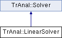

do not remove this div, it is closed by doxygen! 
|  |
| --- |
| NSCL DDAS1.0Support for XIA DDAS at the NSCL |

 end header part 
 Generated by Doxygen 1.8.8 

- [[index]]
- [[pages]]
- [[namespaces]]
- [[annotated]]
- [[files]]
- 
  [[javascript:searchBox.CloseResultsWindow()]]

- [[annotated]]
- [[classes]]
- [[hierarchy]]
- [[functions]]

 window showing the filter options 
[[javascript:void(0)]][[javascript:void(0)]][[javascript:void(0)]][[javascript:void(0)]][[javascript:void(0)]][[javascript:void(0)]][[javascript:void(0)]][[javascript:void(0)]]

 iframe showing the search results (closed by default) 

- **TrAnal**
- [[classTrAnal_1_1LinearSolver]]

 top 
[Public Member Functions](#pub-methods) |
[[classTrAnal_1_1LinearSolver-members]]

TrAnal::LinearSolver Class Reference

header
Root finder based on linear interpolation.  
 [[classTrAnal_1_1LinearSolver#details]]

`#include <Solver.h>`

Inheritance diagram for TrAnal::LinearSolver:

|  |  |
| --- | --- |
| Public Member Functions |
| virtual double | operator()(const std::deque< double > &que) const |
|  | Interpolates between two points linear to find a zero crossing.More... |
|  |
| virtual unsigned int | npoints() const |
|  | Number of points required for a unique solution. |
|  |

## Detailed Description

Root finder based on linear interpolation.

## Member Function Documentation

|  |  |  |  |  |  |  |  |
| --- | --- | --- | --- | --- | --- | --- | --- |
| double TrAnal::LinearSolver::operator()(const std::deque< double > &que)const | double TrAnal::LinearSolver::operator() | ( | const std::deque< double > & | que | ) | const | virtual |
| double TrAnal::LinearSolver::operator() | ( | const std::deque< double > & | que | ) | const |

Interpolates between two points linear to find a zero crossing.

Locates the distance of the zero crossing from the first element in the que. The return value is to be interpreted as a fractional index. For example, if the argument contained two values, que[0]=0.75, que[1]=-0.25. The algorithm will treat this as two points (0,0.75) and (1,-0.25) and find the "x" value of the zero crossing.

Implements [[classTrAnal_1_1Solver#ad9682a30aa200415d784c81747d11fd5]].

---

The documentation for this class was generated from the following files:- traiter/src/[[Solver_8h_source]]
- traiter/src/Solver.cpp

 contents 
 start footer part 

---

Generated on Tue Mar 31 2020 13:10:45 for NSCL DDAS by   1.8.8
