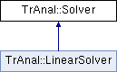

do not remove this div, it is closed by doxygen! 
|  |
| --- |
| NSCL DDAS1.0Support for XIA DDAS at the NSCL |

 end header part 
 Generated by Doxygen 1.8.8 

- [Main Page](https://github.com/FRIBDAQ/docs/tree/main/ddas-1.1/index.md)
- [Related Pages](https://github.com/FRIBDAQ/docs/tree/main/ddas-1.1/pages.md)
- [Namespaces](https://github.com/FRIBDAQ/docs/tree/main/ddas-1.1/namespaces.md)
- [Classes](https://github.com/FRIBDAQ/docs/tree/main/ddas-1.1/annotated.md)
- [Files](https://github.com/FRIBDAQ/docs/tree/main/ddas-1.1/files.md)
- 
  .md)

- [Class List](https://github.com/FRIBDAQ/docs/tree/main/ddas-1.1/annotated.md)
- [Class Index](https://github.com/FRIBDAQ/docs/tree/main/ddas-1.1/classes.md)
- [Class Hierarchy](https://github.com/FRIBDAQ/docs/tree/main/ddas-1.1/hierarchy.md)
- [Class Members](https://github.com/FRIBDAQ/docs/tree/main/ddas-1.1/functions.md)

 window showing the filter options 
[All](https://github.com/FRIBDAQ/docs/tree/main/ddas-1.1/javascript:void(0).md)[Classes](https://github.com/FRIBDAQ/docs/tree/main/ddas-1.1/javascript:void(0).md)[Namespaces](https://github.com/FRIBDAQ/docs/tree/main/ddas-1.1/javascript:void(0).md)[Files](https://github.com/FRIBDAQ/docs/tree/main/ddas-1.1/javascript:void(0).md)[Functions](https://github.com/FRIBDAQ/docs/tree/main/ddas-1.1/javascript:void(0).md)[Variables](https://github.com/FRIBDAQ/docs/tree/main/ddas-1.1/javascript:void(0).md)[Macros](https://github.com/FRIBDAQ/docs/tree/main/ddas-1.1/javascript:void(0).md)[Pages](https://github.com/FRIBDAQ/docs/tree/main/ddas-1.1/javascript:void(0).md)

 iframe showing the search results (closed by default) 

- **TrAnal**
- [Solver](https://github.com/FRIBDAQ/docs/tree/main/ddas-1.1/classTrAnal_1_1Solver.md)

 top 
[Public Member Functions](#pub-methods) |
[List of all members](https://github.com/FRIBDAQ/docs/tree/main/ddas-1.1/classTrAnal_1_1Solver-members.md)

TrAnal::Solver Class Referenceabstract

header
Pure abstract base class for root-finding algorithms.  
 [More...](https://github.com/FRIBDAQ/docs/tree/main/ddas-1.1/classTrAnal_1_1Solver.md#details)

`#include <Solver.h>`

Inheritance diagram for TrAnal::Solver:

|  |  |
| --- | --- |
| Public Member Functions |
| virtual double | operator()(const std::deque< double > &que) const =0 |
|  | The root-finding algorithm.More... |
|  |
| virtual unsigned int | npoints() const =0 |
|  | The minimum number of points required by the algorithm to define unique solution. |
|  |

## Detailed Description

Pure abstract base class for root-finding algorithms.

[Solver](https://github.com/FRIBDAQ/docs/tree/main/ddas-1.1/classTrAnal_1_1Solver.md) objects fit a set of values with a function and then extracts the nearest zero crossing value. These are used by the [CFD](https://github.com/FRIBDAQ/docs/tree/main/ddas-1.1/classCFD.md) algorithms to locate zero crossings.

## Member Function Documentation

|  |  |  |  |  |  |  |  |
| --- | --- | --- | --- | --- | --- | --- | --- |
| virtual double TrAnal::Solver::operator()(const std::deque< double > &que)const | virtual double TrAnal::Solver::operator() | ( | const std::deque< double > & | que | ) | const | pure virtual |
| virtual double TrAnal::Solver::operator() | ( | const std::deque< double > & | que | ) | const |

The root-finding algorithm.

Locates the distance from the first element of the deque to a zero crossing point.

Implemented in [TrAnal::LinearSolver](https://github.com/FRIBDAQ/docs/tree/main/ddas-1.1/classTrAnal_1_1LinearSolver.md#a04a8798530e69dcc88453b7c961b7e96).

---

The documentation for this class was generated from the following file:- traiter/src/[Solver.h](https://github.com/FRIBDAQ/docs/tree/main/ddas-1.1/Solver_8h_source.md)

 contents 
 start footer part 

---

Generated on Tue Mar 31 2020 13:10:45 for NSCL DDAS by   1.8.8
