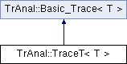

do not remove this div, it is closed by doxygen! 
|  |
| --- |
| NSCL DDAS1.0Support for XIA DDAS at the NSCL |

 end header part 
 Generated by Doxygen 1.8.8 

- [[Main Page|https://github.com/FRIBDAQ/docs/tree/main/ddas-1.1/index.md]]
- [[Related Pages|https://github.com/FRIBDAQ/docs/tree/main/ddas-1.1/pages.md]]
- [[Namespaces|https://github.com/FRIBDAQ/docs/tree/main/ddas-1.1/namespaces.md]]
- [[Classes|https://github.com/FRIBDAQ/docs/tree/main/ddas-1.1/annotated.md]]
- [[Files|https://github.com/FRIBDAQ/docs/tree/main/ddas-1.1/files.md]]
- 
  [[|https://github.com/FRIBDAQ/docs/tree/main/ddas-1.1/javascript:searchBox.CloseResultsWindow().md]]

- [[Class List|https://github.com/FRIBDAQ/docs/tree/main/ddas-1.1/annotated.md]]
- [[Class Index|https://github.com/FRIBDAQ/docs/tree/main/ddas-1.1/classes.md]]
- [[Class Hierarchy|https://github.com/FRIBDAQ/docs/tree/main/ddas-1.1/hierarchy.md]]
- [[Class Members|https://github.com/FRIBDAQ/docs/tree/main/ddas-1.1/functions.md]]

 window showing the filter options 
[[All|https://github.com/FRIBDAQ/docs/tree/main/ddas-1.1/javascript:void(0).md]][[Classes|https://github.com/FRIBDAQ/docs/tree/main/ddas-1.1/javascript:void(0).md]][[Namespaces|https://github.com/FRIBDAQ/docs/tree/main/ddas-1.1/javascript:void(0).md]][[Files|https://github.com/FRIBDAQ/docs/tree/main/ddas-1.1/javascript:void(0).md]][[Functions|https://github.com/FRIBDAQ/docs/tree/main/ddas-1.1/javascript:void(0).md]][[Variables|https://github.com/FRIBDAQ/docs/tree/main/ddas-1.1/javascript:void(0).md]][[Macros|https://github.com/FRIBDAQ/docs/tree/main/ddas-1.1/javascript:void(0).md]][[Pages|https://github.com/FRIBDAQ/docs/tree/main/ddas-1.1/javascript:void(0).md]]

 iframe showing the search results (closed by default) 

- **TrAnal**
- [[TraceT|https://github.com/FRIBDAQ/docs/tree/main/ddas-1.1/classTrAnal_1_1TraceT.md]]

 top 
[Public Member Functions](#pub-methods) |
[[List of all members|https://github.com/FRIBDAQ/docs/tree/main/ddas-1.1/classTrAnal_1_1TraceT-members.md]]

TrAnal::TraceT< T > Class Template Reference

header
Inheritance diagram for TrAnal::TraceT< T >:

|  |  |
| --- | --- |
| Public Member Functions |
|  | TraceT(const std::vector< T > &obj) |
|  |
| TrIterator< T > | begin() const |
|  |
| TrIterator< T > | end() const |
|  |
| virtual T | operator const |
|  |
| virtual size_t | GetLength() const |
|  |

---

The documentation for this class was generated from the following file:- traiter/src/[[Trace.hpp|https://github.com/FRIBDAQ/docs/tree/main/ddas-1.1/Trace_8hpp_source.md]]

 contents 
 start footer part 

---

Generated on Tue Mar 31 2020 13:10:45 for NSCL DDAS by   1.8.8
