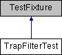

do not remove this div, it is closed by doxygen! 
|  |
| --- |
| NSCL DDAS1.0Support for XIA DDAS at the NSCL |

 end header part 
 Generated by Doxygen 1.8.8 

- [[index]]
- [[pages]]
- [[namespaces]]
- [[annotated]]
- [[files]]
- 
  [[javascript:searchBox.CloseResultsWindow()]]

- [[annotated]]
- [[classes]]
- [[hierarchy]]
- [[functions]]

 window showing the filter options 
[[javascript:void(0)]][[javascript:void(0)]][[javascript:void(0)]][[javascript:void(0)]][[javascript:void(0)]][[javascript:void(0)]][[javascript:void(0)]][[javascript:void(0)]]

 iframe showing the search results (closed by default)

 top 
[Public Member Functions](#pub-methods) |
[[classTrapFilterTest-members]]

TrapFilterTest Class Reference

header
Inheritance diagram for TrapFilterTest:

|  |  |
| --- | --- |
| Public Member Functions |
|  | CPPUNIT_TEST_SUITE(TrapFilterTest) |
|  |
|  | CPPUNIT_TEST(testConstructor) |
|  |
|  | CPPUNIT_TEST(testMinExtent) |
|  |
|  | CPPUNIT_TEST(testMaxExtent) |
|  |
|  | CPPUNIT_TEST(testIncrement) |
|  |
|  | CPPUNIT_TEST(testWhile) |
|  |
|  | CPPUNIT_TEST(testNegative) |
|  |
|  | CPPUNIT_TEST_SUITE_END() |
|  |
| void | setUp() |
|  |
| void | tearDown() |
|  |
| void | testConstructor() |
|  |
| void | testIncrement() |
|  |
| void | testMaxExtent() |
|  |
| void | testMinExtent() |
|  |
| void | testWhile() |
|  |
| void | testNegative() |
|  |

---

The documentation for this class was generated from the following files:- traiter/test/[[TrapFilterTest_8h_source]]
- traiter/test/TrapFilterTest.cpp

 contents 
 start footer part 

---

Generated on Tue Mar 31 2020 13:10:45 for NSCL DDAS by   1.8.8
