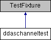

do not remove this div, it is closed by doxygen! 
|  |
| --- |
| NSCL DDAS1.0Support for XIA DDAS at the NSCL |

 end header part 
 Generated by Doxygen 1.8.8 

- [[Main Page|index]]
- [[Related Pages|pages]]
- [[Namespaces|namespaces]]
- [[Classes|annotated]]
- [[Files|files]]
- 
  [[|javascript:searchBox.CloseResultsWindow()]]

- [[Class List|annotated]]
- [[Class Index|classes]]
- [[Class Hierarchy|hierarchy]]
- [[Class Members|functions]]

 window showing the filter options 
[[All|javascript:void(0)]][[Classes|javascript:void(0)]][[Namespaces|javascript:void(0)]][[Files|javascript:void(0)]][[Functions|javascript:void(0)]][[Variables|javascript:void(0)]][[Macros|javascript:void(0)]][[Pages|javascript:void(0)]]

 iframe showing the search results (closed by default)

 top 
[Public Member Functions](#pub-methods) |
[[List of all members|classddaschanneltest-members]]

ddaschanneltest Class Reference

header
Inheritance diagram for ddaschanneltest:

|  |  |
| --- | --- |
| Public Member Functions |
|  | CPPUNIT_TEST_SUITE(ddaschanneltest) |
|  |
|  | CPPUNIT_TEST(crateId_0) |
|  |
|  | CPPUNIT_TEST(slotId_0) |
|  |
|  | CPPUNIT_TEST(chanId_0) |
|  |
|  | CPPUNIT_TEST(headerLength_0) |
|  |
|  | CPPUNIT_TEST(eventLength_0) |
|  |
|  | CPPUNIT_TEST(finishCode_0) |
|  |
|  | CPPUNIT_TEST(msps_0) |
|  |
|  | CPPUNIT_TEST(timelow_0) |
|  |
|  | CPPUNIT_TEST(timehigh_0) |
|  |
|  | CPPUNIT_TEST(coarseTime_0) |
|  |
|  | CPPUNIT_TEST(time_0) |
|  |
|  | CPPUNIT_TEST(cfdFail_0) |
|  |
|  | CPPUNIT_TEST(cfdTrigSource_0) |
|  |
|  | CPPUNIT_TEST(energySums_0) |
|  |
|  | CPPUNIT_TEST(qdcSums_0) |
|  |
|  | CPPUNIT_TEST(trace_0) |
|  |
|  | CPPUNIT_TEST(hdwrRevision_0) |
|  |
|  | CPPUNIT_TEST(adcResolution_0) |
|  |
|  | CPPUNIT_TEST(overunderflow_0) |
|  |
|  | CPPUNIT_TEST(reset_0) |
|  |
|  | CPPUNIT_TEST(defaultCtor_0) |
|  |
|  | CPPUNIT_TEST_SUITE_END() |
|  |
| void | setUp() |
|  |
| void | tearDown() |
|  |
| void | crateId_0() |
|  |
| void | slotId_0() |
|  |
| void | chanId_0() |
|  |
| void | headerLength_0() |
|  |
| void | eventLength_0() |
|  |
| void | finishCode_0() |
|  |
| void | msps_0() |
|  |
| void | timelow_0() |
|  |
| void | timehigh_0() |
|  |
| void | coarseTime_0() |
|  |
| void | time_0() |
|  |
| void | cfdFail_0() |
|  |
| void | cfdTrigSource_0() |
|  |
| void | energySums_0() |
|  |
| void | qdcSums_0() |
|  |
| void | trace_0() |
|  |
| void | hdwrRevision_0() |
|  |
| void | adcResolution_0() |
|  |
| void | overunderflow_0() |
|  |
| void | reset_0() |
|  |
| void | defaultCtor_0() |
|  |

---

The documentation for this class was generated from the following file:- ddasdumper/ddaschanneltest.cpp

 contents 
 start footer part 

---

Generated on Tue Mar 31 2020 13:10:45 for NSCL DDAS by   1.8.8
