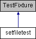

do not remove this div, it is closed by doxygen! 
|  |
| --- |
| NSCL DDAS1.0Support for XIA DDAS at the NSCL |

 end header part 
 Generated by Doxygen 1.8.8 

- [[Main Page|index]]
- [[Related Pages|pages]]
- [[Namespaces|namespaces]]
- [[Classes|annotated]]
- [[Files|files]]
- 
  [[|javascript:searchBox.CloseResultsWindow()]]

- [[Class List|annotated]]
- [[Class Index|classes]]
- [[Class Hierarchy|hierarchy]]
- [[Class Members|functions]]

 window showing the filter options 
[[All|javascript:void(0)]][[Classes|javascript:void(0)]][[Namespaces|javascript:void(0)]][[Files|javascript:void(0)]][[Functions|javascript:void(0)]][[Variables|javascript:void(0)]][[Macros|javascript:void(0)]][[Pages|javascript:void(0)]]

 iframe showing the search results (closed by default)

 top 
[Public Member Functions](#pub-methods) |
[Protected Member Functions](#pro-methods) |
[[List of all members|classsetfiletest-members]]

setfiletest Class Reference

header
Inheritance diagram for setfiletest:

|  |  |
| --- | --- |
| Public Member Functions |
| void | setUp() |
|  |
| void | teardDown() |
|  |

|  |  |
| --- | --- |
| Protected Member Functions |
| void | openvar_1() |
|  |
| void | openvar_2() |
|  |
| void | varread_1() |
|  |
| void | varread_2() |
|  |
| void | vomap_1() |
|  |
| void | vomap_2() |
|  |
| void | vnmap_1() |
|  |
| void | vnmap_2() |
|  |
| void | openset_1() |
|  |
| void | openset_2() |
|  |
| void | setread_1() |
|  |
| void | setwrite_1() |
|  |
| void | setwrite_2() |
|  |
| void | setwrite_3() |
|  |
| void | array_1() |
|  |
| void | array_2() |
|  |
| void | sfmap_1() |
|  |
| void | sfmap_2() |
|  |
| void | sfmap_3() |
|  |
| void | sfmap_4() |
|  |
| void | sfmap_5() |
|  |

---

The documentation for this class was generated from the following file:- xml/[[setreadertests.cpp|setreadertests_8cpp]]

 contents 
 start footer part 

---

Generated on Tue Mar 31 2020 13:10:45 for NSCL DDAS by   1.8.8
