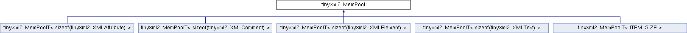

do not remove this div, it is closed by doxygen! 
|  |
| --- |
| NSCL DDAS1.0Support for XIA DDAS at the NSCL |

 end header part 
 Generated by Doxygen 1.8.8 

- [[index]]
- [[pages]]
- [[namespaces]]
- [[annotated]]
- [[files]]
- 
  [[javascript:searchBox.CloseResultsWindow()]]

- [[annotated]]
- [[classes]]
- [[hierarchy]]
- [[functions]]

 window showing the filter options 
[[javascript:void(0)]][[javascript:void(0)]][[javascript:void(0)]][[javascript:void(0)]][[javascript:void(0)]][[javascript:void(0)]][[javascript:void(0)]][[javascript:void(0)]]

 iframe showing the search results (closed by default) 

- **tinyxml2**
- [[classtinyxml2_1_1MemPool]]

 top 
[Public Member Functions](#pub-methods) |
[[classtinyxml2_1_1MemPool-members]]

tinyxml2::MemPool Class Referenceabstract

header
Inheritance diagram for tinyxml2::MemPool:

|  |  |
| --- | --- |
| Public Member Functions |
| virtual int | ItemSize() const =0 |
|  |
| virtual void * | Alloc()=0 |
|  |
| virtual void | Free(void *)=0 |
|  |
| virtual void | SetTracked()=0 |
|  |

---

The documentation for this class was generated from the following file:- xml/tinyxml/[[tinyxml2_8h_source]]

 contents 
 start footer part 

---

Generated on Tue Mar 31 2020 13:10:45 for NSCL DDAS by   1.8.8
