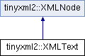

do not remove this div, it is closed by doxygen! 
|  |
| --- |
| NSCL DDAS1.0Support for XIA DDAS at the NSCL |


 end header part 
 Generated by Doxygen 1.8.8 

- [Main Page](https://github.com/FRIBDAQ/docs/tree/main/ddas-1.1/index.md)
- [Related Pages](https://github.com/FRIBDAQ/docs/tree/main/ddas-1.1/pages.md)
- [Namespaces](https://github.com/FRIBDAQ/docs/tree/main/ddas-1.1/namespaces.md)
- [Classes](https://github.com/FRIBDAQ/docs/tree/main/ddas-1.1/annotated.md)
- [Files](https://github.com/FRIBDAQ/docs/tree/main/ddas-1.1/files.md)
- 
  [](https://github.com/FRIBDAQ/docs/tree/main/ddas-1.1/javascript:searchBox.CloseResultsWindow().md)


- [Class List](https://github.com/FRIBDAQ/docs/tree/main/ddas-1.1/annotated.md)
- [Class Index](https://github.com/FRIBDAQ/docs/tree/main/ddas-1.1/classes.md)
- [Class Hierarchy](https://github.com/FRIBDAQ/docs/tree/main/ddas-1.1/hierarchy.md)
- [Class Members](https://github.com/FRIBDAQ/docs/tree/main/ddas-1.1/functions.md)


 window showing the filter options 
[All](https://github.com/FRIBDAQ/docs/tree/main/ddas-1.1/javascript:void(0).md)[Classes](https://github.com/FRIBDAQ/docs/tree/main/ddas-1.1/javascript:void(0).md)[Namespaces](https://github.com/FRIBDAQ/docs/tree/main/ddas-1.1/javascript:void(0).md)[Files](https://github.com/FRIBDAQ/docs/tree/main/ddas-1.1/javascript:void(0).md)[Functions](https://github.com/FRIBDAQ/docs/tree/main/ddas-1.1/javascript:void(0).md)[Variables](https://github.com/FRIBDAQ/docs/tree/main/ddas-1.1/javascript:void(0).md)[Macros](https://github.com/FRIBDAQ/docs/tree/main/ddas-1.1/javascript:void(0).md)[Pages](https://github.com/FRIBDAQ/docs/tree/main/ddas-1.1/javascript:void(0).md)


 iframe showing the search results (closed by default) 


- **tinyxml2**
- [XMLText](https://github.com/FRIBDAQ/docs/tree/main/ddas-1.1/classtinyxml2_1_1XMLText.md)

 top 
[Public Member Functions](#pub-methods) |
[Protected Member Functions](#pro-methods) |
[Friends](#friends) |
[List of all members](https://github.com/FRIBDAQ/docs/tree/main/ddas-1.1/classtinyxml2_1_1XMLText-members.md)


tinyxml2::XMLText Class Reference

header
`#include <tinyxml2.h>`


Inheritance diagram for tinyxml2::XMLText:





|  |  |
| --- | --- |
| Public Member Functions |
| virtual bool | Accept(XMLVisitor*visitor) const |
|  |
| virtualXMLText* | ToText() |
|  | Safely cast to Text, or null. |
|  |
| virtual constXMLText* | ToText() const |
|  |
| void | SetCData(bool isCData) |
|  | Declare whether this should be CDATA or standard text. |
|  |
| bool | CData() const |
|  | Returns true if this is a CDATA text element. |
|  |
| virtualXMLNode* | ShallowClone(XMLDocument*document) const |
|  |
| virtual bool | ShallowEqual(constXMLNode*compare) const |
|  |
| Public Member Functions inherited fromtinyxml2::XMLNode |
| constXMLDocument* | GetDocument() const |
|  | Get theXMLDocumentthat owns thisXMLNode. |
|  |
| XMLDocument* | GetDocument() |
|  | Get theXMLDocumentthat owns thisXMLNode. |
|  |
| virtualXMLElement* | ToElement() |
|  | Safely cast to an Element, or null. |
|  |
| virtualXMLComment* | ToComment() |
|  | Safely cast to a Comment, or null. |
|  |
| virtualXMLDocument* | ToDocument() |
|  | Safely cast to a Document, or null. |
|  |
| virtualXMLDeclaration* | ToDeclaration() |
|  | Safely cast to a Declaration, or null. |
|  |
| virtualXMLUnknown* | ToUnknown() |
|  | Safely cast to an Unknown, or null. |
|  |
| virtual constXMLElement* | ToElement() const |
|  |
| virtual constXMLComment* | ToComment() const |
|  |
| virtual constXMLDocument* | ToDocument() const |
|  |
| virtual constXMLDeclaration* | ToDeclaration() const |
|  |
| virtual constXMLUnknown* | ToUnknown() const |
|  |
| const char * | Value() const |
|  |
| void | SetValue(const char *val, bool staticMem=false) |
|  |
| int | GetLineNum() const |
|  | Gets the line number the node is in, if the document was parsed from a file. |
|  |
| constXMLNode* | Parent() const |
|  | Get the parent of this node on the DOM. |
|  |
| XMLNode* | Parent() |
|  |
| bool | NoChildren() const |
|  | Returns true if this node has no children. |
|  |
| constXMLNode* | FirstChild() const |
|  | Get the first child node, or null if none exists. |
|  |
| XMLNode* | FirstChild() |
|  |
| constXMLElement* | FirstChildElement(const char *name=0) const |
|  |
| XMLElement* | FirstChildElement(const char *name=0) |
|  |
| constXMLNode* | LastChild() const |
|  | Get the last child node, or null if none exists. |
|  |
| XMLNode* | LastChild() |
|  |
| constXMLElement* | LastChildElement(const char *name=0) const |
|  |
| XMLElement* | LastChildElement(const char *name=0) |
|  |
| constXMLNode* | PreviousSibling() const |
|  | Get the previous (left) sibling node of this node. |
|  |
| XMLNode* | PreviousSibling() |
|  |
| constXMLElement* | PreviousSiblingElement(const char *name=0) const |
|  | Get the previous (left) sibling element of this node, with an optionally supplied name. |
|  |
| XMLElement* | PreviousSiblingElement(const char *name=0) |
|  |
| constXMLNode* | NextSibling() const |
|  | Get the next (right) sibling node of this node. |
|  |
| XMLNode* | NextSibling() |
|  |
| constXMLElement* | NextSiblingElement(const char *name=0) const |
|  | Get the next (right) sibling element of this node, with an optionally supplied name. |
|  |
| XMLElement* | NextSiblingElement(const char *name=0) |
|  |
| XMLNode* | InsertEndChild(XMLNode*addThis) |
|  |
| XMLNode* | LinkEndChild(XMLNode*addThis) |
|  |
| XMLNode* | InsertFirstChild(XMLNode*addThis) |
|  |
| XMLNode* | InsertAfterChild(XMLNode*afterThis,XMLNode*addThis) |
|  |
| void | DeleteChildren() |
|  |
| void | DeleteChild(XMLNode*node) |
|  |
| XMLNode* | DeepClone(XMLDocument*target) const |
|  |
| void | SetUserData(void *userData) |
|  |
| void * | GetUserData() const |
|  |

|  |  |
| --- | --- |
| Protected Member Functions |
|  | XMLText(XMLDocument*doc) |
|  |
| char * | ParseDeep(char *p,StrPair*parentEndTag, int *curLineNumPtr) |
|  |
| Protected Member Functions inherited fromtinyxml2::XMLNode |
|  | XMLNode(XMLDocument*) |
|  |

|  |  |
| --- | --- |
| Friends |
| class | XMLDocument |
|  |

|  |  |
| --- | --- |
| Additional Inherited Members |
| Protected Attributes inherited fromtinyxml2::XMLNode |
| XMLDocument* | _document |
|  |
| XMLNode* | _parent |
|  |
| StrPair | _value |
|  |
| int | _parseLineNum |
|  |
| XMLNode* | _firstChild |
|  |
| XMLNode* | _lastChild |
|  |
| XMLNode* | _prev |
|  |
| XMLNode* | _next |
|  |
| void * | _userData |
|  |


<a name="details"></a>## Detailed Description


XML text.

```
Note that a text node can have child element nodes, for example:

```

 ```
    <root>This is <b>bold</b></root>
```

A text node can have 2 ways to output the next. "normal" output and CDATA. It will default to the mode it was parsed from the XML file and you generally want to leave it alone, but you can change the output mode with [SetCData()](https://github.com/FRIBDAQ/docs/tree/main/ddas-1.1/classtinyxml2_1_1XMLText.md#ad080357d76ab7cc59d7651249949329d) and query it with [CData()](https://github.com/FRIBDAQ/docs/tree/main/ddas-1.1/classtinyxml2_1_1XMLText.md#a125574fe49da80efbae1349f20d02d41).

## Member Function Documentation


|  |  |  |  |  |  |  |  |
| --- | --- | --- | --- | --- | --- | --- | --- |
| bool tinyxml2::XMLText::Accept(XMLVisitor*visitor)const | bool tinyxml2::XMLText::Accept | ( | XMLVisitor* | visitor | ) | const | virtual |
| bool tinyxml2::XMLText::Accept | ( | XMLVisitor* | visitor | ) | const |

Accept a hierarchical visit of the nodes in the TinyXML-2 DOM. Every node in the XML tree will be conditionally visited and the host will be called back via the [XMLVisitor](https://github.com/FRIBDAQ/docs/tree/main/ddas-1.1/classtinyxml2_1_1XMLVisitor.md) interface.


This is essentially a SAX interface for TinyXML-2. (Note however it doesn't re-parse the XML for the callbacks, so the performance of TinyXML-2 is unchanged by using this interface versus any other.)


The interface has been based on ideas from:


- [http://www.saxproject.org/](http://www.saxproject.org/)
- [http://c2.com/cgi/wiki?HierarchicalVisitorPattern](http://c2.com/cgi/wiki?HierarchicalVisitorPattern)


Which are both good references for "visiting".


An example of using [Accept()](https://github.com/FRIBDAQ/docs/tree/main/ddas-1.1/classtinyxml2_1_1XMLText.md#ae659d4fc7351a7df11c111cbe1ade46f):

```
XMLPrinter printer;
tinyxmlDoc.Accept( &printer );
const char* xmlcstr = printer.CStr();

```


Implements [tinyxml2::XMLNode](https://github.com/FRIBDAQ/docs/tree/main/ddas-1.1/classtinyxml2_1_1XMLNode.md#a81e66df0a44c67a7af17f3b77a152785).


|  |  |  |  |  |  |  |  |
| --- | --- | --- | --- | --- | --- | --- | --- |
| XMLNode* tinyxml2::XMLText::ShallowClone(XMLDocument*document)const | XMLNode* tinyxml2::XMLText::ShallowClone | ( | XMLDocument* | document | ) | const | virtual |
| XMLNode* tinyxml2::XMLText::ShallowClone | ( | XMLDocument* | document | ) | const |

Make a copy of this node, but not its children. You may pass in a Document pointer that will be the owner of the new Node. If the 'document' is null, then the node returned will be allocated from the current Document. (this->[GetDocument()](https://github.com/FRIBDAQ/docs/tree/main/ddas-1.1/classtinyxml2_1_1XMLNode.md#af343d1ef0b45c0020e62d784d7e67a68))


Note: if called on a [XMLDocument](https://github.com/FRIBDAQ/docs/tree/main/ddas-1.1/classtinyxml2_1_1XMLDocument.md), this will return null.


Implements [tinyxml2::XMLNode](https://github.com/FRIBDAQ/docs/tree/main/ddas-1.1/classtinyxml2_1_1XMLNode.md#a8402cbd3129d20e9e6024bbcc0531283).


|  |  |  |  |  |  |  |  |
| --- | --- | --- | --- | --- | --- | --- | --- |
| bool tinyxml2::XMLText::ShallowEqual(constXMLNode*compare)const | bool tinyxml2::XMLText::ShallowEqual | ( | constXMLNode* | compare | ) | const | virtual |
| bool tinyxml2::XMLText::ShallowEqual | ( | constXMLNode* | compare | ) | const |

[Test](https://github.com/FRIBDAQ/docs/tree/main/ddas-1.1/namespaceTest.md) if 2 nodes are the same, but don't test children. The 2 nodes do not need to be in the same Document.


Note: if called on a [XMLDocument](https://github.com/FRIBDAQ/docs/tree/main/ddas-1.1/classtinyxml2_1_1XMLDocument.md), this will return false.


Implements [tinyxml2::XMLNode](https://github.com/FRIBDAQ/docs/tree/main/ddas-1.1/classtinyxml2_1_1XMLNode.md#a7ce18b751c3ea09eac292dca264f9226).


---

The documentation for this class was generated from the following files:- xml/tinyxml/[tinyxml2.h](https://github.com/FRIBDAQ/docs/tree/main/ddas-1.1/tinyxml2_8h_source.md)
- xml/tinyxml/tinyxml2.cpp

 contents 
 start footer part 

---


Generated on Tue Mar 31 2020 13:10:45 for NSCL DDAS by  [](http://www.doxygen.org/index.html) 1.8.8
