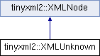

do not remove this div, it is closed by doxygen! 
|  |
| --- |
| NSCL DDAS1.0Support for XIA DDAS at the NSCL |


 end header part 
 Generated by Doxygen 1.8.8 

- [[Main Page|index]]
- [[Related Pages|pages]]
- [[Namespaces|namespaces]]
- [[Classes|annotated]]
- [[Files|files]]
- 
  [[|javascript:searchBox.CloseResultsWindow()]]


- [[Class List|annotated]]
- [[Class Index|classes]]
- [[Class Hierarchy|hierarchy]]
- [[Class Members|functions]]


 window showing the filter options 
[[All|javascript:void(0)]][[Classes|javascript:void(0)]][[Namespaces|javascript:void(0)]][[Files|javascript:void(0)]][[Functions|javascript:void(0)]][[Variables|javascript:void(0)]][[Macros|javascript:void(0)]][[Pages|javascript:void(0)]]


 iframe showing the search results (closed by default) 


- **tinyxml2**
- [[XMLUnknown|classtinyxml2_1_1XMLUnknown]]

 top 
[Public Member Functions](#pub-methods) |
[Protected Member Functions](#pro-methods) |
[Friends](#friends) |
[[List of all members|classtinyxml2_1_1XMLUnknown-members]]


tinyxml2::XMLUnknown Class Reference

header
`#include <tinyxml2.h>`


Inheritance diagram for tinyxml2::XMLUnknown:





|  |  |
| --- | --- |
| Public Member Functions |
| virtualXMLUnknown* | ToUnknown() |
|  | Safely cast to an Unknown, or null. |
|  |
| virtual constXMLUnknown* | ToUnknown() const |
|  |
| virtual bool | Accept(XMLVisitor*visitor) const |
|  |
| virtualXMLNode* | ShallowClone(XMLDocument*document) const |
|  |
| virtual bool | ShallowEqual(constXMLNode*compare) const |
|  |
| Public Member Functions inherited fromtinyxml2::XMLNode |
| constXMLDocument* | GetDocument() const |
|  | Get theXMLDocumentthat owns thisXMLNode. |
|  |
| XMLDocument* | GetDocument() |
|  | Get theXMLDocumentthat owns thisXMLNode. |
|  |
| virtualXMLElement* | ToElement() |
|  | Safely cast to an Element, or null. |
|  |
| virtualXMLText* | ToText() |
|  | Safely cast to Text, or null. |
|  |
| virtualXMLComment* | ToComment() |
|  | Safely cast to a Comment, or null. |
|  |
| virtualXMLDocument* | ToDocument() |
|  | Safely cast to a Document, or null. |
|  |
| virtualXMLDeclaration* | ToDeclaration() |
|  | Safely cast to a Declaration, or null. |
|  |
| virtual constXMLElement* | ToElement() const |
|  |
| virtual constXMLText* | ToText() const |
|  |
| virtual constXMLComment* | ToComment() const |
|  |
| virtual constXMLDocument* | ToDocument() const |
|  |
| virtual constXMLDeclaration* | ToDeclaration() const |
|  |
| const char * | Value() const |
|  |
| void | SetValue(const char *val, bool staticMem=false) |
|  |
| int | GetLineNum() const |
|  | Gets the line number the node is in, if the document was parsed from a file. |
|  |
| constXMLNode* | Parent() const |
|  | Get the parent of this node on the DOM. |
|  |
| XMLNode* | Parent() |
|  |
| bool | NoChildren() const |
|  | Returns true if this node has no children. |
|  |
| constXMLNode* | FirstChild() const |
|  | Get the first child node, or null if none exists. |
|  |
| XMLNode* | FirstChild() |
|  |
| constXMLElement* | FirstChildElement(const char *name=0) const |
|  |
| XMLElement* | FirstChildElement(const char *name=0) |
|  |
| constXMLNode* | LastChild() const |
|  | Get the last child node, or null if none exists. |
|  |
| XMLNode* | LastChild() |
|  |
| constXMLElement* | LastChildElement(const char *name=0) const |
|  |
| XMLElement* | LastChildElement(const char *name=0) |
|  |
| constXMLNode* | PreviousSibling() const |
|  | Get the previous (left) sibling node of this node. |
|  |
| XMLNode* | PreviousSibling() |
|  |
| constXMLElement* | PreviousSiblingElement(const char *name=0) const |
|  | Get the previous (left) sibling element of this node, with an optionally supplied name. |
|  |
| XMLElement* | PreviousSiblingElement(const char *name=0) |
|  |
| constXMLNode* | NextSibling() const |
|  | Get the next (right) sibling node of this node. |
|  |
| XMLNode* | NextSibling() |
|  |
| constXMLElement* | NextSiblingElement(const char *name=0) const |
|  | Get the next (right) sibling element of this node, with an optionally supplied name. |
|  |
| XMLElement* | NextSiblingElement(const char *name=0) |
|  |
| XMLNode* | InsertEndChild(XMLNode*addThis) |
|  |
| XMLNode* | LinkEndChild(XMLNode*addThis) |
|  |
| XMLNode* | InsertFirstChild(XMLNode*addThis) |
|  |
| XMLNode* | InsertAfterChild(XMLNode*afterThis,XMLNode*addThis) |
|  |
| void | DeleteChildren() |
|  |
| void | DeleteChild(XMLNode*node) |
|  |
| XMLNode* | DeepClone(XMLDocument*target) const |
|  |
| void | SetUserData(void *userData) |
|  |
| void * | GetUserData() const |
|  |

|  |  |
| --- | --- |
| Protected Member Functions |
|  | XMLUnknown(XMLDocument*doc) |
|  |
| char * | ParseDeep(char *p,StrPair*parentEndTag, int *curLineNumPtr) |
|  |
| Protected Member Functions inherited fromtinyxml2::XMLNode |
|  | XMLNode(XMLDocument*) |
|  |

|  |  |
| --- | --- |
| Friends |
| class | XMLDocument |
|  |

|  |  |
| --- | --- |
| Additional Inherited Members |
| Protected Attributes inherited fromtinyxml2::XMLNode |
| XMLDocument* | _document |
|  |
| XMLNode* | _parent |
|  |
| StrPair | _value |
|  |
| int | _parseLineNum |
|  |
| XMLNode* | _firstChild |
|  |
| XMLNode* | _lastChild |
|  |
| XMLNode* | _prev |
|  |
| XMLNode* | _next |
|  |
| void * | _userData |
|  |


<a name="details"></a>## Detailed Description


Any tag that TinyXML-2 doesn't recognize is saved as an unknown. It is a tag of text, but should not be modified. It will be written back to the XML, unchanged, when the file is saved.


DTD tags get thrown into XMLUnknowns.

## Member Function Documentation


|  |  |  |  |  |  |  |  |
| --- | --- | --- | --- | --- | --- | --- | --- |
| bool tinyxml2::XMLUnknown::Accept(XMLVisitor*visitor)const | bool tinyxml2::XMLUnknown::Accept | ( | XMLVisitor* | visitor | ) | const | virtual |
| bool tinyxml2::XMLUnknown::Accept | ( | XMLVisitor* | visitor | ) | const |

Accept a hierarchical visit of the nodes in the TinyXML-2 DOM. Every node in the XML tree will be conditionally visited and the host will be called back via the [[XMLVisitor|classtinyxml2_1_1XMLVisitor]] interface.


This is essentially a SAX interface for TinyXML-2. (Note however it doesn't re-parse the XML for the callbacks, so the performance of TinyXML-2 is unchanged by using this interface versus any other.)


The interface has been based on ideas from:


- [http://www.saxproject.org/](http://www.saxproject.org/)
- [http://c2.com/cgi/wiki?HierarchicalVisitorPattern](http://c2.com/cgi/wiki?HierarchicalVisitorPattern)


Which are both good references for "visiting".


An example of using [[Accept()|classtinyxml2_1_1XMLUnknown#a0d341ab804a1438a474810bb5bd29dd5]]:

```
XMLPrinter printer;
tinyxmlDoc.Accept( &printer );
const char* xmlcstr = printer.CStr();

```


Implements [[tinyxml2::XMLNode|classtinyxml2_1_1XMLNode#a81e66df0a44c67a7af17f3b77a152785]].


|  |  |  |  |  |  |  |  |
| --- | --- | --- | --- | --- | --- | --- | --- |
| XMLNode* tinyxml2::XMLUnknown::ShallowClone(XMLDocument*document)const | XMLNode* tinyxml2::XMLUnknown::ShallowClone | ( | XMLDocument* | document | ) | const | virtual |
| XMLNode* tinyxml2::XMLUnknown::ShallowClone | ( | XMLDocument* | document | ) | const |

Make a copy of this node, but not its children. You may pass in a Document pointer that will be the owner of the new Node. If the 'document' is null, then the node returned will be allocated from the current Document. (this->[[GetDocument()|classtinyxml2_1_1XMLNode#af343d1ef0b45c0020e62d784d7e67a68]])


Note: if called on a [[XMLDocument|classtinyxml2_1_1XMLDocument]], this will return null.


Implements [[tinyxml2::XMLNode|classtinyxml2_1_1XMLNode#a8402cbd3129d20e9e6024bbcc0531283]].


|  |  |  |  |  |  |  |  |
| --- | --- | --- | --- | --- | --- | --- | --- |
| bool tinyxml2::XMLUnknown::ShallowEqual(constXMLNode*compare)const | bool tinyxml2::XMLUnknown::ShallowEqual | ( | constXMLNode* | compare | ) | const | virtual |
| bool tinyxml2::XMLUnknown::ShallowEqual | ( | constXMLNode* | compare | ) | const |

[[Test|namespaceTest]] if 2 nodes are the same, but don't test children. The 2 nodes do not need to be in the same Document.


Note: if called on a [[XMLDocument|classtinyxml2_1_1XMLDocument]], this will return false.


Implements [[tinyxml2::XMLNode|classtinyxml2_1_1XMLNode#a7ce18b751c3ea09eac292dca264f9226]].


---

The documentation for this class was generated from the following files:- xml/tinyxml/[[tinyxml2.h|tinyxml2_8h_source]]
- xml/tinyxml/tinyxml2.cpp

 contents 
 start footer part 

---


Generated on Tue Mar 31 2020 13:10:45 for NSCL DDAS by  [](http://www.doxygen.org/index.html) 1.8.8
