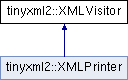

do not remove this div, it is closed by doxygen! 
|  |
| --- |
| NSCL DDAS1.0Support for XIA DDAS at the NSCL |

 end header part 
 Generated by Doxygen 1.8.8 

- [[Main Page|index]]
- [[Related Pages|pages]]
- [[Namespaces|namespaces]]
- [[Classes|annotated]]
- [[Files|files]]
- 
  [[|javascript:searchBox.CloseResultsWindow()]]

- [[Class List|annotated]]
- [[Class Index|classes]]
- [[Class Hierarchy|hierarchy]]
- [[Class Members|functions]]

 window showing the filter options 
[[All|javascript:void(0)]][[Classes|javascript:void(0)]][[Namespaces|javascript:void(0)]][[Files|javascript:void(0)]][[Functions|javascript:void(0)]][[Variables|javascript:void(0)]][[Macros|javascript:void(0)]][[Pages|javascript:void(0)]]

 iframe showing the search results (closed by default) 

- **tinyxml2**
- [[XMLVisitor|classtinyxml2_1_1XMLVisitor]]

 top 
[Public Member Functions](#pub-methods) |
[[List of all members|classtinyxml2_1_1XMLVisitor-members]]

tinyxml2::XMLVisitor Class Reference

header
`#include <tinyxml2.h>`

Inheritance diagram for tinyxml2::XMLVisitor:

|  |  |
| --- | --- |
| Public Member Functions |
| virtual bool | VisitEnter(constXMLDocument&) |
|  | Visit a document. |
|  |
| virtual bool | VisitExit(constXMLDocument&) |
|  | Visit a document. |
|  |
| virtual bool | VisitEnter(constXMLElement&, constXMLAttribute*) |
|  | Visit an element. |
|  |
| virtual bool | VisitExit(constXMLElement&) |
|  | Visit an element. |
|  |
| virtual bool | Visit(constXMLDeclaration&) |
|  | Visit a declaration. |
|  |
| virtual bool | Visit(constXMLText&) |
|  | Visit a text node. |
|  |
| virtual bool | Visit(constXMLComment&) |
|  | Visit a comment node. |
|  |
| virtual bool | Visit(constXMLUnknown&) |
|  | Visit an unknown node. |
|  |

## Detailed Description

Implements the interface to the "Visitor pattern" (see the Accept() method.) If you call the Accept() method, it requires being passed a [[XMLVisitor|classtinyxml2_1_1XMLVisitor]] class to handle callbacks. For nodes that contain other nodes (Document, Element) you will get called with a VisitEnter/VisitExit pair. Nodes that are always leafs are simply called with [[Visit()|classtinyxml2_1_1XMLVisitor#adc75bd459fc7ba8223b50f0616767f9a]].

If you return 'true' from a Visit method, recursive parsing will continue. If you return false, **no children of this node or its siblings** will be visited.

All flavors of Visit methods have a default implementation that returns 'true' (continue visiting). You need to only override methods that are interesting to you.

Generally Accept() is called on the [[XMLDocument|classtinyxml2_1_1XMLDocument]], although all nodes support visiting.

You should never change the document from a callback.

See also[[XMLNode::Accept()|classtinyxml2_1_1XMLNode#a81e66df0a44c67a7af17f3b77a152785]]

---

The documentation for this class was generated from the following file:- xml/tinyxml/[[tinyxml2.h|tinyxml2_8h_source]]

 contents 
 start footer part 

---

Generated on Tue Mar 31 2020 13:10:45 for NSCL DDAS by   1.8.8
