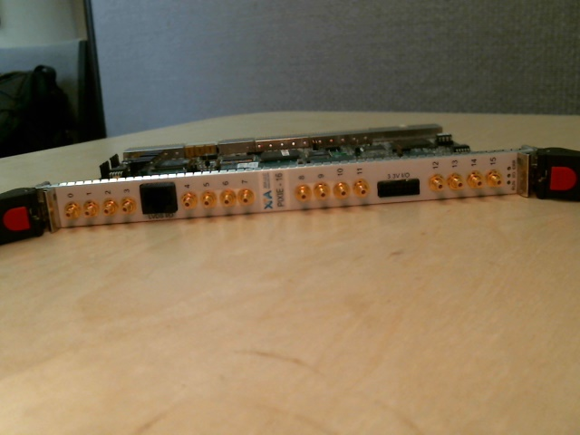
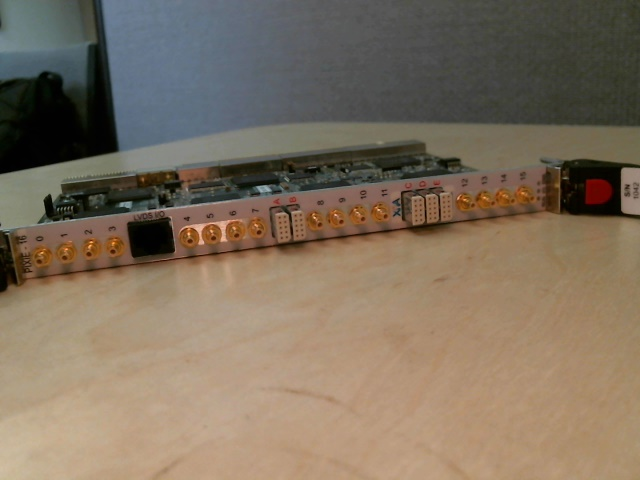
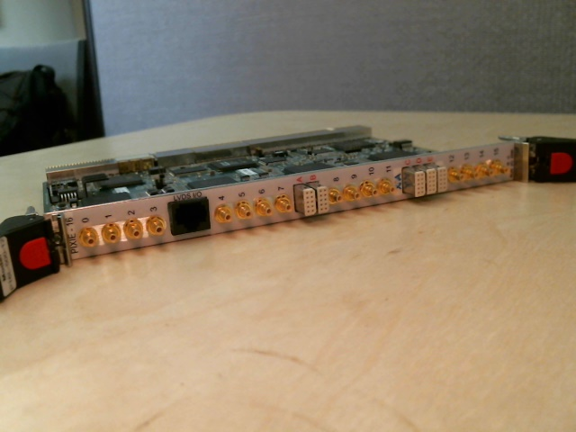
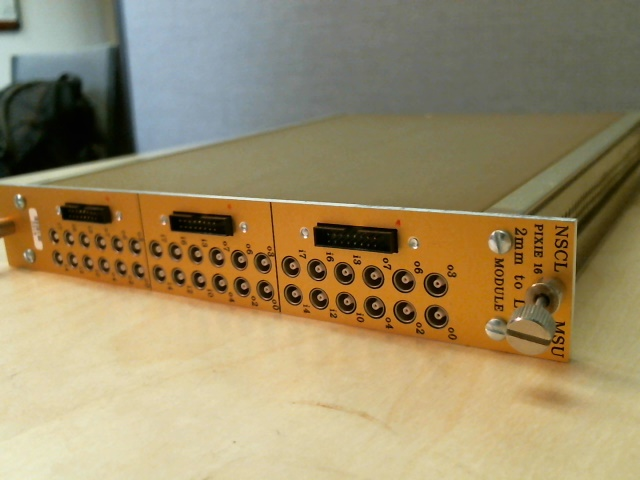
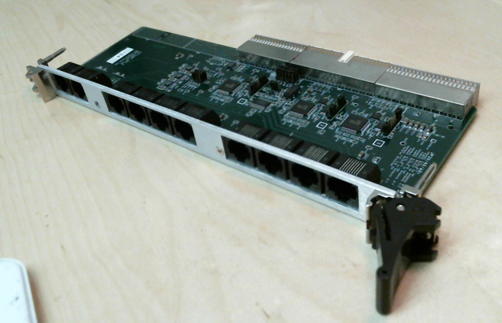

do not remove this div, it is closed by doxygen! 
|  |
| --- |
| NSCL DDAS1.0Support for XIA DDAS at the NSCL |


 end header part 
 Generated by Doxygen 1.8.8 

- [[index]]
- [[pages]]
- [[namespaces]]
- [[annotated]]
- [[files]]
- 
  [[javascript:searchBox.CloseResultsWindow()]]


 window showing the filter options 
[[javascript:void(0)]][[javascript:void(0)]][[javascript:void(0)]][[javascript:void(0)]][[javascript:void(0)]][[javascript:void(0)]][[javascript:void(0)]][[javascript:void(0)]]


 iframe showing the search results (closed by default)

 top 
Hardware

header
AuthorJeromy Tompkins 
Date4/12/2016
# Introduction


The digital data acquisition system is based entirely upon the XIA digital gamma finder family of products. At the NSCL, we use 100 MSPS and 250 MSPS Pixie-16 digitizers and also a 500 MSPS Pixie-16. In addition to these digitizers, there exists hardware to support the use of these in experiments. In the following sections, we will detail the hardware that composes the DDAS.


# The Pixie Digitizers


There are three digitizers in use at the NSCL. They differ primarily in the ADC sampling frequency and resolution. Here we will describe each one and provide some basic useful information for users to understand what to expect.


## The 100 MSPS Pixie-16



The 100 MSPS Pixie-16


The 100 MSPS Pixie-16 forms the largest component of the DDAS hardware inventory. This module has the following characteristics:


|  |  |
| --- | --- |
| Aspect | Detail |
| Timestamp frequency | 100 MHz |
| ADC frequency | 100 MHz |
| ADC resolution | 12 bit |
| Number of channels | 16 |


### Data Format Details


The data format is described in detail in the [[readout]] section. However, the interpretation of the [[classCFD]] time is unique to each module. The 3rd data word in the event header contains the [[classCFD]] time in its most significant 16 bits. The bits have the following meaning:


|  |  |
| --- | --- |
| Bits | Description |
| 0-15 | Time high (most significant bits of timestamp |
| 16-29 | Fractional offset (scaled by 2^14) to zero crossing from previous sample inCFDalgorithm |
| 30 | unused |
| 31 | Fail bit, 0 =CFDalgorithm succes, 1 =CFDthreshold not exceeded |


To compute the timestamp from this module one would do the following computation:


```
timestamp_100mhz = time_low + time_high<<32
correction       = (fraction_offset / (2<<14))
timestamp        = timestamp_100mhz + correction

```

## The 250 MSPS Pixie-16



The 250 MSPS Pixie-16


The 250 MSPS version of the Pixie-16 is quite similar to the 100 MSPS version. The major difference is that it has a higher density of channels for IO on the front panel and then the ADC characteristics. Below are some of the details corresponding to this module:


|  |  |
| --- | --- |
| Aspect | Detail |
| Timestamp frequency | 125 MHz |
| ADC frequency | 250 MHz |
| ADC resolution | 14 bit |
| Number of channels | 16 |


### Data Format Details


The table above shows that the timestamp in the module has a factor of two difference between the frequencies it timestamps with and it digitized with. This is really just a difference between the frequencies of the FPGA and ADC. This factor of two causes some interesting features in the [[classCFD]] time that the module outputs. The [[classCFD]] time provides the correction for the fractional offset from the most recent sample point and also which sample point to adjust from (there are two samples per each tick on the timestamp clock). The meanings of the bits in the third 32-bit header word are as follow:


|  |  |
| --- | --- |
| Bits | Description |
| 0-15 | Time high (most significant bits of timestamp |
| 16-29 | Fractional offset (scaled by 2^14) to zero crossing from previous sample inCFDalgorithm |
| 30 | Sample offset |
| 31 | Fail bit, 0 =CFDalgorithm succes, 1 =CFDthreshold not exceeded |


To compute the [[classCFD]] correction to the timestamp from this, one would do the following computation:


```
timestamp_125mhz = time_low + time_high<<32
correction       = (fraction_offset / (2<<14)) - sample_offset 
timestamp        = 2*timestamp_125mhz + correction

```

## The 500 MSPS Pixie-16



The 500 MSPS Pixie-16


The Pixie-500 is the newest hardware member of the DDAS. It has the following characteristics:


|  |  |
| --- | --- |
| Aspect | Detail |
| Timestamp frequency | 100 MHz |
| ADC frequency | 500 MHz |
| ADC resolution | 14 bit |
| Number of channels | 16 |


### Data Format Details


Like the 250 MSPS modules, there is a discepancy between the timestamp and ADC frequencies. The [[classCFD]] time therefore also accounts for this detail. The third 32-bit header word emitted by the Pixie-500 module has the following bit meanings:


|  |  |
| --- | --- |
| Bits | Description |
| 0-15 | Time high (most significant bits of timestamp |
| 16-28 | Fraction offset (scaled by 2^13) from sample offset source to zero crossing |
| 29-31 | Offset source |


```
timestamp_100mhz = time_low + time_high<<32
correction       = (fraction_offset / (2<<13)) + offset_source - 1
timestamp        = 5*timestamp_100mhz + correction

```

# Breakout Boxes


The Pixie-16 digitizers offer a few connectors on the front panel that are used to provide input and output signals. There are different connectors depending on whether the 100 MSPS or 250 MSPS digitizers are being used. There are a couple different breakout modules that are used for converting signals from one form to another. They will be described here:


## The 100 MSPS LVTTL Breakout Box


The 100 MSPS modules all have two connectors on the front panel. The bottom connector is labeled *3.3 V IO* and consists of 16 conductors that carry information for 12 signals. The connector for a flat cable and the breakout box converts from flat cable to coaxial cables. It "breaks out" the signals into 12 separate cables. It looks like:



The 100 MSPS LVTTL Breakout.


The device requires no power and simply converts between the two cable and connector styles. The following signals are able to be accessed with it:


|  |  |
| --- | --- |
| Signal Label | Description |
| o0 | Delayed local fast trigger |
| o2 | Validated and delayed local fast trigger |
| o3 | Stretched external global validation trigger |
| o4 | Stretched channel validation trigger |
| o6 | OR of all 16 channels' local fast trigger |
| o7 | External trigger input |
| i0 |  |
| i2 |  |
| i3 |  |
| i4 |  |
| i6 |  |
| i7 |  |


## The LVDS Breakout Box


All of the digitizers have a ethernet-like connector for a CAT5 cable on the top of the front panel. This connector has an associated breakout box that allows access to a synchronization signal. The synchronization signal is a level that is OFF when a run is not in progress and then transitions to ON at the same time the Pixie-16 cards synchronize. It is most often used to deal with clock synchronization when DDAS interfaces with other non-DDAS data acquisition systems.


# The Trigger Distribution Board



The Trigger Distribution Board


The trigger distribution board is used to distribute the clock and triggers between crates in a multicrate system. See the [[simple_setup_multicrate#ssncrate_hdwrConfigClockDist_sec]] for a description of this device and how to use it.

 contents 
 start footer part 

---


Generated on Tue Mar 31 2020 12:56:43 for NSCL DDAS by  [](http://www.doxygen.org/index.html) 1.8.8
