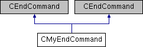

do not remove this div, it is closed by doxygen! 
|  |
| --- |
| NSCL DDAS1.0Support for XIA DDAS at the NSCL |

 end header part 
 Generated by Doxygen 1.8.8 

- [[Main Page|index]]
- [[User Guides|pages]]
- [[Namespaces|namespaces]]
- [[Classes|annotated]]
- [[Files|files]]
- 
  [[|javascript:searchBox.CloseResultsWindow()]]

- [[Class List|annotated]]
- [[Class Index|classes]]
- [[Class Hierarchy|hierarchy]]
- [[Class Members|functions]]

 window showing the filter options 
[[All|javascript:void(0)]][[Classes|javascript:void(0)]][[Namespaces|javascript:void(0)]][[Files|javascript:void(0)]][[Functions|javascript:void(0)]][[Variables|javascript:void(0)]][[Macros|javascript:void(0)]][[Pages|javascript:void(0)]]

 iframe showing the search results (closed by default)

 top 
[Classes](#nested-classes) |
[Public Member Functions](#pub-methods) |
[Static Protected Member Functions](#pro-static-methods) |
[[List of all members|classCMyEndCommand-members]]

CMyEndCommand Class Reference

header
Inheritance diagram for CMyEndCommand:

|  |  |
| --- | --- |
| Classes |
| struct | EndEvent |
|  |

|  |  |
| --- | --- |
| Public Member Functions |
|  | CMyEndCommand(CTCLInterpreter &interp,CMyEventSegment*myevseg) |
|  | Default constructor. |
|  |
|  | ~CMyEndCommand() |
|  | Destructor. |
|  |
| int | transitionToInactive() |
|  |
| int | readOutRemainingData() |
|  |
| int | endRun() |
|  |
| void | rescheduleEndTransition() |
|  |
| void | rescheduleEndRead() |
|  |
| virtual int | operator()(CTCLInterpreter &interp, std::vector< CTCLObject > &objv) |
|  |
|  | CMyEndCommand(CTCLInterpreter &interp,CMyEventSegment*myevseg) |
|  | Default constructor. |
|  |
|  | ~CMyEndCommand() |
|  | Destructor. |
|  |
| virtual int | ExecutePreFunction() |
|  |
| virtual int | ExecutePostFunction() |
|  |
| virtual int | operator()(CTCLInterpreter &interp, std::vector< CTCLObject > &objv) |
|  |

|  |  |
| --- | --- |
| Static Protected Member Functions |
| static int | handleEndRun(Tcl_Event *pEvt, int flags) |
|  |
| static int | handleReadOutRemainingData(Tcl_Event *pEvt, int flags) |
|  |

---

The documentation for this class was generated from the following files:- readout/[[CMyEndCommand.h|CMyEndCommand_8h_source]]
- readout/CMyEndCommand.cpp

 contents 
 start footer part 

---

Generated on Tue Mar 31 2020 12:56:43 for NSCL DDAS by   1.8.8
