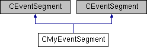

do not remove this div, it is closed by doxygen! 
|  |
| --- |
| NSCL DDAS1.0Support for XIA DDAS at the NSCL |

 end header part 
 Generated by Doxygen 1.8.8 

- [[Main Page|index]]
- [[User Guides|pages]]
- [[Namespaces|namespaces]]
- [[Classes|annotated]]
- [[Files|files]]
- 
  [[|javascript:searchBox.CloseResultsWindow()]]

- [[Class List|annotated]]
- [[Class Index|classes]]
- [[Class Hierarchy|hierarchy]]
- [[Class Members|functions]]

 window showing the filter options 
[[All|javascript:void(0)]][[Classes|javascript:void(0)]][[Namespaces|javascript:void(0)]][[Files|javascript:void(0)]][[Functions|javascript:void(0)]][[Variables|javascript:void(0)]][[Macros|javascript:void(0)]][[Pages|javascript:void(0)]]

 iframe showing the search results (closed by default)

 top 
[Public Member Functions](#pub-methods) |
[[List of all members|classCMyEventSegment-members]]

CMyEventSegment Class Reference

header
Inheritance diagram for CMyEventSegment:

|  |  |
| --- | --- |
| Public Member Functions |
|  | CMyEventSegment(CMyTrigger*trig) |
|  |
| virtual void | initialize() |
|  |
| virtual size_t | read(void *rBuffer, size_t maxwords) |
|  |
| virtual void | disable() |
|  |
| virtual void | clear() |
|  |
| virtual void | onEnd(CExperiment *pExperiment) |
|  |
| int | GetNumberOfModules() |
|  |
| int | GetCrateID() const |
|  |
| bool | IsUniqueEvent(constchannel*event) |
|  |
| void | synchronize() |
|  | Clock synchronization.More... |
|  |
| void | boot(DAQ::DDAS::SystemBooter::BootType=DAQ::DDAS::SystemBooter::FullBoot) |
|  | load fimrware and start boards.More... |
|  |
|  | CMyEventSegment(CMyTrigger*trig) |
|  |
| virtual void | initialize() |
|  |
| virtual size_t | read(void *rBuffer, size_t maxwords) |
|  |
| virtual void | disable() |
|  |
| virtual void | clear() |
|  |
| virtual void | onEnd(CExperiment *pExperiment) |
|  |
| int | GetNumberOfModules() |
|  |
| int | GetCrateID() const |
|  |
| bool | IsUniqueEvent(constchannel*event) |
|  |
| void | boot(DAQ::DDAS::SystemBooter::BootType type=DAQ::DDAS::SystemBooter::FullBoot) |
|  |
| void | synchronize() |
|  |
| void | setTimestampScaleFactor(double value) |
|  |
| double | getTimestampScaleFactor() const |
|  |

## Member Function Documentation

|  |  |  |  |  |  |
| --- | --- | --- | --- | --- | --- |
| void CMyEventSegment::boot | ( | DAQ::DDAS::SystemBooter::BootType | type=DAQ::DDAS::SystemBooter::FullBoot | ) |  |

load fimrware and start boards.

boot Load firmware and start the modules.

Parameters
|  |  |
| --- | --- |
| bootmask | Boot mask passed to boot. |

|  |  |  |  |  |
| --- | --- | --- | --- | --- |
| void CMyEventSegment::synchronize | ( |  | ) |  |

Clock synchronization.

synchronize Perform clock synchronization. This is has been removed from initialize() so that it an be called from the constructor (infinity clock mode), conditionally from initialize() (classic mode) via a command (resynchronized infinity clock mode).

Exceptions
|  |  |
| --- | --- |
| std::runtime_error | - if we fail to talk properly to the module(s). |

---

The documentation for this class was generated from the following files:- readout/[[CMyEventSegment.h|CMyEventSegment_8h_source]]
- readout/CMyEventSegment.cpp

 contents 
 start footer part 

---

Generated on Tue Mar 31 2020 12:56:43 for NSCL DDAS by   1.8.8
