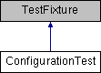

do not remove this div, it is closed by doxygen! 
|  |
| --- |
| NSCL DDAS1.0Support for XIA DDAS at the NSCL |

 end header part 
 Generated by Doxygen 1.8.8 

- [[Main Page|index]]
- [[User Guides|pages]]
- [[Namespaces|namespaces]]
- [[Classes|annotated]]
- [[Files|files]]
- 
  [[|javascript:searchBox.CloseResultsWindow()]]

- [[Class List|annotated]]
- [[Class Index|classes]]
- [[Class Hierarchy|hierarchy]]
- [[Class Members|functions]]

 window showing the filter options 
[[All|javascript:void(0)]][[Classes|javascript:void(0)]][[Namespaces|javascript:void(0)]][[Files|javascript:void(0)]][[Functions|javascript:void(0)]][[Variables|javascript:void(0)]][[Macros|javascript:void(0)]][[Pages|javascript:void(0)]]

 iframe showing the search results (closed by default)

 top 
[Public Member Functions](#pub-methods) |
[[List of all members|classConfigurationTest-members]]

ConfigurationTest Class Reference

header
[[Test|namespaceTest]] some basic logic of the Configuration class.  
 [[More...|classConfigurationTest#details]]

Inheritance diagram for ConfigurationTest:

|  |  |
| --- | --- |
| Public Member Functions |
|  | CPPUNIT_TEST_SUITE(ConfigurationTest) |
|  |
|  | CPPUNIT_TEST(print_0) |
|  |
|  | CPPUNIT_TEST(setModEvtLength_0) |
|  |
|  | CPPUNIT_TEST(setModEvtLength_1) |
|  |
|  | CPPUNIT_TEST(setSlotMap_0) |
|  |
|  | CPPUNIT_TEST(setSlotMap_1) |
|  |
|  | CPPUNIT_TEST(setHardwareMap_0) |
|  |
|  | CPPUNIT_TEST(setHardwareMap_1) |
|  |
|  | CPPUNIT_TEST(setHardwareMap_2) |
|  |
|  | CPPUNIT_TEST_SUITE_END() |
|  |
| void | setUp() |
|  |
| void | tearDown() |
|  |
| void | print_0() |
|  |
| void | setModEvtLength_0() |
|  |
| void | setModEvtLength_1() |
|  |
| void | setSlotMap_0() |
|  |
| void | setSlotMap_1() |
|  |
| void | setHardwareMap_0() |
|  |
| void | setHardwareMap_1() |
|  |
| void | setHardwareMap_2() |
|  |

## Detailed Description

[[Test|namespaceTest]] some basic logic of the Configuration class.

---

The documentation for this class was generated from the following file:- configuration/ConfigurationTest.cpp

 contents 
 start footer part 

---

Generated on Tue Mar 31 2020 12:56:43 for NSCL DDAS by   1.8.8
