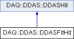

do not remove this div, it is closed by doxygen! 
|  |
| --- |
| NSCL DDAS1.0Support for XIA DDAS at the NSCL |

 end header part 
 Generated by Doxygen 1.8.8 

- [[Main Page|https://github.com/FRIBDAQ/docs/tree/main/ddas-1.1/html/index.md]]
- [[User Guides|https://github.com/FRIBDAQ/docs/tree/main/ddas-1.1/html/pages.md]]
- [[Namespaces|https://github.com/FRIBDAQ/docs/tree/main/ddas-1.1/html/namespaces.md]]
- [[Classes|https://github.com/FRIBDAQ/docs/tree/main/ddas-1.1/html/annotated.md]]
- [[Files|https://github.com/FRIBDAQ/docs/tree/main/ddas-1.1/html/files.md]]
- 
  [[|https://github.com/FRIBDAQ/docs/tree/main/ddas-1.1/html/javascript:searchBox.CloseResultsWindow().md]]

- [[Class List|https://github.com/FRIBDAQ/docs/tree/main/ddas-1.1/html/annotated.md]]
- [[Class Index|https://github.com/FRIBDAQ/docs/tree/main/ddas-1.1/html/classes.md]]
- [[Class Hierarchy|https://github.com/FRIBDAQ/docs/tree/main/ddas-1.1/html/hierarchy.md]]
- [[Class Members|https://github.com/FRIBDAQ/docs/tree/main/ddas-1.1/html/functions.md]]

 window showing the filter options 
[[All|https://github.com/FRIBDAQ/docs/tree/main/ddas-1.1/html/javascript:void(0).md]][[Classes|https://github.com/FRIBDAQ/docs/tree/main/ddas-1.1/html/javascript:void(0).md]][[Namespaces|https://github.com/FRIBDAQ/docs/tree/main/ddas-1.1/html/javascript:void(0).md]][[Files|https://github.com/FRIBDAQ/docs/tree/main/ddas-1.1/html/javascript:void(0).md]][[Functions|https://github.com/FRIBDAQ/docs/tree/main/ddas-1.1/html/javascript:void(0).md]][[Variables|https://github.com/FRIBDAQ/docs/tree/main/ddas-1.1/html/javascript:void(0).md]][[Macros|https://github.com/FRIBDAQ/docs/tree/main/ddas-1.1/html/javascript:void(0).md]][[Pages|https://github.com/FRIBDAQ/docs/tree/main/ddas-1.1/html/javascript:void(0).md]]

 iframe showing the search results (closed by default) 

- **DAQ**
- **DDAS**
- [[DDASFitHit|https://github.com/FRIBDAQ/docs/tree/main/ddas-1.1/html/classDAQ_1_1DDAS_1_1DDASFitHit.md]]

 top 
[Public Member Functions](#pub-methods) |
[[List of all members|https://github.com/FRIBDAQ/docs/tree/main/ddas-1.1/html/classDAQ_1_1DDAS_1_1DDASFitHit-members.md]]

DAQ::DDAS::DDASFitHit Class Reference

header
`#include <DDASFitHit.h>`

Inheritance diagram for DAQ::DDAS::DDASFitHit:

|  |  |
| --- | --- |
| Public Member Functions |
| void | Reset() |
|  |
| void | setExtension(const ::DDAS::HitExtension&extension) |
|  |
| bool | hasExtension() const |
|  |
| const ::DDAS::HitExtension& | getExtension() const |
|  |
| Public Member Functions inherited fromDAQ::DDAS::DDASHit |
|  | DDASHit() |
|  | Default constructor.More... |
|  |
|  | DDASHit(constDDASHit&obj) |
|  | Copy constructor. |
|  |
| DDASHit& | operator=(constDDASHit&obj) |
|  | Assignment operator. |
|  |
| virtual | ~DDASHit() |
|  | Destructor. |
|  |
| void | Reset() |
|  | Resets the state of all member data to that of initialization.More... |
|  |
| uint32_t | GetEnergy() const |
|  | Retrieve the energy.More... |
|  |
| uint32_t | GetTimeHigh() const |
|  | Retrieve most significant 16-bits of raw timestamp. |
|  |
| uint32_t | GetTimeLow() const |
|  | Retrieve least significant 32-bit of raw timestamp. |
|  |
| uint32_t | GetTimeCFD() const |
|  | Retrieve the raw cfd time. |
|  |
| double | GetTime() const |
|  | Retrieve computed time.More... |
|  |
| uint64_t | GetCoarseTime() const |
|  | Retrieve the 48-bit timestamp in nanoseconds without anyCFDcorrection. |
|  |
| uint32_t | GetFinishCode() const |
|  | Retrieve finish code.More... |
|  |
| uint32_t | GetChannelLength() const |
|  | Retrieve number of 32-bit words that were in original data packet.More... |
|  |
| uint32_t | GetChannelLengthHeader() const |
|  | Retrieve length of header in original data packet. |
|  |
| uint32_t | GetOverflowCode() const |
|  | Retrieve the overflow code. |
|  |
| uint32_t | GetSlotID() const |
|  | Retrieve the slot that the module resided in. |
|  |
| uint32_t | GetCrateID() const |
|  | Retrieve the index of the crate the module resided in. |
|  |
| uint32_t | GetChannelID() const |
|  | Retrieve the channel index. |
|  |
| uint32_t | GetModMSPS() const |
|  | Retrieve the ADC frequency of the module. |
|  |
| int | GetHardwareRevision() const |
|  | Retrieve the hardware revision. |
|  |
| int | GetADCResolution() const |
|  | Retrieve the adc resolution. |
|  |
| uint32_t | GetCFDTrigSource() const |
|  |
| uint32_t | GetCFDFailBit() const |
|  |
| uint32_t | GetTraceLength() const |
|  |
| std::vector< uint16_t > & | GetTrace() |
|  |
| const std::vector< uint16_t > & | GetTrace() const |
|  |
| std::vector< uint32_t > & | GetEnergySums() |
|  |
| const std::vector< uint32_t > & | GetEnergySums() const |
|  |
| std::vector< uint32_t > & | GetQDCSums() |
|  |
| const std::vector< uint32_t > & | GetQDCSums() const |
|  |
| uint64_t | GetExternalTimestamp() const |
|  |
| bool | GetADCOverflowUnderflow() const |
|  | Return the adc overflow/underflow status.More... |
|  |
| void | setChannel(uint32_tchannel) |
|  |
| void | setSlot(uint32_t slot) |
|  |
| void | setCrate(uint32_t crate) |
|  |
| void | setChannelHeaderLength(uint32_t channelHeaderLength) |
|  |
| void | setChannelLength(uint32_t channelLength) |
|  |
| void | setOverflowCode(uint32_t overflow) |
|  |
| void | setFinishCode(bool finishCode) |
|  |
| void | setCoarseTime(uint64_t time) |
|  |
| void | setRawCFDTime(uint32_t data) |
|  |
| void | setCFDTrigSourceBit(uint32_t bit) |
|  |
| void | setCFDFailBit(uint32_t bit) |
|  |
| void | setTimeLow(uint32_t datum) |
|  |
| void | setTimeHigh(uint32_t datum) |
|  |
| void | setTime(double time) |
|  |
| void | setEnergy(uint32_t value) |
|  |
| void | setTraceLength(uint32_t trace) |
|  |
| void | setADCFrequency(uint32_t value) |
|  |
| void | setADCResolution(int value) |
|  |
| void | setHardwareRevision(int value) |
|  |
| void | appendEnergySum(uint32_t value) |
|  |
| void | appendQDCSum(uint32_t value) |
|  |
| void | appendTraceSample(uint16_t value) |
|  |
| void | setExternalTimestamp(uint64_t tstamp) |
|  |
| void | setADCOverflowUnderflow(bool state) |
|  |

## Detailed Description

Encapsulates data for ddas hits that may have fitted traces. This is produced by [[FitHitUnpacker::decode|https://github.com/FRIBDAQ/docs/tree/main/ddas-1.1/html/classDAQ_1_1DDAS_1_1FitHitUnpacker.md#a679b859096145c23ee82ceb728899eec]]. This is basically just a [[DDASHit|https://github.com/FRIBDAQ/docs/tree/main/ddas-1.1/html/classDAQ_1_1DDAS_1_1DDASHit.md]] with extra fields.

---

The documentation for this class was generated from the following file:- fits/[[DDASFitHit.h|https://github.com/FRIBDAQ/docs/tree/main/ddas-1.1/html/DDASFitHit_8h_source.md]]

 contents 
 start footer part 

---

Generated on Tue Mar 31 2020 12:56:43 for NSCL DDAS by   1.8.8
