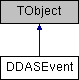

do not remove this div, it is closed by doxygen! 
|  |
| --- |
| NSCL DDAS1.0Support for XIA DDAS at the NSCL |

 end header part 
 Generated by Doxygen 1.8.8 

- [[Main Page|https://github.com/FRIBDAQ/docs/tree/main/ddas-1.1/html/index.md]]
- [[User Guides|https://github.com/FRIBDAQ/docs/tree/main/ddas-1.1/html/pages.md]]
- [[Namespaces|https://github.com/FRIBDAQ/docs/tree/main/ddas-1.1/html/namespaces.md]]
- [[Classes|https://github.com/FRIBDAQ/docs/tree/main/ddas-1.1/html/annotated.md]]
- [[Files|https://github.com/FRIBDAQ/docs/tree/main/ddas-1.1/html/files.md]]
- 
  [[|https://github.com/FRIBDAQ/docs/tree/main/ddas-1.1/html/javascript:searchBox.CloseResultsWindow().md]]

- [[Class List|https://github.com/FRIBDAQ/docs/tree/main/ddas-1.1/html/annotated.md]]
- [[Class Index|https://github.com/FRIBDAQ/docs/tree/main/ddas-1.1/html/classes.md]]
- [[Class Hierarchy|https://github.com/FRIBDAQ/docs/tree/main/ddas-1.1/html/hierarchy.md]]
- [[Class Members|https://github.com/FRIBDAQ/docs/tree/main/ddas-1.1/html/functions.md]]

 window showing the filter options 
[[All|https://github.com/FRIBDAQ/docs/tree/main/ddas-1.1/html/javascript:void(0).md]][[Classes|https://github.com/FRIBDAQ/docs/tree/main/ddas-1.1/html/javascript:void(0).md]][[Namespaces|https://github.com/FRIBDAQ/docs/tree/main/ddas-1.1/html/javascript:void(0).md]][[Files|https://github.com/FRIBDAQ/docs/tree/main/ddas-1.1/html/javascript:void(0).md]][[Functions|https://github.com/FRIBDAQ/docs/tree/main/ddas-1.1/html/javascript:void(0).md]][[Variables|https://github.com/FRIBDAQ/docs/tree/main/ddas-1.1/html/javascript:void(0).md]][[Macros|https://github.com/FRIBDAQ/docs/tree/main/ddas-1.1/html/javascript:void(0).md]][[Pages|https://github.com/FRIBDAQ/docs/tree/main/ddas-1.1/html/javascript:void(0).md]]

 iframe showing the search results (closed by default)

 top 
[Public Member Functions](#pub-methods) |
[[List of all members|https://github.com/FRIBDAQ/docs/tree/main/ddas-1.1/html/classDDASEvent-members.md]]

DDASEvent Class Reference

header
Encapsulates a Built DDAS event.  
 [[More...|https://github.com/FRIBDAQ/docs/tree/main/ddas-1.1/html/classDDASEvent.md#details]]

`#include <DDASEvent.h>`

Inheritance diagram for DDASEvent:

|  |  |
| --- | --- |
| Public Member Functions |
|  | DDASEvent() |
|  | Default constructor. |
|  |
|  | DDASEvent(constDDASEvent&obj) |
|  | Copy constructor.More... |
|  |
| DDASEvent& | operator=(constDDASEvent&obj) |
|  | Assignment operator.More... |
|  |
|  | ~DDASEvent() |
|  | Destructor.More... |
|  |
| std::vector<ddaschannel* > & | GetData() |
|  | Access internal, extensible array of channel data.More... |
|  |
| void | AddChannelData(ddaschannel*channel) |
|  | Append channel data to event.More... |
|  |
| UInt_t | GetNEvents() const |
|  | Get number of channel-wise data in event. |
|  |
| Double_t | GetFirstTime() const |
|  | Get timestamp of first channel datum.More... |
|  |
| Double_t | GetLastTime() const |
|  | Get timestamp of last channel datum.More... |
|  |
| Double_t | GetTimeWidth() const |
|  | Get time difference between first and last channel data.More... |
|  |
| void | Reset() |
|  | Clear data vector and reset event Deletes the ddaschannel data objects and resets the size of the extensible data array to zero. |
|  |
|  | ClassDef(DDASEvent, 1) |
|  |

## Detailed Description

Encapsulates a Built DDAS event.

Any data that was written to disk downstream of the NSCLDAQ event builder will have a "built" structure. What that means is that the body of the physics event item will contain data from more than one DDAS event. The [[DDASEvent|https://github.com/FRIBDAQ/docs/tree/main/ddas-1.1/html/classDDASEvent.md]] class represents this type of data. It provides access to the events that make it up through the ddaschannel objects it owns and then also provides some useful methods for getting data from the event as a whole.

## Constructor & Destructor Documentation

|  |  |  |  |  |  |
| --- | --- | --- | --- | --- | --- |
| DDASEvent::DDASEvent | ( | constDDASEvent& | obj | ) |  |

Copy constructor.

Implements a deep copy

|  |  |  |  |  |
| --- | --- | --- | --- | --- |
| DDASEvent::~DDASEvent | ( |  | ) |  |

Destructor.

Deletes the ddaschannel data objects!

## Member Function Documentation

|  |  |  |  |  |  |
| --- | --- | --- | --- | --- | --- |
| void DDASEvent::AddChannelData | ( | ddaschannel* | channel | ) |  |

Append channel data to event.

Appends the pointer to the internal, extensible data array. There is no check that the object pointed to by the argument exists, so that it is the user's responsibility to implement.

- Parameters
  |  |  |
  | --- | --- |
  | channel | pointer to a ddaschannel object |

|  |  |  |  |  |  |  |
| --- | --- | --- | --- | --- | --- | --- |
| std::vector<ddaschannel*>& DDASEvent::GetData() | std::vector<ddaschannel*>& DDASEvent::GetData | ( |  | ) |  | inline |
| std::vector<ddaschannel*>& DDASEvent::GetData | ( |  | ) |  |

Access internal, extensible array of channel data.

- Returns
  reference to the data

|  |  |  |  |  |
| --- | --- | --- | --- | --- |
| Double_t DDASEvent::GetFirstTime | ( |  | ) | const |

Get timestamp of first channel datum.

If data exists return timestamp of first element in the array. This should be the earliest unit of data stored by this object. If no data exists, returns 0.

|  |  |  |  |  |
| --- | --- | --- | --- | --- |
| Double_t DDASEvent::GetLastTime | ( |  | ) | const |

Get timestamp of last channel datum.

If data exists return timestamp of last element in the array. This should be the most recent unit of data stored by this object. If no data exists, returns 0.

|  |  |  |  |  |
| --- | --- | --- | --- | --- |
| Double_t DDASEvent::GetTimeWidth | ( |  | ) | const |

Get time difference between first and last channel data.

If data exists return timestamp of first and last units of data stored by this object. If no data exists, return 0;

|  |  |  |  |  |  |
| --- | --- | --- | --- | --- | --- |
| DDASEvent& DDASEvent::operator= | ( | constDDASEvent& | obj | ) |  |

Assignment operator.

Performs a deep copy of the data belonging to obj. There is no attempt to make this exception-safe.

---

The documentation for this class was generated from the following files:- ddasdumper/[[DDASEvent.h|https://github.com/FRIBDAQ/docs/tree/main/ddas-1.1/html/DDASEvent_8h_source.md]]
- ddasdumper/DDASEvent.cpp

 contents 
 start footer part 

---

Generated on Tue Mar 31 2020 12:56:43 for NSCL DDAS by   1.8.8
