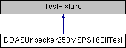

do not remove this div, it is closed by doxygen! 
|  |
| --- |
| NSCL DDAS1.0Support for XIA DDAS at the NSCL |

 end header part 
 Generated by Doxygen 1.8.8 

- [[index]]
- [[pages]]
- [[namespaces]]
- [[annotated]]
- [[files]]
- 
  [[javascript:searchBox.CloseResultsWindow()]]

- [[annotated]]
- [[classes]]
- [[hierarchy]]
- [[functions]]

 window showing the filter options 
[[javascript:void(0)]][[javascript:void(0)]][[javascript:void(0)]][[javascript:void(0)]][[javascript:void(0)]][[javascript:void(0)]][[javascript:void(0)]][[javascript:void(0)]]

 iframe showing the search results (closed by default)

 top 
[Public Member Functions](#pub-methods) |
[[classDDASUnpacker250MSPS16BitTest-members]]

DDASUnpacker250MSPS16BitTest Class Reference

header
Inheritance diagram for DDASUnpacker250MSPS16BitTest:

|  |  |
| --- | --- |
| Public Member Functions |
|  | CPPUNIT_TEST_SUITE(DDASUnpacker250MSPS16BitTest) |
|  |
|  | CPPUNIT_TEST(msps_0) |
|  |
|  | CPPUNIT_TEST(rev_0) |
|  |
|  | CPPUNIT_TEST(resolution_0) |
|  |
|  | CPPUNIT_TEST(coarseTime_0) |
|  |
|  | CPPUNIT_TEST(time_0) |
|  |
|  | CPPUNIT_TEST(cfdFail_0) |
|  |
|  | CPPUNIT_TEST(cfdTrigSource_0) |
|  |
|  | CPPUNIT_TEST(traceLength_0) |
|  |
|  | CPPUNIT_TEST(trace_0) |
|  |
|  | CPPUNIT_TEST_SUITE_END() |
|  |
| void | setUp() |
|  |
| void | tearDown() |
|  |
| void | msps_0() |
|  |
| void | rev_0() |
|  |
| void | resolution_0() |
|  |
| void | coarseTime_0() |
|  |
| void | time_0() |
|  |
| void | cfdFail_0() |
|  |
| void | cfdTrigSource_0() |
|  |
| void | traceLength_0() |
|  |
| void | trace_0() |
|  |
| void | overflowUnderflow_0() |
|  |

---

The documentation for this class was generated from the following file:- format/DDASUnpackerTest250MSPS16Bit.cpp

 contents 
 start footer part 

---

Generated on Tue Mar 31 2020 12:56:43 for NSCL DDAS by   1.8.8
