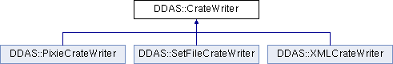

do not remove this div, it is closed by doxygen! 
|  |
| --- |
| NSCL DDAS1.0Support for XIA DDAS at the NSCL |

 end header part 
 Generated by Doxygen 1.8.8 

- [[index]]
- [[pages]]
- [[namespaces]]
- [[annotated]]
- [[files]]
- 
  [[javascript:searchBox.CloseResultsWindow()]]

- [[annotated]]
- [[classes]]
- [[hierarchy]]
- [[functions]]

 window showing the filter options 
[[javascript:void(0)]][[javascript:void(0)]][[javascript:void(0)]][[javascript:void(0)]][[javascript:void(0)]][[javascript:void(0)]][[javascript:void(0)]][[javascript:void(0)]]

 iframe showing the search results (closed by default) 

- **DDAS**
- [[classDDAS_1_1CrateWriter]]

 top 
[Public Member Functions](#pub-methods) |
[Protected Attributes](#pro-attribs) |
[[classDDAS_1_1CrateWriter-members]]

DDAS::CrateWriter Class Referenceabstract

header
`#include <CrateWriter.h>`

Inheritance diagram for DDAS::CrateWriter:

|  |  |
| --- | --- |
| Public Member Functions |
|  | CrateWriter(constCrate&settings) |
|  |
| virtual void | write() |
|  |
| virtual void | startCrate(int id, const std::vector< unsigned short > &slots)=0 |
|  |
| virtual void | endCrate(int id, const std::vector< unsigned short > &slots)=0 |
|  |
| virtualSettingsWriter* | getWriter(unsigned short slotNum)=0 |
|  |

|  |  |
| --- | --- |
| Protected Attributes |
| Crate | m_settings |
|  |

## Detailed Description

Writes a crate worth of stuff to a destination. This abstract base class provides a strategy pattern.

---

The documentation for this class was generated from the following file:- xml/[[CrateWriter_8h_source]]

 contents 
 start footer part 

---

Generated on Tue Mar 31 2020 12:56:43 for NSCL DDAS by   1.8.8
