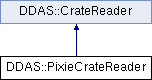

do not remove this div, it is closed by doxygen! 
|  |
| --- |
| NSCL DDAS1.0Support for XIA DDAS at the NSCL |

 end header part 
 Generated by Doxygen 1.8.8 

- [[index]]
- [[pages]]
- [[namespaces]]
- [[annotated]]
- [[files]]
- 
  [[javascript:searchBox.CloseResultsWindow()]]

- [[annotated]]
- [[classes]]
- [[hierarchy]]
- [[functions]]

 window showing the filter options 
[[javascript:void(0)]][[javascript:void(0)]][[javascript:void(0)]][[javascript:void(0)]][[javascript:void(0)]][[javascript:void(0)]][[javascript:void(0)]][[javascript:void(0)]]

 iframe showing the search results (closed by default) 

- **DDAS**
- [[classDDAS_1_1PixieCrateReader]]

 top 
[Public Member Functions](#pub-methods) |
[[classDDAS_1_1PixieCrateReader-members]]

DDAS::PixieCrateReader Class Reference

header
`#include <PixieCrateReader.h>`

Inheritance diagram for DDAS::PixieCrateReader:

|  |  |
| --- | --- |
| Public Member Functions |
|  | PixieCrateReader(unsigned crate, const std::vector< unsigned short > &slots) |
|  |
| virtual | ~PixieCrateReader() |
|  |
| virtualSettingsReader* | createReader(unsigned short slot) |
|  |
| Public Member Functions inherited fromDDAS::CrateReader |
|  | CrateReader(unsigned crate, const std::vector< unsigned short > &slots) |
|  |
| virtual | ~CrateReader() |
|  |
| virtualCrate | readCrate() |
|  |

|  |  |
| --- | --- |
| Additional Inherited Members |
| Protected Attributes inherited fromDDAS::CrateReader |
| std::vector< unsigned short > | m_slots |
|  |
| unsigned | m_crateId |
|  |

## Detailed Description

This is a crate reader that reads the configuration of an entire crate from the Pixie/cPCI crate. Caveats:

- The crate id passed in at construction time is used for the crate id regardless of the crate id configured in the modules.
- The slots parameters must be the same as those passed into the Pixie16InitSystem or the [[classDDAS_1_1CrateManager]] constructor if that's being used.

## Constructor & Destructor Documentation

|  |  |  |  |
| --- | --- | --- | --- |
| DDAS::PixieCrateReader::PixieCrateReader | ( | unsigned | crate, |
|  |  | const std::vector< unsigned short > & | slots |
|  | ) |  |  |

constructor Just initializes the base class:

Parameters
|  |  |
| --- | --- |
| crate | - id of the crate. |
| slots | - Vector of slots. |

|  |  |  |  |  |  |  |
| --- | --- | --- | --- | --- | --- | --- |
| DDAS::PixieCrateReader::~PixieCrateReader() | DDAS::PixieCrateReader::~PixieCrateReader | ( |  | ) |  | virtual |
| DDAS::PixieCrateReader::~PixieCrateReader | ( |  | ) |  |

destructor Release the crate manager.

## Member Function Documentation

|  |  |  |  |  |  |  |  |
| --- | --- | --- | --- | --- | --- | --- | --- |
| SettingsReader* DDAS::PixieCrateReader::createReader(unsigned shortslot) | SettingsReader* DDAS::PixieCrateReader::createReader | ( | unsigned short | slot | ) |  | virtual |
| SettingsReader* DDAS::PixieCrateReader::createReader | ( | unsigned short | slot | ) |  |

createReader Creates a reader for a single slot. We just need to translate the slot number to a module id. The module id is the corresponding index in the m_slots vector.

Parameters
|  |  |
| --- | --- |
| slot | - slot number to create a reader for. |

ReturnsSettingsReader* - pointer to a dynamically created Pixie settings reader object. 
Implements [[classDDAS_1_1CrateReader]].

---

The documentation for this class was generated from the following files:- xml/[[PixieCrateReader_8h_source]]
- xml/[[PixieCrateReader_8cpp]]

 contents 
 start footer part 

---

Generated on Tue Mar 31 2020 12:56:43 for NSCL DDAS by   1.8.8
