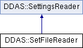

do not remove this div, it is closed by doxygen! 
|  |
| --- |
| NSCL DDAS1.0Support for XIA DDAS at the NSCL |

 end header part 
 Generated by Doxygen 1.8.8 

- [[Main Page|index]]
- [[User Guides|pages]]
- [[Namespaces|namespaces]]
- [[Classes|annotated]]
- [[Files|files]]
- 
  [[|javascript:searchBox.CloseResultsWindow()]]

- [[Class List|annotated]]
- [[Class Index|classes]]
- [[Class Hierarchy|hierarchy]]
- [[Class Members|functions]]

 window showing the filter options 
[[All|javascript:void(0)]][[Classes|javascript:void(0)]][[Namespaces|javascript:void(0)]][[Files|javascript:void(0)]][[Functions|javascript:void(0)]][[Variables|javascript:void(0)]][[Macros|javascript:void(0)]][[Pages|javascript:void(0)]]

 iframe showing the search results (closed by default) 

- **DDAS**
- [[SetFileReader|classDDAS_1_1SetFileReader]]

 top 
[Public Member Functions](#pub-methods) |
[[List of all members|classDDAS_1_1SetFileReader-members]]

DDAS::SetFileReader Class Reference

header
Inheritance diagram for DDAS::SetFileReader:

|  |  |
| --- | --- |
| Public Member Functions |
|  | SetFileReader(const char *setfile, const char *varfile, unsigned Mhz, unsigned slot) |
|  |
| virtualDDAS::ModuleSettings | get() |
|  |

## Constructor & Destructor Documentation

|  |  |  |  |
| --- | --- | --- | --- |
| DDAS::SetFileReader::SetFileReader | ( | const char * | setfile, |
|  |  | const char * | varfile, |
|  |  | unsigned | MHz, |
|  |  | unsigned | slot |
|  | ) |  |  |

constructor

Parameters
|  |  |
| --- | --- |
| setfile | - path to setfile. |
| varfile | - Path to the variable file. |
| Mhz | - Digitizer speed in Mhz. |
| slot | - Number of the slot in the DSP Para file we want. |

## Member Function Documentation

|  |  |  |  |  |  |  |
| --- | --- | --- | --- | --- | --- | --- |
| DDAS::ModuleSettingsDDAS::SetFileReader::get() | DDAS::ModuleSettingsDDAS::SetFileReader::get | ( |  | ) |  | virtual |
| DDAS::ModuleSettingsDDAS::SetFileReader::get | ( |  | ) |  |

get Gets all module settings from the set file. A set file actually has up to 24 module settings. To get them all we assume that they are exactly end to end and that the last item in each setfile is a module level thing (they actually do that for us).

Returnsstd::vector<ModuleSettings> - the module settings for each item. 
Implements [[DDAS::SettingsReader|classDDAS_1_1SettingsReader]].

---

The documentation for this class was generated from the following files:- xml/[[SetFileReader.h|SetFileReader_8h_source]]
- xml/[[SetFileReader.cpp|SetFileReader_8cpp]]

 contents 
 start footer part 

---

Generated on Tue Mar 31 2020 12:56:43 for NSCL DDAS by   1.8.8
