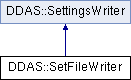

do not remove this div, it is closed by doxygen! 
|  |
| --- |
| NSCL DDAS1.0Support for XIA DDAS at the NSCL |

 end header part 
 Generated by Doxygen 1.8.8 

- [[Main Page|index]]
- [[User Guides|pages]]
- [[Namespaces|namespaces]]
- [[Classes|annotated]]
- [[Files|files]]
- 
  [[|javascript:searchBox.CloseResultsWindow()]]

- [[Class List|annotated]]
- [[Class Index|classes]]
- [[Class Hierarchy|hierarchy]]
- [[Class Members|functions]]

 window showing the filter options 
[[All|javascript:void(0)]][[Classes|javascript:void(0)]][[Namespaces|javascript:void(0)]][[Files|javascript:void(0)]][[Functions|javascript:void(0)]][[Variables|javascript:void(0)]][[Macros|javascript:void(0)]][[Pages|javascript:void(0)]]

 iframe showing the search results (closed by default) 

- **DDAS**
- [[SetFileWriter|classDDAS_1_1SetFileWriter]]

 top 
[Public Member Functions](#pub-methods) |
[[List of all members|classDDAS_1_1SetFileWriter-members]]

DDAS::SetFileWriter Class Reference

header
`#include <SetFileWriter.h>`

Inheritance diagram for DDAS::SetFileWriter:

|  |  |
| --- | --- |
| Public Member Functions |
|  | SetFileWriter(SetFileEditor&editor, unsigned short slot, unsigned short Mhz) |
|  |
| virtual void | write(constModuleSettings&dspSettings) |
|  |

## Detailed Description

Given a slot number and a set file editor, writes the settings from our internal format into the set file's chunk for that module.

## Constructor & Destructor Documentation

|  |  |  |  |
| --- | --- | --- | --- |
| DDAS::SetFileWriter::SetFileWriter | ( | SetFileEditor& | editor, |
|  |  | unsigned short | slot, |
|  |  | unsigned short | Mhz |
|  | ) |  |  |

constructor

- Parameters
  |  |  |
  | --- | --- |
  | m_editor | - references a set file m_editor. |
  | slot | -Slotwe are writing. |
  | Mhz | - Speed of the module in MHz. Needed to convert from internal -> module parameters. |

## Member Function Documentation

|  |  |  |  |  |  |  |  |
| --- | --- | --- | --- | --- | --- | --- | --- |
| void DDAS::SetFileWriter::write(constModuleSettings&dspSettings) | void DDAS::SetFileWriter::write | ( | constModuleSettings& | dspSettings | ) |  | virtual |
| void DDAS::SetFileWriter::write | ( | constModuleSettings& | dspSettings | ) |  |

write Writes the settings described by the parameter to the slot of the set file we've been given.

- Parameters
  |  |  |
  | --- | --- |
  | dspSettings | - Settings information. |

Implements [[DDAS::SettingsWriter|classDDAS_1_1SettingsWriter]].

---

The documentation for this class was generated from the following files:- xml/[[SetFileWriter.h|SetFileWriter_8h_source]]
- xml/[[SetFileWriter.cpp|SetFileWriter_8cpp]]

 contents 
 start footer part 

---

Generated on Tue Mar 31 2020 12:56:43 for NSCL DDAS by   1.8.8
