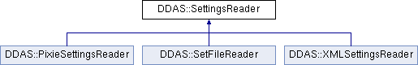

do not remove this div, it is closed by doxygen! 
|  |
| --- |
| NSCL DDAS1.0Support for XIA DDAS at the NSCL |

 end header part 
 Generated by Doxygen 1.8.8 

- [[Main Page|https://github.com/FRIBDAQ/docs/tree/main/ddas-1.1/html/index.md]]
- [[User Guides|https://github.com/FRIBDAQ/docs/tree/main/ddas-1.1/html/pages.md]]
- [[Namespaces|https://github.com/FRIBDAQ/docs/tree/main/ddas-1.1/html/namespaces.md]]
- [[Classes|https://github.com/FRIBDAQ/docs/tree/main/ddas-1.1/html/annotated.md]]
- [[Files|https://github.com/FRIBDAQ/docs/tree/main/ddas-1.1/html/files.md]]
- 
  [[|https://github.com/FRIBDAQ/docs/tree/main/ddas-1.1/html/javascript:searchBox.CloseResultsWindow().md]]

- [[Class List|https://github.com/FRIBDAQ/docs/tree/main/ddas-1.1/html/annotated.md]]
- [[Class Index|https://github.com/FRIBDAQ/docs/tree/main/ddas-1.1/html/classes.md]]
- [[Class Hierarchy|https://github.com/FRIBDAQ/docs/tree/main/ddas-1.1/html/hierarchy.md]]
- [[Class Members|https://github.com/FRIBDAQ/docs/tree/main/ddas-1.1/html/functions.md]]

 window showing the filter options 
[[All|https://github.com/FRIBDAQ/docs/tree/main/ddas-1.1/html/javascript:void(0).md]][[Classes|https://github.com/FRIBDAQ/docs/tree/main/ddas-1.1/html/javascript:void(0).md]][[Namespaces|https://github.com/FRIBDAQ/docs/tree/main/ddas-1.1/html/javascript:void(0).md]][[Files|https://github.com/FRIBDAQ/docs/tree/main/ddas-1.1/html/javascript:void(0).md]][[Functions|https://github.com/FRIBDAQ/docs/tree/main/ddas-1.1/html/javascript:void(0).md]][[Variables|https://github.com/FRIBDAQ/docs/tree/main/ddas-1.1/html/javascript:void(0).md]][[Macros|https://github.com/FRIBDAQ/docs/tree/main/ddas-1.1/html/javascript:void(0).md]][[Pages|https://github.com/FRIBDAQ/docs/tree/main/ddas-1.1/html/javascript:void(0).md]]

 iframe showing the search results (closed by default) 

- **DDAS**
- [[SettingsReader|https://github.com/FRIBDAQ/docs/tree/main/ddas-1.1/html/classDDAS_1_1SettingsReader.md]]

 top 
[Public Member Functions](#pub-methods) |
[[List of all members|https://github.com/FRIBDAQ/docs/tree/main/ddas-1.1/html/classDDAS_1_1SettingsReader-members.md]]

DDAS::SettingsReader Class Referenceabstract

header
`#include <SettingsReader.h>`

Inheritance diagram for DDAS::SettingsReader:

|  |  |
| --- | --- |
| Public Member Functions |
| virtualDDAS::ModuleSettings | get()=0 |
|  |

## Detailed Description

SettingReader objects are able to take some source of DDAS Setings and turn them into a ModuleSettins struct. Derived classes could get this information from .set files, from the modules in a crate themselves or event from EPICS or a database. Note that an external entity must have initializd the API and read in the var files for this module (normally done in a [[CrateManager|https://github.com/FRIBDAQ/docs/tree/main/ddas-1.1/html/classDDAS_1_1CrateManager.md]]).

---

The documentation for this class was generated from the following file:- xml/[[SettingsReader.h|https://github.com/FRIBDAQ/docs/tree/main/ddas-1.1/html/SettingsReader_8h_source.md]]

 contents 
 start footer part 

---

Generated on Tue Mar 31 2020 12:56:43 for NSCL DDAS by   1.8.8
