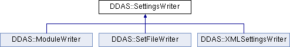

do not remove this div, it is closed by doxygen! 
|  |
| --- |
| NSCL DDAS1.0Support for XIA DDAS at the NSCL |

 end header part 
 Generated by Doxygen 1.8.8 

- [[index]]
- [[pages]]
- [[namespaces]]
- [[annotated]]
- [[files]]
- 
  [[javascript:searchBox.CloseResultsWindow()]]

- [[annotated]]
- [[classes]]
- [[hierarchy]]
- [[functions]]

 window showing the filter options 
[[javascript:void(0)]][[javascript:void(0)]][[javascript:void(0)]][[javascript:void(0)]][[javascript:void(0)]][[javascript:void(0)]][[javascript:void(0)]][[javascript:void(0)]]

 iframe showing the search results (closed by default) 

- **DDAS**
- [[classDDAS_1_1SettingsWriter]]

 top 
[Public Member Functions](#pub-methods) |
[[classDDAS_1_1SettingsWriter-members]]

DDAS::SettingsWriter Class Referenceabstract

header
`#include <ModuleWriter.h>`

Inheritance diagram for DDAS::SettingsWriter:

|  |  |
| --- | --- |
| Public Member Functions |
| virtual void | write(constModuleSettings&dspSettings)=0 |
|  |

## Detailed Description

Class that writes settings data to modules attached to the system. The vector of module settings define what's written this allows for module level granularity on settings written to the module.

Abstract base class for writing settings data to something. The idea is that this can be subclassed to write this data in any of a number of ways. Typically the concrete class's constructor will connect the object to some sink (e.g. file or database or maybe even crate) and the write method would be used to actually output the settings to that sink.

---

The documentation for this class was generated from the following file:- xml/[[SettingsWriter_8h_source]]

 contents 
 start footer part 

---

Generated on Tue Mar 31 2020 12:56:43 for NSCL DDAS by   1.8.8
