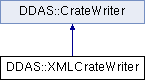

do not remove this div, it is closed by doxygen! 
|  |
| --- |
| NSCL DDAS1.0Support for XIA DDAS at the NSCL |

 end header part 
 Generated by Doxygen 1.8.8 

- [[Main Page|index]]
- [[User Guides|pages]]
- [[Namespaces|namespaces]]
- [[Classes|annotated]]
- [[Files|files]]
- 
  [[|javascript:searchBox.CloseResultsWindow()]]

- [[Class List|annotated]]
- [[Class Index|classes]]
- [[Class Hierarchy|hierarchy]]
- [[Class Members|functions]]

 window showing the filter options 
[[All|javascript:void(0)]][[Classes|javascript:void(0)]][[Namespaces|javascript:void(0)]][[Files|javascript:void(0)]][[Functions|javascript:void(0)]][[Variables|javascript:void(0)]][[Macros|javascript:void(0)]][[Pages|javascript:void(0)]]

 iframe showing the search results (closed by default) 

- **DDAS**
- [[XMLCrateWriter|classDDAS_1_1XMLCrateWriter]]

 top 
[Classes](#nested-classes) |
[Public Member Functions](#pub-methods) |
[[List of all members|classDDAS_1_1XMLCrateWriter-members]]

DDAS::XMLCrateWriter Class Reference

header
`#include <XMLCrateWriter.h>`

Inheritance diagram for DDAS::XMLCrateWriter:

|  |  |
| --- | --- |
| Classes |
| struct | ModuleInformation |
|  |

|  |  |
| --- | --- |
| Public Member Functions |
|  | XMLCrateWriter(std::string crateFile, constCrate&settings, const std::vector<ModuleInformation> &metadata) |
|  |
| virtual | ~XMLCrateWriter() |
|  |
| virtual void | startCrate(int id, const std::vector< unsigned short > &slots) |
|  |
| virtual void | endCrate(int id, const std::vector< unsigned short > &slots) |
|  |
| virtualSettingsWriter* | getWriter(unsigned short slotNum) |
|  |
| Public Member Functions inherited fromDDAS::CrateWriter |
|  | CrateWriter(constCrate&settings) |
|  |
| virtual void | write() |
|  |

|  |  |
| --- | --- |
| Additional Inherited Members |
| Protected Attributes inherited fromDDAS::CrateWriter |
| Crate | m_settings |
|  |

## Detailed Description

Writes a crate worth of settings via XML This requires a few things:

- A crate file to which to write the top level definitions.
- A description of the stuff to write at top level. The second one is somewhat problematic. Each slot has a <slot> tag in the main file that contains several bits of mandatory information and potentially optional information. Mandatory information is the

[[Slot|structDDAS_1_1Slot]] number for the module (comes from the base class)

- evtlen for the module
- configuration file into which the module settings are written Optional parameters:
- fifo_threshold for the module, defines what it is that makes a module 'trigger' the read.
- infinity_clock - boolean true, if the module is run with infinity clock mode
- timestamp_scale - Multiplier for the timestamps emitted.
- external_clock - Boolean, true if the module uses external clock. All but the external_clock must come external to the settings. Therefore, when the [[XMLCrateWriter|classDDAS_1_1XMLCrateWriter]] is constructed, substantial additiona information must be provided for each module.

See the [[ModuleInformation|structDDAS_1_1XMLCrateWriter_1_1ModuleInformation]] struct in the class for that.

## Constructor & Destructor Documentation

|  |  |  |  |
| --- | --- | --- | --- |
| DDAS::XMLCrateWriter::XMLCrateWriter | ( | std::string | crateFile, |
|  |  | constCrate& | settings, |
|  |  | const std::vector<ModuleInformation> & | metadata |
|  | ) |  |  |

constructor We just save the data for now.

Parameters
|  |  |
| --- | --- |
| crateFile | - Where we're going to write the crate file. |
| settings | - Settings info (passed to the base class). |
| metadata | - Per slot metadata for the <slot> tag. |

|  |  |  |  |  |  |  |
| --- | --- | --- | --- | --- | --- | --- |
| DDAS::XMLCrateWriter::~XMLCrateWriter() | DDAS::XMLCrateWriter::~XMLCrateWriter | ( |  | ) |  | virtual |
| DDAS::XMLCrateWriter::~XMLCrateWriter | ( |  | ) |  |

destructor Kill off the XMLPrinter if it's still alive.

## Member Function Documentation

|  |  |  |  |  |  |  |  |  |  |  |  |  |  |
| --- | --- | --- | --- | --- | --- | --- | --- | --- | --- | --- | --- | --- | --- |
| void DDAS::XMLCrateWriter::endCrate(intid,const std::vector< unsigned short > &slots) | void DDAS::XMLCrateWriter::endCrate | ( | int | id, |  |  | const std::vector< unsigned short > & | slots |  | ) |  |  | virtual |
| void DDAS::XMLCrateWriter::endCrate | ( | int | id, |
|  |  | const std::vector< unsigned short > & | slots |
|  | ) |  |  |

endCrate Called when the entire crate has been writeen out.

- Close the top level element.
- Open the crate file.
- Write the XML string from the printer.
- delete the printer and set m_pPrinter -> nullptr. (this allows multiple writes). Parameters
  |  |  |
  | --- | --- |
  | id | - crate id. |
  | slots | - slot map. |

Implements [[DDAS::CrateWriter|classDDAS_1_1CrateWriter]].

|  |  |  |  |  |  |  |  |
| --- | --- | --- | --- | --- | --- | --- | --- |
| SettingsWriter* DDAS::XMLCrateWriter::getWriter(unsigned shortslot) | SettingsWriter* DDAS::XMLCrateWriter::getWriter | ( | unsigned short | slot | ) |  | virtual |
| SettingsWriter* DDAS::XMLCrateWriter::getWriter | ( | unsigned short | slot | ) |  |

getWriter Our responsibility from the point of view of the base class is to produce an [[XMLSettingsWriter|classDDAS_1_1XMLSettingsWriter]] for it to write the settings file for a single module. Additionally, we need to add a <slot> tag to the crate file. To do this we need to:

- open the tag,
- Write the slot attribute.
- Figure out the id of the slot and look up the corresponding [[ModuleInformation|structDDAS_1_1XMLCrateWriter_1_1ModuleInformation]] record.
- Use the module info record to write the remaining attributes.
- Close the <slot> tag. We can use the filename in the [[ModuleSettings|structDDAS_1_1ModuleSettings]] to create the settings writer which we pass back to the caller.

Parameters
|  |  |
| --- | --- |
| slotNum | - number of the slot to write. |

Implements [[DDAS::CrateWriter|classDDAS_1_1CrateWriter]].

|  |  |  |  |  |  |  |  |  |  |  |  |  |  |
| --- | --- | --- | --- | --- | --- | --- | --- | --- | --- | --- | --- | --- | --- |
| void DDAS::XMLCrateWriter::startCrate(intid,const std::vector< unsigned short > &slots) | void DDAS::XMLCrateWriter::startCrate | ( | int | id, |  |  | const std::vector< unsigned short > & | slots |  | ) |  |  | virtual |
| void DDAS::XMLCrateWriter::startCrate | ( | int | id, |
|  |  | const std::vector< unsigned short > & | slots |
|  | ) |  |  |

startCrate

- Create the printer to print to strings.
- Open the crate tag giving it the crate id. Notes:
- Each slot tag is issued in GetWriter.
- The XMLPrinter is opened in string mode.
- On end crate, the crate file is opened and the XML string written to it. Parameters
  |  |  |
  | --- | --- |
  | id | - Id of the crate. |
  | slots | (unused) slot map of the crate. |

Implements [[DDAS::CrateWriter|classDDAS_1_1CrateWriter]].

---

The documentation for this class was generated from the following files:- xml/[[XMLCrateWriter.h|XMLCrateWriter_8h_source]]
- xml/[[XMLCrateWriter.cpp|XMLCrateWriter_8cpp]]

 contents 
 start footer part 

---

Generated on Tue Mar 31 2020 12:56:43 for NSCL DDAS by   1.8.8
