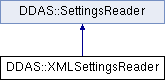

do not remove this div, it is closed by doxygen! 
|  |
| --- |
| NSCL DDAS1.0Support for XIA DDAS at the NSCL |

 end header part 
 Generated by Doxygen 1.8.8 

- [[Main Page|index]]
- [[User Guides|pages]]
- [[Namespaces|namespaces]]
- [[Classes|annotated]]
- [[Files|files]]
- 
  [[|javascript:searchBox.CloseResultsWindow()]]

- [[Class List|annotated]]
- [[Class Index|classes]]
- [[Class Hierarchy|hierarchy]]
- [[Class Members|functions]]

 window showing the filter options 
[[All|javascript:void(0)]][[Classes|javascript:void(0)]][[Namespaces|javascript:void(0)]][[Files|javascript:void(0)]][[Functions|javascript:void(0)]][[Variables|javascript:void(0)]][[Macros|javascript:void(0)]][[Pages|javascript:void(0)]]

 iframe showing the search results (closed by default) 

- **DDAS**
- [[XMLSettingsReader|classDDAS_1_1XMLSettingsReader]]

 top 
[Public Member Functions](#pub-methods) |
[[List of all members|classDDAS_1_1XMLSettingsReader-members]]

DDAS::XMLSettingsReader Class Reference

header
`#include <XMLSettingsReader.h>`

Inheritance diagram for DDAS::XMLSettingsReader:

|  |  |
| --- | --- |
| Public Member Functions |
|  | XMLSettingsReader(const char *filename) |
|  |
| virtual | ~XMLSettingsReader() |
|  |
| virtualDDAS::ModuleSettings | get() |
|  |

## Detailed Description

This class is a settings reader that can read XML Setings files. Two types of settings files can be read:

- Individual module settings files - these contain settings for a specific module. They have a <Module>/</Module> structure.
- Create settings files - These contain setings for a several modules, typically a single crate worth of modules. These have a <Crate></Crate> structure.

For the structure of module files see [[XMLSettingsWriter.h|XMLSettingsWriter_8h]] and its description of the [[XMLSettingsWriter|classDDAS_1_1XMLSettingsWriter]] class. The structure of [[Crate|structDDAS_1_1Crate]] definition files is pretty simple:

<Crate> <Module id="n' fileref="path-to-module-file" /> ... </Crate>

That is for each module, in the crate, there's a module tag that specifies the module id (numbered from 0) and a reference to the XML module file that configures that module.

## Constructor & Destructor Documentation

|  |  |  |  |  |  |
| --- | --- | --- | --- | --- | --- |
| DDAS::XMLSettingsReader::XMLSettingsReader | ( | const char * | file | ) |  |

constructor Save the module file for later.

Parameters
|  |  |
| --- | --- |
| filename | - name of the XML file to process. |

|  |  |  |  |  |  |  |
| --- | --- | --- | --- | --- | --- | --- |
| DDAS::XMLSettingsReader::~XMLSettingsReader() | DDAS::XMLSettingsReader::~XMLSettingsReader | ( |  | ) |  | virtual |
| DDAS::XMLSettingsReader::~XMLSettingsReader | ( |  | ) |  |

destructor Just kill off the documents in m_modules

## Member Function Documentation

|  |  |  |  |  |  |  |
| --- | --- | --- | --- | --- | --- | --- |
| ModuleSettingsDDAS::XMLSettingsReader::get() | ModuleSettingsDDAS::XMLSettingsReader::get | ( |  | ) |  | virtual |
| ModuleSettingsDDAS::XMLSettingsReader::get | ( |  | ) |  |

get Return the module settings for all of the documents stored. The first element of the pair in m_modules will be substituted into the s_modId field overriding the value in the XML.

Returnsstd::vector<ModuleSettings> - the settings. 
Implements [[DDAS::SettingsReader|classDDAS_1_1SettingsReader]].

---

The documentation for this class was generated from the following files:- xml/[[XMLSettingsReader.h|XMLSettingsReader_8h_source]]
- xml/[[XMLSettingsReader.cpp|XMLSettingsReader_8cpp]]

 contents 
 start footer part 

---

Generated on Tue Mar 31 2020 12:56:43 for NSCL DDAS by   1.8.8
