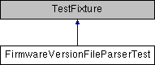

do not remove this div, it is closed by doxygen! 
|  |
| --- |
| NSCL DDAS1.0Support for XIA DDAS at the NSCL |

 end header part 
 Generated by Doxygen 1.8.8 

- [[Main Page|https://github.com/FRIBDAQ/docs/tree/main/ddas-1.1/html/index.md]]
- [[User Guides|https://github.com/FRIBDAQ/docs/tree/main/ddas-1.1/html/pages.md]]
- [[Namespaces|https://github.com/FRIBDAQ/docs/tree/main/ddas-1.1/html/namespaces.md]]
- [[Classes|https://github.com/FRIBDAQ/docs/tree/main/ddas-1.1/html/annotated.md]]
- [[Files|https://github.com/FRIBDAQ/docs/tree/main/ddas-1.1/html/files.md]]
- 
  [[|https://github.com/FRIBDAQ/docs/tree/main/ddas-1.1/html/javascript:searchBox.CloseResultsWindow().md]]

- [[Class List|https://github.com/FRIBDAQ/docs/tree/main/ddas-1.1/html/annotated.md]]
- [[Class Index|https://github.com/FRIBDAQ/docs/tree/main/ddas-1.1/html/classes.md]]
- [[Class Hierarchy|https://github.com/FRIBDAQ/docs/tree/main/ddas-1.1/html/hierarchy.md]]
- [[Class Members|https://github.com/FRIBDAQ/docs/tree/main/ddas-1.1/html/functions.md]]

 window showing the filter options 
[[All|https://github.com/FRIBDAQ/docs/tree/main/ddas-1.1/html/javascript:void(0).md]][[Classes|https://github.com/FRIBDAQ/docs/tree/main/ddas-1.1/html/javascript:void(0).md]][[Namespaces|https://github.com/FRIBDAQ/docs/tree/main/ddas-1.1/html/javascript:void(0).md]][[Files|https://github.com/FRIBDAQ/docs/tree/main/ddas-1.1/html/javascript:void(0).md]][[Functions|https://github.com/FRIBDAQ/docs/tree/main/ddas-1.1/html/javascript:void(0).md]][[Variables|https://github.com/FRIBDAQ/docs/tree/main/ddas-1.1/html/javascript:void(0).md]][[Macros|https://github.com/FRIBDAQ/docs/tree/main/ddas-1.1/html/javascript:void(0).md]][[Pages|https://github.com/FRIBDAQ/docs/tree/main/ddas-1.1/html/javascript:void(0).md]]

 iframe showing the search results (closed by default)

 top 
[Public Member Functions](#pub-methods) |
[Public Attributes](#pub-attribs) |
[[List of all members|https://github.com/FRIBDAQ/docs/tree/main/ddas-1.1/html/classFirmwareVersionFileParserTest-members.md]]

FirmwareVersionFileParserTest Class Reference

header
Tests for the FirmwareVersionFileParser class.  
 [[More...|https://github.com/FRIBDAQ/docs/tree/main/ddas-1.1/html/classFirmwareVersionFileParserTest.md#details]]

Inheritance diagram for FirmwareVersionFileParserTest:

|  |  |
| --- | --- |
| Public Member Functions |
|  | CPPUNIT_TEST_SUITE(FirmwareVersionFileParserTest) |
|  |
|  | CPPUNIT_TEST(parse_0a) |
|  |
|  | CPPUNIT_TEST(parse_0b) |
|  |
|  | CPPUNIT_TEST(parse_0c) |
|  |
|  | CPPUNIT_TEST(parse_1a) |
|  |
|  | CPPUNIT_TEST(parse_1b) |
|  |
|  | CPPUNIT_TEST(parse_1c) |
|  |
|  | CPPUNIT_TEST(parse_2a) |
|  |
|  | CPPUNIT_TEST(parse_2b) |
|  |
|  | CPPUNIT_TEST(parse_2c) |
|  |
|  | CPPUNIT_TEST(parse_3a) |
|  |
|  | CPPUNIT_TEST(parse_3b) |
|  |
|  | CPPUNIT_TEST(parse_3c) |
|  |
|  | CPPUNIT_TEST(parse_4) |
|  |
|  | CPPUNIT_TEST(parse_5) |
|  |
|  | CPPUNIT_TEST(parse_6) |
|  |
|  | CPPUNIT_TEST(parse_7) |
|  |
|  | CPPUNIT_TEST(parse_8) |
|  |
|  | CPPUNIT_TEST(parse_9) |
|  |
|  | CPPUNIT_TEST(parse_10) |
|  |
|  | CPPUNIT_TEST(parse_11) |
|  |
|  | CPPUNIT_TEST(parse_12) |
|  |
|  | CPPUNIT_TEST(parse_13) |
|  |
|  | CPPUNIT_TEST(parse_14) |
|  |
|  | CPPUNIT_TEST(parse_15) |
|  |
|  | CPPUNIT_TEST(parse_16) |
|  |
|  | CPPUNIT_TEST(parse_17) |
|  |
|  | CPPUNIT_TEST(parse_18) |
|  |
|  | CPPUNIT_TEST(parse_19) |
|  |
|  | CPPUNIT_TEST(parse_20) |
|  |
|  | CPPUNIT_TEST(parse_21) |
|  |
|  | CPPUNIT_TEST(parse_22) |
|  |
|  | CPPUNIT_TEST(parse_23) |
|  |
|  | CPPUNIT_TEST(parse_24) |
|  |
|  | CPPUNIT_TEST(parse_25) |
|  |
|  | CPPUNIT_TEST(parse_26) |
|  |
|  | CPPUNIT_TEST(parse_27) |
|  |
|  | CPPUNIT_TEST(parse_28) |
|  |
|  | CPPUNIT_TEST(parse_29) |
|  |
|  | CPPUNIT_TEST(parse_30) |
|  |
|  | CPPUNIT_TEST(parse_31) |
|  |
|  | CPPUNIT_TEST_SUITE_END() |
|  |
| void | setUp() |
|  |
| void | tearDown() |
|  |
| vector< string > | createSampleFileContent() |
|  |
| string | mergeLines(const vector< string > &content) |
|  |
| string | createSampleStream() |
|  |
| void | parse_0a() |
|  |
| void | parse_0b() |
|  |
| void | parse_0c() |
|  |
| void | parse_1a() |
|  |
| void | parse_1b() |
|  |
| void | parse_1c() |
|  |
| void | parse_2a() |
|  |
| void | parse_2b() |
|  |
| void | parse_2c() |
|  |
| void | parse_3a() |
|  |
| void | parse_3b() |
|  |
| void | parse_3c() |
|  |
| void | parse_4() |
|  |
| void | parse_5() |
|  |
| void | parse_6() |
|  |
| void | parse_7() |
|  |
| void | parse_8() |
|  |
| void | parse_9() |
|  |
| void | parse_10() |
|  |
| void | parse_11() |
|  |
| void | parse_12() |
|  |
| void | parse_13() |
|  |
| void | parse_14() |
|  |
| void | parse_15() |
|  |
| void | parse_16() |
|  |
| void | parse_17() |
|  |
| void | parse_18() |
|  |
| void | parse_19() |
|  |
| void | parse_20() |
|  |
| void | parse_21() |
|  |
| void | parse_22() |
|  |
| void | parse_23() |
|  |
| void | parse_24() |
|  |
| void | parse_25() |
|  |
| void | parse_26() |
|  |
| void | parse_27() |
|  |
| void | parse_28() |
|  |
| void | parse_29() |
|  |
| void | parse_30() |
|  |
| void | parse_31() |
|  |

|  |  |
| --- | --- |
| Public Attributes |
| Configuration | m_config |
|  |

## Detailed Description

Tests for the FirmwareVersionFileParser class.

---

The documentation for this class was generated from the following file:- configuration/FirmwareVersionFileParserTest.cpp

 contents 
 start footer part 

---

Generated on Tue Mar 31 2020 12:56:43 for NSCL DDAS by   1.8.8
