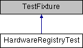

do not remove this div, it is closed by doxygen! 
|  |
| --- |
| NSCL DDAS1.0Support for XIA DDAS at the NSCL |

 end header part 
 Generated by Doxygen 1.8.8 

- [[index]]
- [[pages]]
- [[namespaces]]
- [[annotated]]
- [[files]]
- 
  [[javascript:searchBox.CloseResultsWindow()]]

- [[annotated]]
- [[classes]]
- [[hierarchy]]
- [[functions]]

 window showing the filter options 
[[javascript:void(0)]][[javascript:void(0)]][[javascript:void(0)]][[javascript:void(0)]][[javascript:void(0)]][[javascript:void(0)]][[javascript:void(0)]][[javascript:void(0)]]

 iframe showing the search results (closed by default)

 top 
[Public Member Functions](#pub-methods) |
[[classHardwareRegistryTest-members]]

HardwareRegistryTest Class Reference

header
Tests for the ModEvtFileParser class.  
 [[classHardwareRegistryTest#details]]

Inheritance diagram for HardwareRegistryTest:

|  |  |
| --- | --- |
| Public Member Functions |
|  | CPPUNIT_TEST_SUITE(HardwareRegistryTest) |
|  |
|  | CPPUNIT_TEST(resetToDefaults_0) |
|  |
|  | CPPUNIT_TEST(getSpecification_0a) |
|  |
|  | CPPUNIT_TEST(getSpecification_0b) |
|  |
|  | CPPUNIT_TEST(getSpecification_0c) |
|  |
|  | CPPUNIT_TEST(getSpecification_1) |
|  |
|  | CPPUNIT_TEST(getSpecification_2) |
|  |
|  | CPPUNIT_TEST(getSpecification_3) |
|  |
|  | CPPUNIT_TEST(getSpecification_4) |
|  |
|  | CPPUNIT_TEST(getSpecification_5) |
|  |
|  | CPPUNIT_TEST(getSpecification_6) |
|  |
|  | CPPUNIT_TEST(getSpecification_7) |
|  |
|  | CPPUNIT_TEST(configureHardwareType_0) |
|  |
|  | CPPUNIT_TEST(computeHardwareType_0) |
|  |
|  | CPPUNIT_TEST(computeHardwareType_1) |
|  |
|  | CPPUNIT_TEST(computeHardwareType_2) |
|  |
|  | CPPUNIT_TEST(computeHardwareType_3) |
|  |
|  | CPPUNIT_TEST(computeHardwareType_4) |
|  |
|  | CPPUNIT_TEST(computeHardwareType_5) |
|  |
|  | CPPUNIT_TEST(computeHardwareType_6) |
|  |
|  | CPPUNIT_TEST(computeHardwareType_7) |
|  |
|  | CPPUNIT_TEST(computeHardwareType_8) |
|  |
|  | CPPUNIT_TEST(computeHardwareType_9) |
|  |
|  | CPPUNIT_TEST(computeHardwareType_10) |
|  |
|  | CPPUNIT_TEST(createHardwareType_0) |
|  |
|  | CPPUNIT_TEST(computeHardwareType_11) |
|  |
|  | CPPUNIT_TEST(createHardwareType_1) |
|  |
|  | CPPUNIT_TEST_SUITE_END() |
|  |
| void | setUp() |
|  |
| void | tearDown() |
|  |
| void | resetToDefaults_0() |
|  |
| void | getSpecification_0a() |
|  |
| void | getSpecification_0b() |
|  |
| void | getSpecification_0c() |
|  |
| void | getSpecification_1() |
|  |
| void | getSpecification_2() |
|  |
| void | getSpecification_3() |
|  |
| void | getSpecification_4() |
|  |
| void | getSpecification_5() |
|  |
| void | getSpecification_6() |
|  |
| void | getSpecification_7() |
|  |
| void | configureHardwareType_0() |
|  |
| void | computeHardwareType_0() |
|  |
| void | computeHardwareType_1() |
|  |
| void | computeHardwareType_2() |
|  |
| void | computeHardwareType_3() |
|  |
| void | computeHardwareType_4() |
|  |
| void | computeHardwareType_5() |
|  |
| void | computeHardwareType_6() |
|  |
| void | computeHardwareType_7() |
|  |
| void | computeHardwareType_8() |
|  |
| void | computeHardwareType_9() |
|  |
| void | computeHardwareType_10() |
|  |
| void | computeHardwareType_11() |
|  |
| void | createHardwareType_0() |
|  |
| void | createHardwareType_1() |
|  |

## Detailed Description

Tests for the ModEvtFileParser class.

---

The documentation for this class was generated from the following file:- configuration/HardwareRegistryTests.cpp

 contents 
 start footer part 

---

Generated on Tue Mar 31 2020 12:56:43 for NSCL DDAS by   1.8.8
