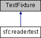

do not remove this div, it is closed by doxygen! 
|  |
| --- |
| NSCL DDAS1.0Support for XIA DDAS at the NSCL |

 end header part 
 Generated by Doxygen 1.8.8 

- [[index]]
- [[pages]]
- [[namespaces]]
- [[annotated]]
- [[files]]
- 
  [[javascript:searchBox.CloseResultsWindow()]]

- [[annotated]]
- [[classes]]
- [[hierarchy]]
- [[functions]]

 window showing the filter options 
[[javascript:void(0)]][[javascript:void(0)]][[javascript:void(0)]][[javascript:void(0)]][[javascript:void(0)]][[javascript:void(0)]][[javascript:void(0)]][[javascript:void(0)]]

 iframe showing the search results (closed by default)

 top 
[Public Member Functions](#pub-methods) |
[Protected Member Functions](#pro-methods) |
[[classsfcreadertest-members]]

sfcreadertest Class Reference

header
Inheritance diagram for sfcreadertest:

|  |  |
| --- | --- |
| Public Member Functions |
| void | setUp() |
|  |
| void | teardDown() |
|  |

|  |  |
| --- | --- |
| Protected Member Functions |
| void | read_1() |
|  |
| void | read_2() |
|  |
| void | read_3() |
|  |
| void | read_4() |
|  |
| void | read_5() |
|  |
| void | read_6() |
|  |
| void | read_7() |
|  |
| void | read_8() |
|  |
| void | read_9() |
|  |
| void | read_10() |
|  |

---

The documentation for this class was generated from the following file:- xml/setcratereadertests.cpp

 contents 
 start footer part 

---

Generated on Tue Mar 31 2020 12:56:43 for NSCL DDAS by   1.8.8
