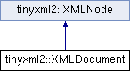

do not remove this div, it is closed by doxygen! 
|  |
| --- |
| NSCL DDAS1.0Support for XIA DDAS at the NSCL |


 end header part 
 Generated by Doxygen 1.8.8 

- [[Main Page|https://github.com/FRIBDAQ/docs/tree/main/ddas-1.1/html/index.md]]
- [[User Guides|https://github.com/FRIBDAQ/docs/tree/main/ddas-1.1/html/pages.md]]
- [[Namespaces|https://github.com/FRIBDAQ/docs/tree/main/ddas-1.1/html/namespaces.md]]
- [[Classes|https://github.com/FRIBDAQ/docs/tree/main/ddas-1.1/html/annotated.md]]
- [[Files|https://github.com/FRIBDAQ/docs/tree/main/ddas-1.1/html/files.md]]
- 
  [[|https://github.com/FRIBDAQ/docs/tree/main/ddas-1.1/html/javascript:searchBox.CloseResultsWindow().md]]


- [[Class List|https://github.com/FRIBDAQ/docs/tree/main/ddas-1.1/html/annotated.md]]
- [[Class Index|https://github.com/FRIBDAQ/docs/tree/main/ddas-1.1/html/classes.md]]
- [[Class Hierarchy|https://github.com/FRIBDAQ/docs/tree/main/ddas-1.1/html/hierarchy.md]]
- [[Class Members|https://github.com/FRIBDAQ/docs/tree/main/ddas-1.1/html/functions.md]]


 window showing the filter options 
[[All|https://github.com/FRIBDAQ/docs/tree/main/ddas-1.1/html/javascript:void(0).md]][[Classes|https://github.com/FRIBDAQ/docs/tree/main/ddas-1.1/html/javascript:void(0).md]][[Namespaces|https://github.com/FRIBDAQ/docs/tree/main/ddas-1.1/html/javascript:void(0).md]][[Files|https://github.com/FRIBDAQ/docs/tree/main/ddas-1.1/html/javascript:void(0).md]][[Functions|https://github.com/FRIBDAQ/docs/tree/main/ddas-1.1/html/javascript:void(0).md]][[Variables|https://github.com/FRIBDAQ/docs/tree/main/ddas-1.1/html/javascript:void(0).md]][[Macros|https://github.com/FRIBDAQ/docs/tree/main/ddas-1.1/html/javascript:void(0).md]][[Pages|https://github.com/FRIBDAQ/docs/tree/main/ddas-1.1/html/javascript:void(0).md]]


 iframe showing the search results (closed by default) 


- **tinyxml2**
- [[XMLDocument|https://github.com/FRIBDAQ/docs/tree/main/ddas-1.1/html/classtinyxml2_1_1XMLDocument.md]]

 top 
[Classes](#nested-classes) |
[Public Member Functions](#pub-methods) |
[Static Public Member Functions](#pub-static-methods) |
[Friends](#friends) |
[[List of all members|https://github.com/FRIBDAQ/docs/tree/main/ddas-1.1/html/classtinyxml2_1_1XMLDocument-members.md]]


tinyxml2::XMLDocument Class Reference

header
`#include <tinyxml2.h>`


Inheritance diagram for tinyxml2::XMLDocument:





|  |  |
| --- | --- |
| Public Member Functions |
|  | XMLDocument(bool processEntities=true, Whitespace whitespaceMode=PRESERVE_WHITESPACE) |
|  | constructor |
|  |
| virtualXMLDocument* | ToDocument() |
|  | Safely cast to a Document, or null. |
|  |
| virtual constXMLDocument* | ToDocument() const |
|  |
| XMLError | Parse(const char *xml, size_t nBytes=static_cast< size_t >(-1)) |
|  |
| XMLError | LoadFile(const char *filename) |
|  |
| XMLError | LoadFile(FILE *) |
|  |
| XMLError | SaveFile(const char *filename, bool compact=false) |
|  |
| XMLError | SaveFile(FILE *fp, bool compact=false) |
|  |
| bool | ProcessEntities() const |
|  |
| Whitespace | WhitespaceMode() const |
|  |
| bool | HasBOM() const |
|  |
| void | SetBOM(bool useBOM) |
|  |
| XMLElement* | RootElement() |
|  |
| constXMLElement* | RootElement() const |
|  |
| void | Print(XMLPrinter*streamer=0) const |
|  |
| virtual bool | Accept(XMLVisitor*visitor) const |
|  |
| XMLElement* | NewElement(const char *name) |
|  |
| XMLComment* | NewComment(const char *comment) |
|  |
| XMLText* | NewText(const char *text) |
|  |
| XMLDeclaration* | NewDeclaration(const char *text=0) |
|  |
| XMLUnknown* | NewUnknown(const char *text) |
|  |
| void | DeleteNode(XMLNode*node) |
|  |
| void | ClearError() |
|  |
| bool | Error() const |
|  | Return true if there was an error parsing the document. |
|  |
| XMLError | ErrorID() const |
|  | Return the errorID. |
|  |
| const char * | ErrorName() const |
|  |
| const char * | ErrorStr() const |
|  |
| void | PrintError() const |
|  | A (trivial) utility function that prints theErrorStr()to stdout. |
|  |
| int | ErrorLineNum() const |
|  | Return the line where the error occurred, or zero if unknown. |
|  |
| void | Clear() |
|  | Clear the document, resetting it to the initial state. |
|  |
| void | DeepCopy(XMLDocument*target) const |
|  |
| char * | Identify(char *p,XMLNode**node) |
|  |
| void | MarkInUse(XMLNode*) |
|  |
| virtualXMLNode* | ShallowClone(XMLDocument*) const |
|  |
| virtual bool | ShallowEqual(constXMLNode*) const |
|  |
| Public Member Functions inherited fromtinyxml2::XMLNode |
| constXMLDocument* | GetDocument() const |
|  | Get theXMLDocumentthat owns thisXMLNode. |
|  |
| XMLDocument* | GetDocument() |
|  | Get theXMLDocumentthat owns thisXMLNode. |
|  |
| virtualXMLElement* | ToElement() |
|  | Safely cast to an Element, or null. |
|  |
| virtualXMLText* | ToText() |
|  | Safely cast to Text, or null. |
|  |
| virtualXMLComment* | ToComment() |
|  | Safely cast to a Comment, or null. |
|  |
| virtualXMLDeclaration* | ToDeclaration() |
|  | Safely cast to a Declaration, or null. |
|  |
| virtualXMLUnknown* | ToUnknown() |
|  | Safely cast to an Unknown, or null. |
|  |
| virtual constXMLElement* | ToElement() const |
|  |
| virtual constXMLText* | ToText() const |
|  |
| virtual constXMLComment* | ToComment() const |
|  |
| virtual constXMLDeclaration* | ToDeclaration() const |
|  |
| virtual constXMLUnknown* | ToUnknown() const |
|  |
| const char * | Value() const |
|  |
| void | SetValue(const char *val, bool staticMem=false) |
|  |
| int | GetLineNum() const |
|  | Gets the line number the node is in, if the document was parsed from a file. |
|  |
| constXMLNode* | Parent() const |
|  | Get the parent of this node on the DOM. |
|  |
| XMLNode* | Parent() |
|  |
| bool | NoChildren() const |
|  | Returns true if this node has no children. |
|  |
| constXMLNode* | FirstChild() const |
|  | Get the first child node, or null if none exists. |
|  |
| XMLNode* | FirstChild() |
|  |
| constXMLElement* | FirstChildElement(const char *name=0) const |
|  |
| XMLElement* | FirstChildElement(const char *name=0) |
|  |
| constXMLNode* | LastChild() const |
|  | Get the last child node, or null if none exists. |
|  |
| XMLNode* | LastChild() |
|  |
| constXMLElement* | LastChildElement(const char *name=0) const |
|  |
| XMLElement* | LastChildElement(const char *name=0) |
|  |
| constXMLNode* | PreviousSibling() const |
|  | Get the previous (left) sibling node of this node. |
|  |
| XMLNode* | PreviousSibling() |
|  |
| constXMLElement* | PreviousSiblingElement(const char *name=0) const |
|  | Get the previous (left) sibling element of this node, with an optionally supplied name. |
|  |
| XMLElement* | PreviousSiblingElement(const char *name=0) |
|  |
| constXMLNode* | NextSibling() const |
|  | Get the next (right) sibling node of this node. |
|  |
| XMLNode* | NextSibling() |
|  |
| constXMLElement* | NextSiblingElement(const char *name=0) const |
|  | Get the next (right) sibling element of this node, with an optionally supplied name. |
|  |
| XMLElement* | NextSiblingElement(const char *name=0) |
|  |
| XMLNode* | InsertEndChild(XMLNode*addThis) |
|  |
| XMLNode* | LinkEndChild(XMLNode*addThis) |
|  |
| XMLNode* | InsertFirstChild(XMLNode*addThis) |
|  |
| XMLNode* | InsertAfterChild(XMLNode*afterThis,XMLNode*addThis) |
|  |
| void | DeleteChildren() |
|  |
| void | DeleteChild(XMLNode*node) |
|  |
| XMLNode* | DeepClone(XMLDocument*target) const |
|  |
| void | SetUserData(void *userData) |
|  |
| void * | GetUserData() const |
|  |

|  |  |
| --- | --- |
| Static Public Member Functions |
| static const char * | ErrorIDToName(XMLError errorID) |
|  |

|  |  |
| --- | --- |
| Friends |
| class | XMLElement |
|  |
| class | XMLNode |
|  |
| class | XMLText |
|  |
| class | XMLComment |
|  |
| class | XMLDeclaration |
|  |
| class | XMLUnknown |
|  |

|  |  |
| --- | --- |
| Additional Inherited Members |
| Protected Member Functions inherited fromtinyxml2::XMLNode |
|  | XMLNode(XMLDocument*) |
|  |
| virtual char * | ParseDeep(char *p,StrPair*parentEndTag, int *curLineNumPtr) |
|  |
| Protected Attributes inherited fromtinyxml2::XMLNode |
| XMLDocument* | _document |
|  |
| XMLNode* | _parent |
|  |
| StrPair | _value |
|  |
| int | _parseLineNum |
|  |
| XMLNode* | _firstChild |
|  |
| XMLNode* | _lastChild |
|  |
| XMLNode* | _prev |
|  |
| XMLNode* | _next |
|  |
| void * | _userData |
|  |


<a name="details"></a>## Detailed Description


A Document binds together all the functionality. It can be saved, loaded, and printed to the screen. All Nodes are connected and allocated to a Document. If the Document is deleted, all its Nodes are also deleted.

## Member Function Documentation


|  |  |  |  |  |  |  |  |
| --- | --- | --- | --- | --- | --- | --- | --- |
| bool tinyxml2::XMLDocument::Accept(XMLVisitor*visitor)const | bool tinyxml2::XMLDocument::Accept | ( | XMLVisitor* | visitor | ) | const | virtual |
| bool tinyxml2::XMLDocument::Accept | ( | XMLVisitor* | visitor | ) | const |

Accept a hierarchical visit of the nodes in the TinyXML-2 DOM. Every node in the XML tree will be conditionally visited and the host will be called back via the [[XMLVisitor|https://github.com/FRIBDAQ/docs/tree/main/ddas-1.1/html/classtinyxml2_1_1XMLVisitor.md]] interface.


This is essentially a SAX interface for TinyXML-2. (Note however it doesn't re-parse the XML for the callbacks, so the performance of TinyXML-2 is unchanged by using this interface versus any other.)


The interface has been based on ideas from:


- [http://www.saxproject.org/](http://www.saxproject.org/)
- [http://c2.com/cgi/wiki?HierarchicalVisitorPattern](http://c2.com/cgi/wiki?HierarchicalVisitorPattern)


Which are both good references for "visiting".


An example of using [[Accept()|https://github.com/FRIBDAQ/docs/tree/main/ddas-1.1/html/classtinyxml2_1_1XMLDocument.md#aa08503d24898bf9992ae5e5fb8b0cf87]]:

```
XMLPrinter printer;
tinyxmlDoc.Accept( &printer );
const char* xmlcstr = printer.CStr();

```


Implements [[tinyxml2::XMLNode|https://github.com/FRIBDAQ/docs/tree/main/ddas-1.1/html/classtinyxml2_1_1XMLNode.md#a81e66df0a44c67a7af17f3b77a152785]].


|  |  |  |  |  |  |
| --- | --- | --- | --- | --- | --- |
| void tinyxml2::XMLDocument::DeepCopy | ( | XMLDocument* | target | ) | const |

Copies this document to a target document. The target will be completely cleared before the copy. If you want to copy a sub-tree, see [[XMLNode::DeepClone()|https://github.com/FRIBDAQ/docs/tree/main/ddas-1.1/html/classtinyxml2_1_1XMLNode.md#aac9830f503ff38b6f9f7ea7f48b8adee]].


NOTE: that the 'target' must be non-null.


|  |  |  |  |  |  |
| --- | --- | --- | --- | --- | --- |
| void tinyxml2::XMLDocument::DeleteNode | ( | XMLNode* | node | ) |  |

Delete a node associated with this document. It will be unlinked from the DOM.


|  |  |  |  |  |
| --- | --- | --- | --- | --- |
| const char * tinyxml2::XMLDocument::ErrorStr | ( |  | ) | const |

Returns a "long form" error description. A hopefully helpful diagnostic with location, line number, and/or additional info.


|  |  |  |  |  |  |  |
| --- | --- | --- | --- | --- | --- | --- |
| bool tinyxml2::XMLDocument::HasBOM()const | bool tinyxml2::XMLDocument::HasBOM | ( |  | ) | const | inline |
| bool tinyxml2::XMLDocument::HasBOM | ( |  | ) | const |

Returns true if this document has a leading Byte Order Mark of UTF8.


|  |  |  |  |  |  |
| --- | --- | --- | --- | --- | --- |
| XMLError tinyxml2::XMLDocument::LoadFile | ( | const char * | filename | ) |  |

Load an XML file from disk. Returns XML_SUCCESS (0) on success, or an errorID.


|  |  |  |  |  |  |
| --- | --- | --- | --- | --- | --- |
| XMLError tinyxml2::XMLDocument::LoadFile | ( | FILE * | fp | ) |  |

Load an XML file from disk. You are responsible for providing and closing the FILE*.


NOTE: The file should be opened as binary ("rb") not text in order for TinyXML-2 to correctly do newline normalization.


Returns XML_SUCCESS (0) on success, or an errorID.


|  |  |  |  |  |  |
| --- | --- | --- | --- | --- | --- |
| XMLComment* tinyxml2::XMLDocument::NewComment | ( | const char * | comment | ) |  |

Create a new Comment associated with this Document. The memory for the Comment is managed by the Document.


|  |  |  |  |  |  |
| --- | --- | --- | --- | --- | --- |
| XMLDeclaration* tinyxml2::XMLDocument::NewDeclaration | ( | const char * | text=0 | ) |  |

Create a new Declaration associated with this Document. The memory for the object is managed by the Document.


If the 'text' param is null, the standard declaration is used.:

```
        <?xml version="1.0" encoding="UTF-8"?>

```


|  |  |  |  |  |  |
| --- | --- | --- | --- | --- | --- |
| XMLElement* tinyxml2::XMLDocument::NewElement | ( | const char * | name | ) |  |

Create a new Element associated with this Document. The memory for the Element is managed by the Document.


|  |  |  |  |  |  |
| --- | --- | --- | --- | --- | --- |
| XMLText* tinyxml2::XMLDocument::NewText | ( | const char * | text | ) |  |

Create a new Text associated with this Document. The memory for the Text is managed by the Document.


|  |  |  |  |  |  |
| --- | --- | --- | --- | --- | --- |
| XMLUnknown* tinyxml2::XMLDocument::NewUnknown | ( | const char * | text | ) |  |

Create a new Unknown associated with this Document. The memory for the object is managed by the Document.


|  |  |  |  |
| --- | --- | --- | --- |
| XMLError tinyxml2::XMLDocument::Parse | ( | const char * | xml, |
|  |  | size_t | nBytes=static_cast<size_t>(-1) |
|  | ) |  |  |

Parse an XML file from a character string. Returns XML_SUCCESS (0) on success, or an errorID.


You may optionally pass in the 'nBytes', which is the number of bytes which will be parsed. If not specified, TinyXML-2 will assume 'xml' points to a null terminated string.


|  |  |  |  |  |  |
| --- | --- | --- | --- | --- | --- |
| void tinyxml2::XMLDocument::Print | ( | XMLPrinter* | streamer=0 | ) | const |

Print the Document. If the Printer is not provided, it will print to stdout. If you provide Printer, this can print to a file:

```
XMLPrinter printer( fp );
doc.Print( &printer );

```

Or you can use a printer to print to memory:

```
XMLPrinter printer;
doc.Print( &printer );
// printer.CStr() has a const char* to the XML

```


|  |  |  |  |  |  |  |
| --- | --- | --- | --- | --- | --- | --- |
| XMLElement* tinyxml2::XMLDocument::RootElement() | XMLElement* tinyxml2::XMLDocument::RootElement | ( |  | ) |  | inline |
| XMLElement* tinyxml2::XMLDocument::RootElement | ( |  | ) |  |

Return the root element of DOM. Equivalent to [[FirstChildElement()|https://github.com/FRIBDAQ/docs/tree/main/ddas-1.1/html/classtinyxml2_1_1XMLNode.md#a4a38e0da23f4d97673a86c77d5cae5c2]]. To get the first node, use FirstChild().


|  |  |  |  |
| --- | --- | --- | --- |
| XMLError tinyxml2::XMLDocument::SaveFile | ( | const char * | filename, |
|  |  | bool | compact=false |
|  | ) |  |  |

Save the XML file to disk. Returns XML_SUCCESS (0) on success, or an errorID.


|  |  |  |  |
| --- | --- | --- | --- |
| XMLError tinyxml2::XMLDocument::SaveFile | ( | FILE * | fp, |
|  |  | bool | compact=false |
|  | ) |  |  |

Save the XML file to disk. You are responsible for providing and closing the FILE*.


Returns XML_SUCCESS (0) on success, or an errorID.


|  |  |  |  |  |  |  |  |
| --- | --- | --- | --- | --- | --- | --- | --- |
| void tinyxml2::XMLDocument::SetBOM(booluseBOM) | void tinyxml2::XMLDocument::SetBOM | ( | bool | useBOM | ) |  | inline |
| void tinyxml2::XMLDocument::SetBOM | ( | bool | useBOM | ) |  |

Sets whether to write the BOM when writing the file.


|  |  |  |  |  |  |  |  |
| --- | --- | --- | --- | --- | --- | --- | --- |
| virtualXMLNode* tinyxml2::XMLDocument::ShallowClone(XMLDocument*document)const | virtualXMLNode* tinyxml2::XMLDocument::ShallowClone | ( | XMLDocument* | document | ) | const | inlinevirtual |
| virtualXMLNode* tinyxml2::XMLDocument::ShallowClone | ( | XMLDocument* | document | ) | const |

Make a copy of this node, but not its children. You may pass in a Document pointer that will be the owner of the new Node. If the 'document' is null, then the node returned will be allocated from the current Document. (this->[[GetDocument()|https://github.com/FRIBDAQ/docs/tree/main/ddas-1.1/html/classtinyxml2_1_1XMLNode.md#af343d1ef0b45c0020e62d784d7e67a68]])


Note: if called on a [[XMLDocument|https://github.com/FRIBDAQ/docs/tree/main/ddas-1.1/html/classtinyxml2_1_1XMLDocument.md]], this will return null.


Implements [[tinyxml2::XMLNode|https://github.com/FRIBDAQ/docs/tree/main/ddas-1.1/html/classtinyxml2_1_1XMLNode.md#a8402cbd3129d20e9e6024bbcc0531283]].


|  |  |  |  |  |  |  |  |
| --- | --- | --- | --- | --- | --- | --- | --- |
| virtual bool tinyxml2::XMLDocument::ShallowEqual(constXMLNode*compare)const | virtual bool tinyxml2::XMLDocument::ShallowEqual | ( | constXMLNode* | compare | ) | const | inlinevirtual |
| virtual bool tinyxml2::XMLDocument::ShallowEqual | ( | constXMLNode* | compare | ) | const |

[[Test|https://github.com/FRIBDAQ/docs/tree/main/ddas-1.1/html/namespaceTest.md]] if 2 nodes are the same, but don't test children. The 2 nodes do not need to be in the same Document.


Note: if called on a [[XMLDocument|https://github.com/FRIBDAQ/docs/tree/main/ddas-1.1/html/classtinyxml2_1_1XMLDocument.md]], this will return false.


Implements [[tinyxml2::XMLNode|https://github.com/FRIBDAQ/docs/tree/main/ddas-1.1/html/classtinyxml2_1_1XMLNode.md#a7ce18b751c3ea09eac292dca264f9226]].


---

The documentation for this class was generated from the following files:- xml/tinyxml/[[tinyxml2.h|https://github.com/FRIBDAQ/docs/tree/main/ddas-1.1/html/tinyxml2_8h_source.md]]
- xml/tinyxml/tinyxml2.cpp

 contents 
 start footer part 

---


Generated on Tue Mar 31 2020 12:56:43 for NSCL DDAS by  [](http://www.doxygen.org/index.html) 1.8.8
