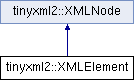

do not remove this div, it is closed by doxygen! 
|  |
| --- |
| NSCL DDAS1.0Support for XIA DDAS at the NSCL |


 end header part 
 Generated by Doxygen 1.8.8 

- [[Main Page|index]]
- [[User Guides|pages]]
- [[Namespaces|namespaces]]
- [[Classes|annotated]]
- [[Files|files]]
- 
  [[|javascript:searchBox.CloseResultsWindow()]]


- [[Class List|annotated]]
- [[Class Index|classes]]
- [[Class Hierarchy|hierarchy]]
- [[Class Members|functions]]


 window showing the filter options 
[[All|javascript:void(0)]][[Classes|javascript:void(0)]][[Namespaces|javascript:void(0)]][[Files|javascript:void(0)]][[Functions|javascript:void(0)]][[Variables|javascript:void(0)]][[Macros|javascript:void(0)]][[Pages|javascript:void(0)]]


 iframe showing the search results (closed by default) 


- **tinyxml2**
- [[XMLElement|classtinyxml2_1_1XMLElement]]

 top 
[Public Types](#pub-types) |
[Public Member Functions](#pub-methods) |
[Protected Member Functions](#pro-methods) |
[Friends](#friends) |
[[List of all members|classtinyxml2_1_1XMLElement-members]]


tinyxml2::XMLElement Class Reference

header
`#include <tinyxml2.h>`


Inheritance diagram for tinyxml2::XMLElement:





|  |  |
| --- | --- |
| Public Types |
| enum | ElementClosingType{OPEN,CLOSED,CLOSING} |
|  |

|  |  |
| --- | --- |
| Public Member Functions |
| const char * | Name() const |
|  | Get the name of an element (which is theValue()of the node.) |
|  |
| void | SetName(const char *str, bool staticMem=false) |
|  | Set the name of the element. |
|  |
| virtualXMLElement* | ToElement() |
|  | Safely cast to an Element, or null. |
|  |
| virtual constXMLElement* | ToElement() const |
|  |
| virtual bool | Accept(XMLVisitor*visitor) const |
|  |
| const char * | Attribute(const char *name, const char *value=0) const |
|  |
| int | IntAttribute(const char *name, int defaultValue=0) const |
|  |
| unsigned | UnsignedAttribute(const char *name, unsigned defaultValue=0) const |
|  | SeeIntAttribute() |
|  |
| int64_t | Int64Attribute(const char *name, int64_t defaultValue=0) const |
|  | SeeIntAttribute() |
|  |
| uint64_t | Unsigned64Attribute(const char *name, uint64_t defaultValue=0) const |
|  | SeeIntAttribute() |
|  |
| bool | BoolAttribute(const char *name, bool defaultValue=false) const |
|  | SeeIntAttribute() |
|  |
| double | DoubleAttribute(const char *name, double defaultValue=0) const |
|  | SeeIntAttribute() |
|  |
| float | FloatAttribute(const char *name, float defaultValue=0) const |
|  | SeeIntAttribute() |
|  |
| XMLError | QueryIntAttribute(const char *name, int *value) const |
|  |
| XMLError | QueryUnsignedAttribute(const char *name, unsigned int *value) const |
|  | SeeQueryIntAttribute() |
|  |
| XMLError | QueryInt64Attribute(const char *name, int64_t *value) const |
|  | SeeQueryIntAttribute() |
|  |
| XMLError | QueryUnsigned64Attribute(const char *name, uint64_t *value) const |
|  | SeeQueryIntAttribute() |
|  |
| XMLError | QueryBoolAttribute(const char *name, bool *value) const |
|  | SeeQueryIntAttribute() |
|  |
| XMLError | QueryDoubleAttribute(const char *name, double *value) const |
|  | SeeQueryIntAttribute() |
|  |
| XMLError | QueryFloatAttribute(const char *name, float *value) const |
|  | SeeQueryIntAttribute() |
|  |
| XMLError | QueryStringAttribute(const char *name, const char **value) const |
|  | SeeQueryIntAttribute() |
|  |
| XMLError | QueryAttribute(const char *name, int *value) const |
|  |
| XMLError | QueryAttribute(const char *name, unsigned int *value) const |
|  |
| XMLError | QueryAttribute(const char *name, int64_t *value) const |
|  |
| XMLError | QueryAttribute(const char *name, uint64_t *value) const |
|  |
| XMLError | QueryAttribute(const char *name, bool *value) const |
|  |
| XMLError | QueryAttribute(const char *name, double *value) const |
|  |
| XMLError | QueryAttribute(const char *name, float *value) const |
|  |
| void | SetAttribute(const char *name, const char *value) |
|  | Sets the named attribute to value. |
|  |
| void | SetAttribute(const char *name, int value) |
|  | Sets the named attribute to value. |
|  |
| void | SetAttribute(const char *name, unsigned value) |
|  | Sets the named attribute to value. |
|  |
| void | SetAttribute(const char *name, int64_t value) |
|  | Sets the named attribute to value. |
|  |
| void | SetAttribute(const char *name, uint64_t value) |
|  | Sets the named attribute to value. |
|  |
| void | SetAttribute(const char *name, bool value) |
|  | Sets the named attribute to value. |
|  |
| void | SetAttribute(const char *name, double value) |
|  | Sets the named attribute to value. |
|  |
| void | SetAttribute(const char *name, float value) |
|  | Sets the named attribute to value. |
|  |
| void | DeleteAttribute(const char *name) |
|  |
| constXMLAttribute* | FirstAttribute() const |
|  | Return the first attribute in the list. |
|  |
| constXMLAttribute* | FindAttribute(const char *name) const |
|  | Query a specific attribute in the list. |
|  |
| const char * | GetText() const |
|  |
| void | SetText(const char *inText) |
|  |
| void | SetText(int value) |
|  | Convenience method for setting text inside an element. SeeSetText()for important limitations. |
|  |
| void | SetText(unsigned value) |
|  | Convenience method for setting text inside an element. SeeSetText()for important limitations. |
|  |
| void | SetText(int64_t value) |
|  | Convenience method for setting text inside an element. SeeSetText()for important limitations. |
|  |
| void | SetText(uint64_t value) |
|  | Convenience method for setting text inside an element. SeeSetText()for important limitations. |
|  |
| void | SetText(bool value) |
|  | Convenience method for setting text inside an element. SeeSetText()for important limitations. |
|  |
| void | SetText(double value) |
|  | Convenience method for setting text inside an element. SeeSetText()for important limitations. |
|  |
| void | SetText(float value) |
|  | Convenience method for setting text inside an element. SeeSetText()for important limitations. |
|  |
| XMLError | QueryIntText(int *ival) const |
|  |
| XMLError | QueryUnsignedText(unsigned *uval) const |
|  | SeeQueryIntText() |
|  |
| XMLError | QueryInt64Text(int64_t *uval) const |
|  | SeeQueryIntText() |
|  |
| XMLError | QueryUnsigned64Text(uint64_t *uval) const |
|  | SeeQueryIntText() |
|  |
| XMLError | QueryBoolText(bool *bval) const |
|  | SeeQueryIntText() |
|  |
| XMLError | QueryDoubleText(double *dval) const |
|  | SeeQueryIntText() |
|  |
| XMLError | QueryFloatText(float *fval) const |
|  | SeeQueryIntText() |
|  |
| int | IntText(int defaultValue=0) const |
|  |
| unsigned | UnsignedText(unsigned defaultValue=0) const |
|  | SeeQueryIntText() |
|  |
| int64_t | Int64Text(int64_t defaultValue=0) const |
|  | SeeQueryIntText() |
|  |
| uint64_t | Unsigned64Text(uint64_t defaultValue=0) const |
|  | SeeQueryIntText() |
|  |
| bool | BoolText(bool defaultValue=false) const |
|  | SeeQueryIntText() |
|  |
| double | DoubleText(double defaultValue=0) const |
|  | SeeQueryIntText() |
|  |
| float | FloatText(float defaultValue=0) const |
|  | SeeQueryIntText() |
|  |
| ElementClosingType | ClosingType() const |
|  |
| virtualXMLNode* | ShallowClone(XMLDocument*document) const |
|  |
| virtual bool | ShallowEqual(constXMLNode*compare) const |
|  |
| Public Member Functions inherited fromtinyxml2::XMLNode |
| constXMLDocument* | GetDocument() const |
|  | Get theXMLDocumentthat owns thisXMLNode. |
|  |
| XMLDocument* | GetDocument() |
|  | Get theXMLDocumentthat owns thisXMLNode. |
|  |
| virtualXMLText* | ToText() |
|  | Safely cast to Text, or null. |
|  |
| virtualXMLComment* | ToComment() |
|  | Safely cast to a Comment, or null. |
|  |
| virtualXMLDocument* | ToDocument() |
|  | Safely cast to a Document, or null. |
|  |
| virtualXMLDeclaration* | ToDeclaration() |
|  | Safely cast to a Declaration, or null. |
|  |
| virtualXMLUnknown* | ToUnknown() |
|  | Safely cast to an Unknown, or null. |
|  |
| virtual constXMLText* | ToText() const |
|  |
| virtual constXMLComment* | ToComment() const |
|  |
| virtual constXMLDocument* | ToDocument() const |
|  |
| virtual constXMLDeclaration* | ToDeclaration() const |
|  |
| virtual constXMLUnknown* | ToUnknown() const |
|  |
| const char * | Value() const |
|  |
| void | SetValue(const char *val, bool staticMem=false) |
|  |
| int | GetLineNum() const |
|  | Gets the line number the node is in, if the document was parsed from a file. |
|  |
| constXMLNode* | Parent() const |
|  | Get the parent of this node on the DOM. |
|  |
| XMLNode* | Parent() |
|  |
| bool | NoChildren() const |
|  | Returns true if this node has no children. |
|  |
| constXMLNode* | FirstChild() const |
|  | Get the first child node, or null if none exists. |
|  |
| XMLNode* | FirstChild() |
|  |
| constXMLElement* | FirstChildElement(const char *name=0) const |
|  |
| XMLElement* | FirstChildElement(const char *name=0) |
|  |
| constXMLNode* | LastChild() const |
|  | Get the last child node, or null if none exists. |
|  |
| XMLNode* | LastChild() |
|  |
| constXMLElement* | LastChildElement(const char *name=0) const |
|  |
| XMLElement* | LastChildElement(const char *name=0) |
|  |
| constXMLNode* | PreviousSibling() const |
|  | Get the previous (left) sibling node of this node. |
|  |
| XMLNode* | PreviousSibling() |
|  |
| constXMLElement* | PreviousSiblingElement(const char *name=0) const |
|  | Get the previous (left) sibling element of this node, with an optionally supplied name. |
|  |
| XMLElement* | PreviousSiblingElement(const char *name=0) |
|  |
| constXMLNode* | NextSibling() const |
|  | Get the next (right) sibling node of this node. |
|  |
| XMLNode* | NextSibling() |
|  |
| constXMLElement* | NextSiblingElement(const char *name=0) const |
|  | Get the next (right) sibling element of this node, with an optionally supplied name. |
|  |
| XMLElement* | NextSiblingElement(const char *name=0) |
|  |
| XMLNode* | InsertEndChild(XMLNode*addThis) |
|  |
| XMLNode* | LinkEndChild(XMLNode*addThis) |
|  |
| XMLNode* | InsertFirstChild(XMLNode*addThis) |
|  |
| XMLNode* | InsertAfterChild(XMLNode*afterThis,XMLNode*addThis) |
|  |
| void | DeleteChildren() |
|  |
| void | DeleteChild(XMLNode*node) |
|  |
| XMLNode* | DeepClone(XMLDocument*target) const |
|  |
| void | SetUserData(void *userData) |
|  |
| void * | GetUserData() const |
|  |

|  |  |
| --- | --- |
| Protected Member Functions |
| char * | ParseDeep(char *p,StrPair*parentEndTag, int *curLineNumPtr) |
|  |
| Protected Member Functions inherited fromtinyxml2::XMLNode |
|  | XMLNode(XMLDocument*) |
|  |

|  |  |
| --- | --- |
| Friends |
| class | XMLDocument |
|  |

|  |  |
| --- | --- |
| Additional Inherited Members |
| Protected Attributes inherited fromtinyxml2::XMLNode |
| XMLDocument* | _document |
|  |
| XMLNode* | _parent |
|  |
| StrPair | _value |
|  |
| int | _parseLineNum |
|  |
| XMLNode* | _firstChild |
|  |
| XMLNode* | _lastChild |
|  |
| XMLNode* | _prev |
|  |
| XMLNode* | _next |
|  |
| void * | _userData |
|  |


<a name="details"></a>## Detailed Description


The element is a container class. It has a value, the element name, and can contain other elements, text, comments, and unknowns. Elements also contain an arbitrary number of attributes.

## Member Function Documentation


|  |  |  |  |  |  |  |  |
| --- | --- | --- | --- | --- | --- | --- | --- |
| bool tinyxml2::XMLElement::Accept(XMLVisitor*visitor)const | bool tinyxml2::XMLElement::Accept | ( | XMLVisitor* | visitor | ) | const | virtual |
| bool tinyxml2::XMLElement::Accept | ( | XMLVisitor* | visitor | ) | const |

Accept a hierarchical visit of the nodes in the TinyXML-2 DOM. Every node in the XML tree will be conditionally visited and the host will be called back via the [[XMLVisitor|classtinyxml2_1_1XMLVisitor]] interface.


This is essentially a SAX interface for TinyXML-2. (Note however it doesn't re-parse the XML for the callbacks, so the performance of TinyXML-2 is unchanged by using this interface versus any other.)


The interface has been based on ideas from:


- [http://www.saxproject.org/](http://www.saxproject.org/)
- [http://c2.com/cgi/wiki?HierarchicalVisitorPattern](http://c2.com/cgi/wiki?HierarchicalVisitorPattern)


Which are both good references for "visiting".


An example of using [[Accept()|classtinyxml2_1_1XMLElement#a36d65438991a1e85096caf39ad13a099]]:

```
XMLPrinter printer;
tinyxmlDoc.Accept( &printer );
const char* xmlcstr = printer.CStr();

```


Implements [[tinyxml2::XMLNode|classtinyxml2_1_1XMLNode#a81e66df0a44c67a7af17f3b77a152785]].


|  |  |  |  |
| --- | --- | --- | --- |
| const char * tinyxml2::XMLElement::Attribute | ( | const char * | name, |
|  |  | const char * | value=0 |
|  | ) |  | const |

Given an attribute name, [[Attribute()|classtinyxml2_1_1XMLElement#a7bdebdf1888074087237f3dd03912740]] returns the value for the attribute of that name, or null if none exists. For example:


```
const char* value = ele->Attribute( "foo" );

```

The 'value' parameter is normally null. However, if specified, the attribute will only be returned if the 'name' and 'value' match. This allow you to write code:


```
if ( ele->Attribute( "foo", "bar" ) ) callFooIsBar();

```

rather than:

```
if ( ele->Attribute( "foo" ) ) {
        if ( strcmp( ele->Attribute( "foo" ), "bar" ) == 0 ) callFooIsBar();
}

```


|  |  |  |  |  |  |
| --- | --- | --- | --- | --- | --- |
| void tinyxml2::XMLElement::DeleteAttribute | ( | const char * | name | ) |  |

Delete an attribute.


|  |  |  |  |  |
| --- | --- | --- | --- | --- |
| const char * tinyxml2::XMLElement::GetText | ( |  | ) | const |

Convenience function for easy access to the text inside an element. Although easy and concise, [[GetText()|classtinyxml2_1_1XMLElement#a56cc727044dad002b978256754d43a4b]] is limited compared to getting the [[XMLText|classtinyxml2_1_1XMLText]] child and accessing it directly.


If the first child of 'this' is a [[XMLText|classtinyxml2_1_1XMLText]], the [[GetText()|classtinyxml2_1_1XMLElement#a56cc727044dad002b978256754d43a4b]] returns the character string of the Text node, else null is returned.


This is a convenient method for getting the text of simple contained text:

```
<foo>This is text</foo>
        const char* str = fooElement->GetText();

```

'str' will be a pointer to "This is text".


Note that this function can be misleading. If the element foo was created from this XML:

```
        <foo><b>This is text</b></foo>

```

then the value of str would be null. The first child node isn't a text node, it is another element. From this XML:

```
        <foo>This is <b>text</b></foo>

```

[[GetText()|classtinyxml2_1_1XMLElement#a56cc727044dad002b978256754d43a4b]] will return "This is ".


|  |  |  |  |
| --- | --- | --- | --- |
| int tinyxml2::XMLElement::IntAttribute | ( | const char * | name, |
|  |  | int | defaultValue=0 |
|  | ) |  | const |

Given an attribute name, [[IntAttribute()|classtinyxml2_1_1XMLElement#a1e0b2ebd4ae63ae207f84531c20cfa87]] returns the value of the attribute interpreted as an integer. The default value will be returned if the attribute isn't present, or if there is an error. (For a method with error checking, see [[QueryIntAttribute()|classtinyxml2_1_1XMLElement#a8b92c729346aa8ea9acd59ed3e9f2378]]).


|  |  |  |  |  |  |  |  |  |  |  |  |  |  |
| --- | --- | --- | --- | --- | --- | --- | --- | --- | --- | --- | --- | --- | --- |
| XMLError tinyxml2::XMLElement::QueryAttribute(const char *name,int *value)const | XMLError tinyxml2::XMLElement::QueryAttribute | ( | const char * | name, |  |  | int * | value |  | ) |  | const | inline |
| XMLError tinyxml2::XMLElement::QueryAttribute | ( | const char * | name, |
|  |  | int * | value |
|  | ) |  | const |

Given an attribute name, [[QueryAttribute()|classtinyxml2_1_1XMLElement#a3c6ca41fb1b6023b58ff4414c8eae2c0]] returns XML_SUCCESS, XML_WRONG_ATTRIBUTE_TYPE if the conversion can't be performed, or XML_NO_ATTRIBUTE if the attribute doesn't exist. It is overloaded for the primitive types, and is a generally more convenient replacement of [[QueryIntAttribute()|classtinyxml2_1_1XMLElement#a8b92c729346aa8ea9acd59ed3e9f2378]] and related functions.


If successful, the result of the conversion will be written to 'value'. If not successful, nothing will be written to 'value'. This allows you to provide default value:


```
int value = 10;
QueryAttribute( "foo", &value );                // if "foo" isn't found, value will still be 10

```


|  |  |  |  |  |  |  |  |  |  |  |  |  |  |
| --- | --- | --- | --- | --- | --- | --- | --- | --- | --- | --- | --- | --- | --- |
| XMLError tinyxml2::XMLElement::QueryIntAttribute(const char *name,int *value)const | XMLError tinyxml2::XMLElement::QueryIntAttribute | ( | const char * | name, |  |  | int * | value |  | ) |  | const | inline |
| XMLError tinyxml2::XMLElement::QueryIntAttribute | ( | const char * | name, |
|  |  | int * | value |
|  | ) |  | const |

Given an attribute name, [[QueryIntAttribute()|classtinyxml2_1_1XMLElement#a8b92c729346aa8ea9acd59ed3e9f2378]] returns XML_SUCCESS, XML_WRONG_ATTRIBUTE_TYPE if the conversion can't be performed, or XML_NO_ATTRIBUTE if the attribute doesn't exist. If successful, the result of the conversion will be written to 'value'. If not successful, nothing will be written to 'value'. This allows you to provide default value:


```
int value = 10;
QueryIntAttribute( "foo", &value );             // if "foo" isn't found, value will still be 10

```


|  |  |  |  |  |  |
| --- | --- | --- | --- | --- | --- |
| XMLError tinyxml2::XMLElement::QueryIntText | ( | int * | ival | ) | const |

Convenience method to query the value of a child text node. This is probably best shown by example. Given you have a document is this form:

```
        <point>
                <x>1</x>
                <y>1.4</y>
        </point>

```

The [[QueryIntText()|classtinyxml2_1_1XMLElement#a71327c9a9d8840562bd204f46d0a7189]] and similar functions provide a safe and easier way to get to the "value" of x and y.


```
        int x = 0;
        float y = 0;    // types of x and y are contrived for example
        const XMLElement* xElement = pointElement->FirstChildElement( "x" );
        const XMLElement* yElement = pointElement->FirstChildElement( "y" );
        xElement->QueryIntText( &x );
        yElement->QueryFloatText( &y );

```

- Returns
  XML_SUCCESS (0) on success, XML_CAN_NOT_CONVERT_TEXT if the text cannot be converted to the requested type, and XML_NO_TEXT_NODE if there is no child text to query.


|  |  |  |  |  |  |
| --- | --- | --- | --- | --- | --- |
| void tinyxml2::XMLElement::SetText | ( | const char * | inText | ) |  |

Convenience function for easy access to the text inside an element. Although easy and concise, [[SetText()|classtinyxml2_1_1XMLElement#a1f9c2cd61b72af5ae708d37b7ad283ce]] is limited compared to creating an [[XMLText|classtinyxml2_1_1XMLText]] child and mutating it directly.


If the first child of 'this' is a [[XMLText|classtinyxml2_1_1XMLText]], [[SetText()|classtinyxml2_1_1XMLElement#a1f9c2cd61b72af5ae708d37b7ad283ce]] sets its value to the given string, otherwise it will create a first child that is an [[XMLText|classtinyxml2_1_1XMLText]].


This is a convenient method for setting the text of simple contained text:

```
<foo>This is text</foo>
        fooElement->SetText( "Hullaballoo!" );
<foo>Hullaballoo!</foo>
```

Note that this function can be misleading. If the element foo was created from this XML:

```
        <foo><b>This is text</b></foo>

```

then it will not change "This is text", but rather prefix it with a text element:

```
        <foo>Hullaballoo!<b>This is text</b></foo>

```

 ```
    For this XML:

```

 ```
        <foo />

```

[[SetText()|classtinyxml2_1_1XMLElement#a1f9c2cd61b72af5ae708d37b7ad283ce]] will generate

```
        <foo>Hullaballoo!</foo>

```


|  |  |  |  |  |  |  |  |
| --- | --- | --- | --- | --- | --- | --- | --- |
| XMLNode* tinyxml2::XMLElement::ShallowClone(XMLDocument*document)const | XMLNode* tinyxml2::XMLElement::ShallowClone | ( | XMLDocument* | document | ) | const | virtual |
| XMLNode* tinyxml2::XMLElement::ShallowClone | ( | XMLDocument* | document | ) | const |

Make a copy of this node, but not its children. You may pass in a Document pointer that will be the owner of the new Node. If the 'document' is null, then the node returned will be allocated from the current Document. (this->[[GetDocument()|classtinyxml2_1_1XMLNode#af343d1ef0b45c0020e62d784d7e67a68]])


Note: if called on a [[XMLDocument|classtinyxml2_1_1XMLDocument]], this will return null.


Implements [[tinyxml2::XMLNode|classtinyxml2_1_1XMLNode#a8402cbd3129d20e9e6024bbcc0531283]].


|  |  |  |  |  |  |  |  |
| --- | --- | --- | --- | --- | --- | --- | --- |
| bool tinyxml2::XMLElement::ShallowEqual(constXMLNode*compare)const | bool tinyxml2::XMLElement::ShallowEqual | ( | constXMLNode* | compare | ) | const | virtual |
| bool tinyxml2::XMLElement::ShallowEqual | ( | constXMLNode* | compare | ) | const |

[[Test|namespaceTest]] if 2 nodes are the same, but don't test children. The 2 nodes do not need to be in the same Document.


Note: if called on a [[XMLDocument|classtinyxml2_1_1XMLDocument]], this will return false.


Implements [[tinyxml2::XMLNode|classtinyxml2_1_1XMLNode#a7ce18b751c3ea09eac292dca264f9226]].


---

The documentation for this class was generated from the following files:- xml/tinyxml/[[tinyxml2.h|tinyxml2_8h_source]]
- xml/tinyxml/tinyxml2.cpp

 contents 
 start footer part 

---


Generated on Tue Mar 31 2020 12:56:43 for NSCL DDAS by  [](http://www.doxygen.org/index.html) 1.8.8
