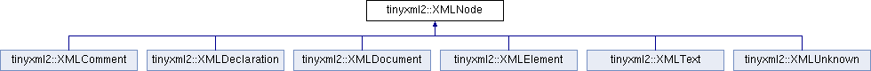

do not remove this div, it is closed by doxygen! 
|  |
| --- |
| NSCL DDAS1.0Support for XIA DDAS at the NSCL |


 end header part 
 Generated by Doxygen 1.8.8 

- [[Main Page|index]]
- [[User Guides|pages]]
- [[Namespaces|namespaces]]
- [[Classes|annotated]]
- [[Files|files]]
- 
  [[|javascript:searchBox.CloseResultsWindow()]]


- [[Class List|annotated]]
- [[Class Index|classes]]
- [[Class Hierarchy|hierarchy]]
- [[Class Members|functions]]


 window showing the filter options 
[[All|javascript:void(0)]][[Classes|javascript:void(0)]][[Namespaces|javascript:void(0)]][[Files|javascript:void(0)]][[Functions|javascript:void(0)]][[Variables|javascript:void(0)]][[Macros|javascript:void(0)]][[Pages|javascript:void(0)]]


 iframe showing the search results (closed by default) 


- **tinyxml2**
- [[XMLNode|classtinyxml2_1_1XMLNode]]

 top 
[Public Member Functions](#pub-methods) |
[Protected Member Functions](#pro-methods) |
[Protected Attributes](#pro-attribs) |
[Friends](#friends) |
[[List of all members|classtinyxml2_1_1XMLNode-members]]


tinyxml2::XMLNode Class Referenceabstract

header
`#include <tinyxml2.h>`


Inheritance diagram for tinyxml2::XMLNode:





|  |  |
| --- | --- |
| Public Member Functions |
| constXMLDocument* | GetDocument() const |
|  | Get theXMLDocumentthat owns thisXMLNode. |
|  |
| XMLDocument* | GetDocument() |
|  | Get theXMLDocumentthat owns thisXMLNode. |
|  |
| virtualXMLElement* | ToElement() |
|  | Safely cast to an Element, or null. |
|  |
| virtualXMLText* | ToText() |
|  | Safely cast to Text, or null. |
|  |
| virtualXMLComment* | ToComment() |
|  | Safely cast to a Comment, or null. |
|  |
| virtualXMLDocument* | ToDocument() |
|  | Safely cast to a Document, or null. |
|  |
| virtualXMLDeclaration* | ToDeclaration() |
|  | Safely cast to a Declaration, or null. |
|  |
| virtualXMLUnknown* | ToUnknown() |
|  | Safely cast to an Unknown, or null. |
|  |
| virtual constXMLElement* | ToElement() const |
|  |
| virtual constXMLText* | ToText() const |
|  |
| virtual constXMLComment* | ToComment() const |
|  |
| virtual constXMLDocument* | ToDocument() const |
|  |
| virtual constXMLDeclaration* | ToDeclaration() const |
|  |
| virtual constXMLUnknown* | ToUnknown() const |
|  |
| const char * | Value() const |
|  |
| void | SetValue(const char *val, bool staticMem=false) |
|  |
| int | GetLineNum() const |
|  | Gets the line number the node is in, if the document was parsed from a file. |
|  |
| constXMLNode* | Parent() const |
|  | Get the parent of this node on the DOM. |
|  |
| XMLNode* | Parent() |
|  |
| bool | NoChildren() const |
|  | Returns true if this node has no children. |
|  |
| constXMLNode* | FirstChild() const |
|  | Get the first child node, or null if none exists. |
|  |
| XMLNode* | FirstChild() |
|  |
| constXMLElement* | FirstChildElement(const char *name=0) const |
|  |
| XMLElement* | FirstChildElement(const char *name=0) |
|  |
| constXMLNode* | LastChild() const |
|  | Get the last child node, or null if none exists. |
|  |
| XMLNode* | LastChild() |
|  |
| constXMLElement* | LastChildElement(const char *name=0) const |
|  |
| XMLElement* | LastChildElement(const char *name=0) |
|  |
| constXMLNode* | PreviousSibling() const |
|  | Get the previous (left) sibling node of this node. |
|  |
| XMLNode* | PreviousSibling() |
|  |
| constXMLElement* | PreviousSiblingElement(const char *name=0) const |
|  | Get the previous (left) sibling element of this node, with an optionally supplied name. |
|  |
| XMLElement* | PreviousSiblingElement(const char *name=0) |
|  |
| constXMLNode* | NextSibling() const |
|  | Get the next (right) sibling node of this node. |
|  |
| XMLNode* | NextSibling() |
|  |
| constXMLElement* | NextSiblingElement(const char *name=0) const |
|  | Get the next (right) sibling element of this node, with an optionally supplied name. |
|  |
| XMLElement* | NextSiblingElement(const char *name=0) |
|  |
| XMLNode* | InsertEndChild(XMLNode*addThis) |
|  |
| XMLNode* | LinkEndChild(XMLNode*addThis) |
|  |
| XMLNode* | InsertFirstChild(XMLNode*addThis) |
|  |
| XMLNode* | InsertAfterChild(XMLNode*afterThis,XMLNode*addThis) |
|  |
| void | DeleteChildren() |
|  |
| void | DeleteChild(XMLNode*node) |
|  |
| virtualXMLNode* | ShallowClone(XMLDocument*document) const =0 |
|  |
| XMLNode* | DeepClone(XMLDocument*target) const |
|  |
| virtual bool | ShallowEqual(constXMLNode*compare) const =0 |
|  |
| virtual bool | Accept(XMLVisitor*visitor) const =0 |
|  |
| void | SetUserData(void *userData) |
|  |
| void * | GetUserData() const |
|  |

|  |  |
| --- | --- |
| Protected Member Functions |
|  | XMLNode(XMLDocument*) |
|  |
| virtual char * | ParseDeep(char *p,StrPair*parentEndTag, int *curLineNumPtr) |
|  |

|  |  |
| --- | --- |
| Protected Attributes |
| XMLDocument* | _document |
|  |
| XMLNode* | _parent |
|  |
| StrPair | _value |
|  |
| int | _parseLineNum |
|  |
| XMLNode* | _firstChild |
|  |
| XMLNode* | _lastChild |
|  |
| XMLNode* | _prev |
|  |
| XMLNode* | _next |
|  |
| void * | _userData |
|  |

|  |  |
| --- | --- |
| Friends |
| class | XMLDocument |
|  |
| class | XMLElement |
|  |


<a name="details"></a>## Detailed Description


[[XMLNode|classtinyxml2_1_1XMLNode]] is a base class for every object that is in the XML Document Object Model (DOM), except XMLAttributes. Nodes have siblings, a parent, and children which can be navigated. A node is always in a [[XMLDocument|classtinyxml2_1_1XMLDocument]]. The type of a [[XMLNode|classtinyxml2_1_1XMLNode]] can be queried, and it can be cast to its more defined type.


A [[XMLDocument|classtinyxml2_1_1XMLDocument]] allocates memory for all its Nodes. When the [[XMLDocument|classtinyxml2_1_1XMLDocument]] gets deleted, all its Nodes will also be deleted.


```
    A Document can contain:     Element (container or leaf)
                                                Comment (leaf)
                                                Unknown (leaf)
                                                Declaration( leaf )

    An Element can contain:     Element (container or leaf)
                                                Text    (leaf)
                                                Attributes (not on tree)
                                                Comment (leaf)
                                                Unknown (leaf)
```

## Member Function Documentation


|  |  |  |  |  |  |  |  |
| --- | --- | --- | --- | --- | --- | --- | --- |
| virtual bool tinyxml2::XMLNode::Accept(XMLVisitor*visitor)const | virtual bool tinyxml2::XMLNode::Accept | ( | XMLVisitor* | visitor | ) | const | pure virtual |
| virtual bool tinyxml2::XMLNode::Accept | ( | XMLVisitor* | visitor | ) | const |

Accept a hierarchical visit of the nodes in the TinyXML-2 DOM. Every node in the XML tree will be conditionally visited and the host will be called back via the [[XMLVisitor|classtinyxml2_1_1XMLVisitor]] interface.


This is essentially a SAX interface for TinyXML-2. (Note however it doesn't re-parse the XML for the callbacks, so the performance of TinyXML-2 is unchanged by using this interface versus any other.)


The interface has been based on ideas from:


- [http://www.saxproject.org/](http://www.saxproject.org/)
- [http://c2.com/cgi/wiki?HierarchicalVisitorPattern](http://c2.com/cgi/wiki?HierarchicalVisitorPattern)


Which are both good references for "visiting".


An example of using [[Accept()|classtinyxml2_1_1XMLNode#a81e66df0a44c67a7af17f3b77a152785]]:

```
XMLPrinter printer;
tinyxmlDoc.Accept( &printer );
const char* xmlcstr = printer.CStr();

```


Implemented in [[tinyxml2::XMLDocument|classtinyxml2_1_1XMLDocument#aa08503d24898bf9992ae5e5fb8b0cf87]], [[tinyxml2::XMLElement|classtinyxml2_1_1XMLElement#a36d65438991a1e85096caf39ad13a099]], [[tinyxml2::XMLUnknown|classtinyxml2_1_1XMLUnknown#a0d341ab804a1438a474810bb5bd29dd5]], [[tinyxml2::XMLDeclaration|classtinyxml2_1_1XMLDeclaration#a953a7359cc312d15218eb5843a4ca108]], [[tinyxml2::XMLComment|classtinyxml2_1_1XMLComment#aa382b1be6a8b0650c16a2d88bb499335]], and [[tinyxml2::XMLText|classtinyxml2_1_1XMLText#ae659d4fc7351a7df11c111cbe1ade46f]].


|  |  |  |  |  |  |
| --- | --- | --- | --- | --- | --- |
| XMLNode* tinyxml2::XMLNode::DeepClone | ( | XMLDocument* | target | ) | const |

Make a copy of this node and all its children.


If the 'target' is null, then the nodes will be allocated in the current document. If 'target' is specified, the memory will be allocated is the specified [[XMLDocument|classtinyxml2_1_1XMLDocument]].

```
    NOTE: This is probably not the correct tool to
    copy a document, since XMLDocuments can have multiple
    top level XMLNodes. You probably want to use

```

[[XMLDocument::DeepCopy()|classtinyxml2_1_1XMLDocument#a341e6d8c97c0c2b5d96a5f355c09c665]]


|  |  |  |  |  |  |
| --- | --- | --- | --- | --- | --- |
| void tinyxml2::XMLNode::DeleteChild | ( | XMLNode* | node | ) |  |

Delete a child of this node.


|  |  |  |  |  |
| --- | --- | --- | --- | --- |
| void tinyxml2::XMLNode::DeleteChildren | ( |  | ) |  |

Delete all the children of this node.


|  |  |  |  |  |  |
| --- | --- | --- | --- | --- | --- |
| constXMLElement* tinyxml2::XMLNode::FirstChildElement | ( | const char * | name=0 | ) | const |

Get the first child element, or optionally the first child element with the specified name.


|  |  |  |  |  |  |  |
| --- | --- | --- | --- | --- | --- | --- |
| void* tinyxml2::XMLNode::GetUserData()const | void* tinyxml2::XMLNode::GetUserData | ( |  | ) | const | inline |
| void* tinyxml2::XMLNode::GetUserData | ( |  | ) | const |

Get user data set into the [[XMLNode|classtinyxml2_1_1XMLNode]]. TinyXML-2 in no way processes or interprets user data. It is initially 0.


|  |  |  |  |
| --- | --- | --- | --- |
| XMLNode* tinyxml2::XMLNode::InsertAfterChild | ( | XMLNode* | afterThis, |
|  |  | XMLNode* | addThis |
|  | ) |  |  |

Add a node after the specified child node. If the child node is already part of the document, it is moved from its old location to the new location. Returns the addThis argument or 0 if the afterThis node is not a child of this node, or if the node does not belong to the same document.


|  |  |  |  |  |  |
| --- | --- | --- | --- | --- | --- |
| XMLNode* tinyxml2::XMLNode::InsertEndChild | ( | XMLNode* | addThis | ) |  |

Add a child node as the last (right) child. If the child node is already part of the document, it is moved from its old location to the new location. Returns the addThis argument or 0 if the node does not belong to the same document.


|  |  |  |  |  |  |
| --- | --- | --- | --- | --- | --- |
| XMLNode* tinyxml2::XMLNode::InsertFirstChild | ( | XMLNode* | addThis | ) |  |

Add a child node as the first (left) child. If the child node is already part of the document, it is moved from its old location to the new location. Returns the addThis argument or 0 if the node does not belong to the same document.


|  |  |  |  |  |  |
| --- | --- | --- | --- | --- | --- |
| constXMLElement* tinyxml2::XMLNode::LastChildElement | ( | const char * | name=0 | ) | const |

Get the last child element or optionally the last child element with the specified name.


|  |  |  |  |  |  |  |  |
| --- | --- | --- | --- | --- | --- | --- | --- |
| void tinyxml2::XMLNode::SetUserData(void *userData) | void tinyxml2::XMLNode::SetUserData | ( | void * | userData | ) |  | inline |
| void tinyxml2::XMLNode::SetUserData | ( | void * | userData | ) |  |

Set user data into the [[XMLNode|classtinyxml2_1_1XMLNode]]. TinyXML-2 in no way processes or interprets user data. It is initially 0.


|  |  |  |  |
| --- | --- | --- | --- |
| void tinyxml2::XMLNode::SetValue | ( | const char * | val, |
|  |  | bool | staticMem=false |
|  | ) |  |  |

Set the Value of an XML node.

See also[[Value()|classtinyxml2_1_1XMLNode#a92835c779871918f9af569bfe9669fe6]]


|  |  |  |  |  |  |  |  |
| --- | --- | --- | --- | --- | --- | --- | --- |
| virtualXMLNode* tinyxml2::XMLNode::ShallowClone(XMLDocument*document)const | virtualXMLNode* tinyxml2::XMLNode::ShallowClone | ( | XMLDocument* | document | ) | const | pure virtual |
| virtualXMLNode* tinyxml2::XMLNode::ShallowClone | ( | XMLDocument* | document | ) | const |

Make a copy of this node, but not its children. You may pass in a Document pointer that will be the owner of the new Node. If the 'document' is null, then the node returned will be allocated from the current Document. (this->[[GetDocument()|classtinyxml2_1_1XMLNode#af343d1ef0b45c0020e62d784d7e67a68]])


Note: if called on a [[XMLDocument|classtinyxml2_1_1XMLDocument]], this will return null.


Implemented in [[tinyxml2::XMLDocument|classtinyxml2_1_1XMLDocument#a57c8511ed9f83aa3e20909a3db3f83d0]], [[tinyxml2::XMLElement|classtinyxml2_1_1XMLElement#a85d85e32c18863fff1eeed53ae1ce23d]], [[tinyxml2::XMLUnknown|classtinyxml2_1_1XMLUnknown#aa09fc7cb0cd64d6bb9c5ae00ffc549ec]], [[tinyxml2::XMLDeclaration|classtinyxml2_1_1XMLDeclaration#a39458732ee6796cfc85dd35d3c488e0b]], [[tinyxml2::XMLComment|classtinyxml2_1_1XMLComment#a90bb60193a691b484f5e1b487857016d]], and [[tinyxml2::XMLText|classtinyxml2_1_1XMLText#af5115f8cc83de2947ed6a9d13e2f88c8]].


|  |  |  |  |  |  |  |  |
| --- | --- | --- | --- | --- | --- | --- | --- |
| virtual bool tinyxml2::XMLNode::ShallowEqual(constXMLNode*compare)const | virtual bool tinyxml2::XMLNode::ShallowEqual | ( | constXMLNode* | compare | ) | const | pure virtual |
| virtual bool tinyxml2::XMLNode::ShallowEqual | ( | constXMLNode* | compare | ) | const |

[[Test|namespaceTest]] if 2 nodes are the same, but don't test children. The 2 nodes do not need to be in the same Document.


Note: if called on a [[XMLDocument|classtinyxml2_1_1XMLDocument]], this will return false.


Implemented in [[tinyxml2::XMLDocument|classtinyxml2_1_1XMLDocument#a12eac66c6e45d074d5cc47319868cd66]], [[tinyxml2::XMLElement|classtinyxml2_1_1XMLElement#a25d51a2aad92625c78441457d58c85bc]], [[tinyxml2::XMLUnknown|classtinyxml2_1_1XMLUnknown#a0169df157bf69a092b404ca49621ff1a]], [[tinyxml2::XMLDeclaration|classtinyxml2_1_1XMLDeclaration#ace0d2d9bc1b63278bd5e984ebe0c7bd0]], [[tinyxml2::XMLComment|classtinyxml2_1_1XMLComment#a2d9f26757b0018fce933e74420cda22a]], and [[tinyxml2::XMLText|classtinyxml2_1_1XMLText#a1588aa5d23cb21eb31f36df0aaaa8d66]].


|  |  |  |  |  |
| --- | --- | --- | --- | --- |
| const char * tinyxml2::XMLNode::Value | ( |  | ) | const |

The meaning of 'value' changes for the specific type.

```
Document:       empty (NULL is returned, not an empty string)
Element:        name of the element
Comment:        the comment text
Unknown:        the tag contents
Text:           the text string

```


---

The documentation for this class was generated from the following files:- xml/tinyxml/[[tinyxml2.h|tinyxml2_8h_source]]
- xml/tinyxml/tinyxml2.cpp

 contents 
 start footer part 

---


Generated on Tue Mar 31 2020 12:56:43 for NSCL DDAS by  [](http://www.doxygen.org/index.html) 1.8.8
