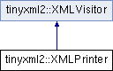

do not remove this div, it is closed by doxygen! 
|  |
| --- |
| NSCL DDAS1.0Support for XIA DDAS at the NSCL |


 end header part 
 Generated by Doxygen 1.8.8 

- [[Main Page|index]]
- [[User Guides|pages]]
- [[Namespaces|namespaces]]
- [[Classes|annotated]]
- [[Files|files]]
- 
  [[|javascript:searchBox.CloseResultsWindow()]]


- [[Class List|annotated]]
- [[Class Index|classes]]
- [[Class Hierarchy|hierarchy]]
- [[Class Members|functions]]


 window showing the filter options 
[[All|javascript:void(0)]][[Classes|javascript:void(0)]][[Namespaces|javascript:void(0)]][[Files|javascript:void(0)]][[Functions|javascript:void(0)]][[Variables|javascript:void(0)]][[Macros|javascript:void(0)]][[Pages|javascript:void(0)]]


 iframe showing the search results (closed by default) 


- **tinyxml2**
- [[XMLPrinter|classtinyxml2_1_1XMLPrinter]]

 top 
[Public Member Functions](#pub-methods) |
[Protected Member Functions](#pro-methods) |
[Protected Attributes](#pro-attribs) |
[[List of all members|classtinyxml2_1_1XMLPrinter-members]]


tinyxml2::XMLPrinter Class Reference

header
`#include <tinyxml2.h>`


Inheritance diagram for tinyxml2::XMLPrinter:





|  |  |
| --- | --- |
| Public Member Functions |
|  | XMLPrinter(FILE *file=0, bool compact=false, int depth=0) |
|  |
| void | PushHeader(bool writeBOM, bool writeDeclaration) |
|  |
| void | OpenElement(const char *name, bool compactMode=false) |
|  |
| void | PushAttribute(const char *name, const char *value) |
|  | If streaming, add an attribute to an open element. |
|  |
| void | PushAttribute(const char *name, int value) |
|  |
| void | PushAttribute(const char *name, unsigned value) |
|  |
| void | PushAttribute(const char *name, int64_t value) |
|  |
| void | PushAttribute(const char *name, uint64_t value) |
|  |
| void | PushAttribute(const char *name, bool value) |
|  |
| void | PushAttribute(const char *name, double value) |
|  |
| virtual void | CloseElement(bool compactMode=false) |
|  | If streaming, close the Element. |
|  |
| void | PushText(const char *text, bool cdata=false) |
|  | Add a text node. |
|  |
| void | PushText(int value) |
|  | Add a text node from an integer. |
|  |
| void | PushText(unsigned value) |
|  | Add a text node from an unsigned. |
|  |
| void | PushText(int64_t value) |
|  | Add a text node from a signed 64bit integer. |
|  |
| void | PushText(uint64_t value) |
|  | Add a text node from an unsigned 64bit integer. |
|  |
| void | PushText(bool value) |
|  | Add a text node from a bool. |
|  |
| void | PushText(float value) |
|  | Add a text node from a float. |
|  |
| void | PushText(double value) |
|  | Add a text node from a double. |
|  |
| void | PushComment(const char *comment) |
|  | Add a comment. |
|  |
| void | PushDeclaration(const char *value) |
|  |
| void | PushUnknown(const char *value) |
|  |
| virtual bool | VisitEnter(constXMLDocument&) |
|  | Visit a document. |
|  |
| virtual bool | VisitExit(constXMLDocument&) |
|  | Visit a document. |
|  |
| virtual bool | VisitEnter(constXMLElement&element, constXMLAttribute*attribute) |
|  | Visit an element. |
|  |
| virtual bool | VisitExit(constXMLElement&element) |
|  | Visit an element. |
|  |
| virtual bool | Visit(constXMLText&text) |
|  | Visit a text node. |
|  |
| virtual bool | Visit(constXMLComment&comment) |
|  | Visit a comment node. |
|  |
| virtual bool | Visit(constXMLDeclaration&declaration) |
|  | Visit a declaration. |
|  |
| virtual bool | Visit(constXMLUnknown&unknown) |
|  | Visit an unknown node. |
|  |
| const char * | CStr() const |
|  |
| int | CStrSize() const |
|  |
| void | ClearBuffer(bool resetToFirstElement=true) |
|  |

|  |  |
| --- | --- |
| Protected Member Functions |
| virtual bool | CompactMode(constXMLElement&) |
|  |
| virtual void | PrintSpace(int depth) |
|  |
| void | Print(const char *format,...) |
|  |
| void | Write(const char *data, size_t size) |
|  |
| void | Write(const char *data) |
|  |
| void | Putc(char ch) |
|  |
| void | SealElementIfJustOpened() |
|  |

|  |  |
| --- | --- |
| Protected Attributes |
| bool | _elementJustOpened |
|  |
| DynArray< const char *, 10 > | _stack |
|  |


<a name="details"></a>## Detailed Description


Printing functionality. The [[XMLPrinter|classtinyxml2_1_1XMLPrinter]] gives you more options than the [[XMLDocument::Print()|classtinyxml2_1_1XMLDocument#a686ea28672c0e0c60383ec28148c1ac0]] method.


It can:

1. Print to memory.
2. Print to a file you provide.
3. Print XML without a [[XMLDocument|classtinyxml2_1_1XMLDocument]].


Print to Memory


```
XMLPrinter printer;
doc.Print( &printer );
SomeFunction( printer.CStr() );

```

Print to a File


You provide the file pointer.

```
XMLPrinter printer( fp );
doc.Print( &printer );

```

Print without a [[XMLDocument|classtinyxml2_1_1XMLDocument]]


When loading, an XML parser is very useful. However, sometimes when saving, it just gets in the way. The code is often set up for streaming, and constructing the DOM is just overhead.


The Printer supports the streaming case. The following code prints out a trivially simple XML file without ever creating an XML document.


```
XMLPrinter printer( fp );
printer.OpenElement( "foo" );
printer.PushAttribute( "foo", "bar" );
printer.CloseElement();

```

## Constructor & Destructor Documentation


|  |  |  |  |
| --- | --- | --- | --- |
| tinyxml2::XMLPrinter::XMLPrinter | ( | FILE * | file=0, |
|  |  | bool | compact=false, |
|  |  | int | depth=0 |
|  | ) |  |  |

Construct the printer. If the FILE* is specified, this will print to the FILE. Else it will print to memory, and the result is available in [[CStr()|classtinyxml2_1_1XMLPrinter#a4a1b788e11b540921ec50687cd2b24a9]]. If 'compact' is set to true, then output is created with only required whitespace and newlines.


## Member Function Documentation


|  |  |  |  |  |  |  |  |
| --- | --- | --- | --- | --- | --- | --- | --- |
| void tinyxml2::XMLPrinter::ClearBuffer(boolresetToFirstElement=true) | void tinyxml2::XMLPrinter::ClearBuffer | ( | bool | resetToFirstElement=true | ) |  | inline |
| void tinyxml2::XMLPrinter::ClearBuffer | ( | bool | resetToFirstElement=true | ) |  |

If in print to memory mode, reset the buffer to the beginning.


|  |  |  |  |  |  |  |
| --- | --- | --- | --- | --- | --- | --- |
| const char* tinyxml2::XMLPrinter::CStr()const | const char* tinyxml2::XMLPrinter::CStr | ( |  | ) | const | inline |
| const char* tinyxml2::XMLPrinter::CStr | ( |  | ) | const |

If in print to memory mode, return a pointer to the XML file in memory.


|  |  |  |  |  |  |  |
| --- | --- | --- | --- | --- | --- | --- |
| int tinyxml2::XMLPrinter::CStrSize()const | int tinyxml2::XMLPrinter::CStrSize | ( |  | ) | const | inline |
| int tinyxml2::XMLPrinter::CStrSize | ( |  | ) | const |

If in print to memory mode, return the size of the XML file in memory. (Note the size returned includes the terminating null.)


|  |  |  |  |
| --- | --- | --- | --- |
| void tinyxml2::XMLPrinter::OpenElement | ( | const char * | name, |
|  |  | bool | compactMode=false |
|  | ) |  |  |

If streaming, start writing an element. The element must be closed with [[CloseElement()|classtinyxml2_1_1XMLPrinter#af1fb439e5d800999646f333fa2f0699a]]


|  |  |  |  |  |  |  |  |
| --- | --- | --- | --- | --- | --- | --- | --- |
| void tinyxml2::XMLPrinter::PrintSpace(intdepth) | void tinyxml2::XMLPrinter::PrintSpace | ( | int | depth | ) |  | protectedvirtual |
| void tinyxml2::XMLPrinter::PrintSpace | ( | int | depth | ) |  |

Prints out the space before an element. You may override to change the space and tabs used. A [[PrintSpace()|classtinyxml2_1_1XMLPrinter#a1c4b2ccbe4fdb316d54f5a93f3559260]] override should call Print().


|  |  |  |  |
| --- | --- | --- | --- |
| void tinyxml2::XMLPrinter::PushHeader | ( | bool | writeBOM, |
|  |  | bool | writeDeclaration |
|  | ) |  |  |

If streaming, write the BOM and declaration.


---

The documentation for this class was generated from the following files:- xml/tinyxml/[[tinyxml2.h|tinyxml2_8h_source]]
- xml/tinyxml/tinyxml2.cpp

 contents 
 start footer part 

---


Generated on Tue Mar 31 2020 12:56:43 for NSCL DDAS by  [](http://www.doxygen.org/index.html) 1.8.8
