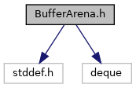
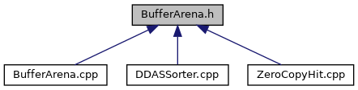

do not remove this div, it is closed by doxygen! 
|  |
| --- |
| NSCL DDAS12.1-001Support for XIA DDAS at FRIB |

 end header part 
 Generated by Doxygen 1.9.1 

 window showing the filter options 

 iframe showing the search results (closed by default) 

- [[ddas|dir_6514a8425036055b37d1cc9ce7dc44e6]]
- [[readout|dir_9ad3e8fcfa94677d694c5b48d5640f86]]

 top 
[Classes](#nested-classes) |
[Namespaces](#namespaces)

BufferArena.h File Reference

header
Manager for a set of ReferenceCountedBuffer objects.  
[More...](#details)

`#include <stddef.h>`  

`#include <deque>`

Include dependency graph for BufferArena.h:

This graph shows which files directly or indirectly include this file:

[[Go to the source code of this file.|BufferArena_8h_source]]

|  |  |
| --- | --- |
| Classes |
| class | DDASReadout::BufferArena |
|  | Provides a class for memory management in reference-counted buffers.More... |
|  |

|  |  |
| --- | --- |
| Namespaces |
|  | DDASReadout |
|  |

## Detailed Description

Manager for a set of ReferenceCountedBuffer objects.

 contents 
 start footer part 

---

Generated by  1.9.1
