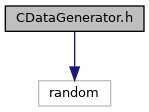
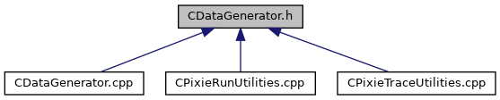

do not remove this div, it is closed by doxygen! 
|  |
| --- |
| NSCL DDAS12.1-001Support for XIA DDAS at FRIB |

 end header part 
 Generated by Doxygen 1.9.1 

 window showing the filter options 

 iframe showing the search results (closed by default) 

- [[dir_6514a8425036055b37d1cc9ce7dc44e6]]
- [[dir_9334a42c99d1a98f3e5901fa69a667c5]]

 top 
[Classes](#nested-classes)

CDataGenerator.h File Reference

header
Defines a class for generating offline data for testing/debugging and a ctypes interface for the class.  
[More...](#details)

`#include <random>`

Include dependency graph for CDataGenerator.h:

This graph shows which files directly or indirectly include this file:

[[CDataGenerator_8h_source]]

|  |  |
| --- | --- |
| Classes |
| class | CDataGenerator |
|  | A class to generate test pulse, run, and baseline data for offline operation of QtScope.More... |
|  |

## Detailed Description

Defines a class for generating offline data for testing/debugging and a ctypes interface for the class.

 contents 
 start footer part 

---

Generated by  1.9.1
