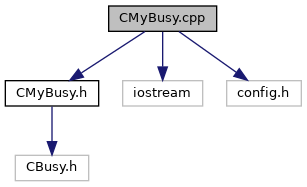

do not remove this div, it is closed by doxygen! 
|  |
| --- |
| NSCL DDAS12.1-001Support for XIA DDAS at FRIB |

 end header part 
 Generated by Doxygen 1.9.1 

 window showing the filter options 

 iframe showing the search results (closed by default) 

- [[ddas|dir_6514a8425036055b37d1cc9ce7dc44e6]]
- [[readout|dir_9ad3e8fcfa94677d694c5b48d5640f86]]

 top 
CMyBusy.cpp File Reference

header
Implement a busy class for DDAS. Entirely No-ops.  
[More...](#details)

`#include "CMyBusy.h"`  

`#include <iostream>`  

`#include <config.h>`

Include dependency graph for CMyBusy.cpp:

## Detailed Description

Implement a busy class for DDAS. Entirely No-ops.

 contents 
 start footer part 

---

Generated by  1.9.1
