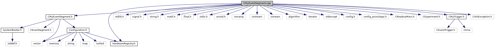

do not remove this div, it is closed by doxygen! 
|  |
| --- |
| NSCL DDAS12.1-001Support for XIA DDAS at FRIB |

 end header part 
 Generated by Doxygen 1.9.1 

 window showing the filter options 

 iframe showing the search results (closed by default) 

- [[dir_6514a8425036055b37d1cc9ce7dc44e6]]
- [[dir_9ad3e8fcfa94677d694c5b48d5640f86]]

 top 
[Functions](#func-members)

CMyEventSegment.cpp File Reference

header
Implementation of the event segment class for DDAS systems.  
[More...](#details)

`#include "CMyEventSegment.h"`  

`#include <stdlib.h>`  

`#include <signal.h>`  

`#include <string.h>`  

`#include <math.h>`  

`#include <float.h>`  

`#include <stdio.h>`  

`#include <unistd.h>`  

`#include <iomanip>`  

`#include <iostream>`  

`#include <sstream>`  

`#include <algorithm>`  

`#include <iterator>`  

`#include <stdexcept>`  

`#include <config.h>`  

`#include <config_pixie16api.h>`  

`#include <CReadoutMain.h>`  

`#include <CExperiment.h>`  

`#include "HardwareRegistry.h"`  

`#include "CMyTrigger.h"`  

`#include <CXIAException.h>`

Include dependency graph for CMyEventSegment.cpp:

|  |  |
| --- | --- |
| Functions |
| const uint32_t | CCSRA_EXTTSENA_MASK(1<< 21) |
|  | CSRA external clock bit.More... |
|  |
| const uint32_t | MODREVBITMSPS_EXTCLK_BIT(1<< 21) |
|  | Shift in the clock word.More... |
|  |

## Detailed Description

Implementation of the event segment class for DDAS systems.

## Function Documentation

## [◆](#a43cfb710fadde1a91015cdd26be12ee0)CCSRA_EXTTSENA_MASK()

|  |  |  |  |  |  |
| --- | --- | --- | --- | --- | --- |
| const uint32_t CCSRA_EXTTSENA_MASK | ( | 1<< | 21 | ) |  |

CSRA external clock bit.

## [◆](#a918f02f677893411086008003194a807)MODREVBITMSPS_EXTCLK_BIT()

|  |  |  |  |  |  |
| --- | --- | --- | --- | --- | --- |
| const uint32_t MODREVBITMSPS_EXTCLK_BIT | ( | 1<< | 21 | ) |  |

Shift in the clock word.

 contents 
 start footer part 

---

Generated by  1.9.1
