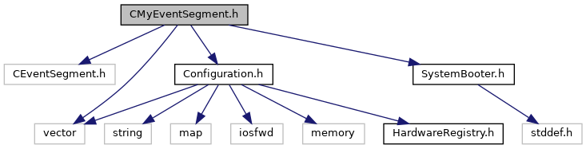
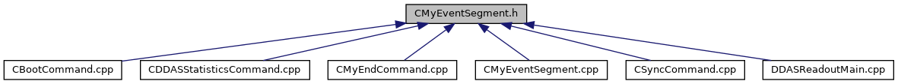

do not remove this div, it is closed by doxygen! 
|  |
| --- |
| NSCL DDAS12.1-001Support for XIA DDAS at FRIB |

 end header part 
 Generated by Doxygen 1.9.1 

 window showing the filter options 

 iframe showing the search results (closed by default) 

- [[ddas|https://github.com/FRIBDAQ/docs/tree/main/ddas-12.1-001/dir_6514a8425036055b37d1cc9ce7dc44e6.md]]
- [[readout|https://github.com/FRIBDAQ/docs/tree/main/ddas-12.1-001/dir_9ad3e8fcfa94677d694c5b48d5640f86.md]]

 top 
[Classes](#nested-classes) |
[Variables](#var-members)

CMyEventSegment.h File Reference

header
Define a DDAS event segment.  
[More...](#details)

`#include <CEventSegment.h>`  

`#include <vector>`  

`#include <Configuration.h>`  

`#include <SystemBooter.h>`

Include dependency graph for CMyEventSegment.h:

This graph shows which files directly or indirectly include this file:

[[Go to the source code of this file.|https://github.com/FRIBDAQ/docs/tree/main/ddas-12.1-001/CMyEventSegment_8h_source.md]]

|  |  |
| --- | --- |
| Classes |
| class | CMyEventSegment |
|  | Derived class for DDAS event segments.More... |
|  |

|  |  |
| --- | --- |
| Variables |
| const int | MAX_MODULES_PER_CRATE= 13 |
|  | A full crate is 13 modules.More... |
|  |

## Detailed Description

Define a DDAS event segment.

## Variable Documentation

## [◆](#abf3dcfb241ffb10110f915719769dbf9)MAX_MODULES_PER_CRATE

|  |
| --- |
| const int MAX_MODULES_PER_CRATE = 13 |

A full crate is 13 modules.

 contents 
 start footer part 

---

Generated by  1.9.1
