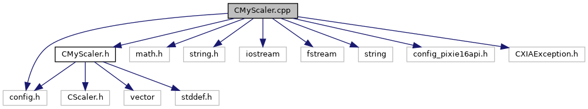

do not remove this div, it is closed by doxygen! 
|  |
| --- |
| NSCL DDAS12.1-001Support for XIA DDAS at FRIB |

 end header part 
 Generated by Doxygen 1.9.1 

 window showing the filter options 

 iframe showing the search results (closed by default) 

- [[dir_6514a8425036055b37d1cc9ce7dc44e6]]
- [[dir_9ad3e8fcfa94677d694c5b48d5640f86]]

 top 
CMyScaler.cpp File Reference

header
Implement the DDAS scaler class.  
[More...](#details)

`#include "CMyScaler.h"`  

`#include <math.h>`  

`#include <string.h>`  

`#include <iostream>`  

`#include <fstream>`  

`#include <string>`  

`#include <config.h>`  

`#include <config_pixie16api.h>`  

`#include <CXIAException.h>`

Include dependency graph for CMyScaler.cpp:

## Detailed Description

Implement the DDAS scaler class.

 contents 
 start footer part 

---

Generated by  1.9.1
