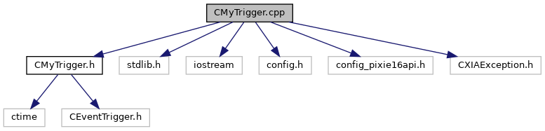

do not remove this div, it is closed by doxygen! 
|  |
| --- |
| NSCL DDAS12.1-001Support for XIA DDAS at FRIB |

 end header part 
 Generated by Doxygen 1.9.1 

 window showing the filter options 

 iframe showing the search results (closed by default) 

- [[ddas|https://github.com/FRIBDAQ/docs/tree/main/ddas-12.1-001/dir_6514a8425036055b37d1cc9ce7dc44e6.md]]
- [[readout|https://github.com/FRIBDAQ/docs/tree/main/ddas-12.1-001/dir_9ad3e8fcfa94677d694c5b48d5640f86.md]]

 top 
[Variables](#var-members)

CMyTrigger.cpp File Reference

header
Implement the DDAS trigger.  
[More...](#details)

`#include "CMyTrigger.h"`  

`#include <stdlib.h>`  

`#include <iostream>`  

`#include <config.h>`  

`#include <config_pixie16api.h>`  

`#include <CXIAException.h>`

Include dependency graph for CMyTrigger.cpp:

|  |  |
| --- | --- |
| Variables |
| const int | TRIGGER_TIMEOUT_SECS= 5 |
|  | Auto-trigger timeout in seconds.More... |
|  |

## Detailed Description

Implement the DDAS trigger.

## Variable Documentation

## [◆](#a07c69d08957693cfe3a0f85b793a02f3)TRIGGER_TIMEOUT_SECS

|  |
| --- |
| const int TRIGGER_TIMEOUT_SECS = 5 |

Auto-trigger timeout in seconds.

 contents 
 start footer part 

---

Generated by  1.9.1
