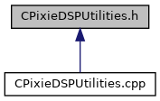

do not remove this div, it is closed by doxygen! 
|  |
| --- |
| NSCL DDAS12.1-001Support for XIA DDAS at FRIB |

 end header part 
 Generated by Doxygen 1.9.1 

 window showing the filter options 

 iframe showing the search results (closed by default) 

- [[ddas|dir_6514a8425036055b37d1cc9ce7dc44e6]]
- [[qtscope|dir_9334a42c99d1a98f3e5901fa69a667c5]]

 top 
[Classes](#nested-classes) |
[Functions](#func-members)

CPixieDSPUtilities.h File Reference

header
Defines a class to read and write settings to XIA Pixie modules and a ctypes interface for the class.  
[More...](#details)

This graph shows which files directly or indirectly include this file:

[[Go to the source code of this file.|CPixieDSPUtilities_8h_source]]

|  |  |
| --- | --- |
| Classes |
| class | CPixieDSPUtilities |
|  | Read and writes both channel-level and module-level DSP settings.More... |
|  |

|  |  |
| --- | --- |
| Functions |
| CPixieDSPUtilities* | CPixieDSPUtilities_new() |
|  | Wrapper for the class constructor.More... |
|  |
| int | CPixieDSPUtilities_AdjustOffsets(CPixieDSPUtilities*utils, int mod) |
|  | Wrapper to adjust DC offsets.More... |
|  |
| int | CPixieDSPUtilities_WriteChanPar(CPixieDSPUtilities*utils, int mod, int chan, char *pName, double val) |
|  | Wrapper to write a channel parameter.More... |
|  |
| int | CPixieDSPUtilities_ReadChanPar(CPixieDSPUtilities*utils, int mod, int chan, char *pName, double &val) |
|  | Wrapper to read a channel parameter.More... |
|  |
| int | CPixieDSPUtilities_WriteModPar(CPixieDSPUtilities*utils, int mod, char *pName, unsigned int val) |
|  | Wrapper to write a module parameter.More... |
|  |
| int | CPixieDSPUtilities_ReadModPar(CPixieDSPUtilities*utils, int mod, char *pName, unsigned int &val) |
|  | Wrapper to read a module parameter.More... |
|  |
| void | CPixieDSPUtilities_delete(CPixieDSPUtilities*utils) |
|  | Wrapper for the class destructor.More... |
|  |

## Detailed Description

Defines a class to read and write settings to XIA Pixie modules and a ctypes interface for the class.

## Function Documentation

## [◆](#a0f73d172fe069a16b6fdfd64d8bb8e7e)CPixieDSPUtilities_AdjustOffsets()

|  |  |  |  |
| --- | --- | --- | --- |
| int CPixieDSPUtilities_AdjustOffsets | ( | CPixieDSPUtilities* | utils, |
|  |  | int | mod |
|  | ) |  |  |

Wrapper to adjust DC offsets.

## [◆](#a0c78a5226e74c2d3a160c3baf8907f54)CPixieDSPUtilities_delete()

|  |  |  |  |  |  |
| --- | --- | --- | --- | --- | --- |
| void CPixieDSPUtilities_delete | ( | CPixieDSPUtilities* | utils | ) |  |

Wrapper for the class destructor.

## [◆](#a72dc21e325ba1614e7144b27e15ca7d9)CPixieDSPUtilities_new()

|  |  |  |  |  |
| --- | --- | --- | --- | --- |
| CPixieDSPUtilities* CPixieDSPUtilities_new | ( |  | ) |  |

Wrapper for the class constructor.

## [◆](#ad57dfeaf70a1c412f993e0dd21236d3a)CPixieDSPUtilities_ReadChanPar()

|  |  |  |  |
| --- | --- | --- | --- |
| int CPixieDSPUtilities_ReadChanPar | ( | CPixieDSPUtilities* | utils, |
|  |  | int | mod, |
|  |  | int | chan, |
|  |  | char * | pName, |
|  |  | double & | val |
|  | ) |  |  |

Wrapper to read a channel parameter.

## [◆](#a0b375ff46a8dddf2a8efe87fe9342246)CPixieDSPUtilities_ReadModPar()

|  |  |  |  |
| --- | --- | --- | --- |
| int CPixieDSPUtilities_ReadModPar | ( | CPixieDSPUtilities* | utils, |
|  |  | int | mod, |
|  |  | char * | pName, |
|  |  | unsigned int & | val |
|  | ) |  |  |

Wrapper to read a module parameter.

## [◆](#a29e60cc6379b0d666a965183afb0a768)CPixieDSPUtilities_WriteChanPar()

|  |  |  |  |
| --- | --- | --- | --- |
| int CPixieDSPUtilities_WriteChanPar | ( | CPixieDSPUtilities* | utils, |
|  |  | int | mod, |
|  |  | int | chan, |
|  |  | char * | pName, |
|  |  | double | val |
|  | ) |  |  |

Wrapper to write a channel parameter.

## [◆](#a51fc211563f3a7d54784e5e0f60b95d6)CPixieDSPUtilities_WriteModPar()

|  |  |  |  |
| --- | --- | --- | --- |
| int CPixieDSPUtilities_WriteModPar | ( | CPixieDSPUtilities* | utils, |
|  |  | int | mod, |
|  |  | char * | pName, |
|  |  | unsigned int | val |
|  | ) |  |  |

Wrapper to write a module parameter.

 contents 
 start footer part 

---

Generated by  1.9.1
