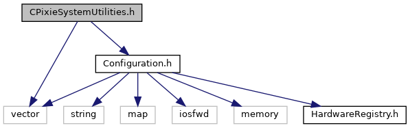
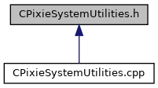

do not remove this div, it is closed by doxygen! 
|  |
| --- |
| NSCL DDAS12.1-001Support for XIA DDAS at FRIB |

 end header part 
 Generated by Doxygen 1.9.1 

 window showing the filter options 

 iframe showing the search results (closed by default) 

- [[ddas|https://github.com/FRIBDAQ/docs/tree/main/ddas-12.1-001/dir_6514a8425036055b37d1cc9ce7dc44e6.md]]
- [[qtscope|https://github.com/FRIBDAQ/docs/tree/main/ddas-12.1-001/dir_9334a42c99d1a98f3e5901fa69a667c5.md]]

 top 
[Classes](#nested-classes) |
[Functions](#func-members)

CPixieSystemUtilities.h File Reference

header
Defines a class for managing the state of Pixie [[DAQ|https://github.com/FRIBDAQ/docs/tree/main/ddas-12.1-001/namespaceDAQ.md]] systems and a ctypes interface for the class.  
[More...](#details)

`#include <vector>`  

`#include <Configuration.h>`

Include dependency graph for CPixieSystemUtilities.h:

This graph shows which files directly or indirectly include this file:

[[Go to the source code of this file.|https://github.com/FRIBDAQ/docs/tree/main/ddas-12.1-001/CPixieSystemUtilities_8h_source.md]]

|  |  |
| --- | --- |
| Classes |
| class | CPixieSystemUtilities |
|  | System manager class for DDAS.More... |
|  |

|  |  |
| --- | --- |
| Functions |
| CPixieSystemUtilities* | CPixieSystemUtilities_new() |
|  | Wrapper for the class constructor.More... |
|  |
| int | CPixieSystemUtilities_Boot(CPixieSystemUtilities*utils) |
|  | Wrapper to boot the crate.More... |
|  |
| int | CPixieSystemUtilities_SaveSetFile(CPixieSystemUtilities*utils, char *fName) |
|  | Wrapper to save a settings file.More... |
|  |
| int | CPixieSystemUtilities_LoadSetFile(CPixieSystemUtilities*utils, char *fName) |
|  | Wrapper to load a settings file.More... |
|  |
| int | CPixieSystemUtilities_ExitSystem(CPixieSystemUtilities*utils) |
|  | Wrapper to exit the system file.More... |
|  |
| void | CPixieSystemUtilities_SetBootMode(CPixieSystemUtilities*utils, int mode) |
|  | Wrapper to set the boot mode.More... |
|  |
| int | CPixieSystemUtilities_GetBootMode(CPixieSystemUtilities*utils) |
|  | Wrapper to get the boot mode.More... |
|  |
| bool | CPixieSystemUtilities_GetBootStatus(CPixieSystemUtilities*utils) |
|  | Wrapper to get the boot status.More... |
|  |
| unsigned short | CPixieSystemUtilities_GetNumModules(CPixieSystemUtilities*utils) |
|  | Wrapper to get the number of modules.More... |
|  |
| int | CPixieSystemUtilities_GetModuleMSPS(CPixieSystemUtilities*utils, int mod) |
|  | Wrapper to get a single module ADC MSPS from the HW map.More... |
|  |
| void | CPixieSystemUtilities_delete(CPixieSystemUtilities*utils) |
|  | Wrapper for the class destructor.More... |
|  |

## Detailed Description

Defines a class for managing the state of Pixie [[DAQ|https://github.com/FRIBDAQ/docs/tree/main/ddas-12.1-001/namespaceDAQ.md]] systems and a ctypes interface for the class.

## Function Documentation

## [◆](#ad5b72cbabc65dd242cd2c1b3d2c276d1)CPixieSystemUtilities_Boot()

|  |  |  |  |  |  |
| --- | --- | --- | --- | --- | --- |
| int CPixieSystemUtilities_Boot | ( | CPixieSystemUtilities* | utils | ) |  |

Wrapper to boot the crate.

## [◆](#a249c9fb47c2aba2142380ee307026ed2)CPixieSystemUtilities_delete()

|  |  |  |  |  |  |
| --- | --- | --- | --- | --- | --- |
| void CPixieSystemUtilities_delete | ( | CPixieSystemUtilities* | utils | ) |  |

Wrapper for the class destructor.

## [◆](#a8bae80680eb26577cb921845485cca69)CPixieSystemUtilities_ExitSystem()

|  |  |  |  |  |  |
| --- | --- | --- | --- | --- | --- |
| int CPixieSystemUtilities_ExitSystem | ( | CPixieSystemUtilities* | utils | ) |  |

Wrapper to exit the system file.

## [◆](#a2434d667ccd452f6c4471b5366c0f716)CPixieSystemUtilities_GetBootMode()

|  |  |  |  |  |  |
| --- | --- | --- | --- | --- | --- |
| int CPixieSystemUtilities_GetBootMode | ( | CPixieSystemUtilities* | utils | ) |  |

Wrapper to get the boot mode.

## [◆](#a3b97f36a0e18a49023d575cf793fa560)CPixieSystemUtilities_GetBootStatus()

|  |  |  |  |  |  |
| --- | --- | --- | --- | --- | --- |
| bool CPixieSystemUtilities_GetBootStatus | ( | CPixieSystemUtilities* | utils | ) |  |

Wrapper to get the boot status.

## [◆](#aca8bd0d11c27ced3e85b7f1cf4d6b20d)CPixieSystemUtilities_GetModuleMSPS()

|  |  |  |  |
| --- | --- | --- | --- |
| int CPixieSystemUtilities_GetModuleMSPS | ( | CPixieSystemUtilities* | utils, |
|  |  | int | mod |
|  | ) |  |  |

Wrapper to get a single module ADC MSPS from the HW map.

## [◆](#aa0b739e664a7940a6cc6508e4e46f385)CPixieSystemUtilities_GetNumModules()

|  |  |  |  |  |  |
| --- | --- | --- | --- | --- | --- |
| unsigned short CPixieSystemUtilities_GetNumModules | ( | CPixieSystemUtilities* | utils | ) |  |

Wrapper to get the number of modules.

## [◆](#aa47e2a16eac93a72cb17a5f7f9402bfa)CPixieSystemUtilities_LoadSetFile()

|  |  |  |  |
| --- | --- | --- | --- |
| int CPixieSystemUtilities_LoadSetFile | ( | CPixieSystemUtilities* | utils, |
|  |  | char * | fName |
|  | ) |  |  |

Wrapper to load a settings file.

## [◆](#ae2a352b1c38fc0c9c929203adaabec31)CPixieSystemUtilities_new()

|  |  |  |  |  |
| --- | --- | --- | --- | --- |
| CPixieSystemUtilities* CPixieSystemUtilities_new | ( |  | ) |  |

Wrapper for the class constructor.

## [◆](#a7a59ad34efc3744f5aaaf095a7f402d7)CPixieSystemUtilities_SaveSetFile()

|  |  |  |  |
| --- | --- | --- | --- |
| int CPixieSystemUtilities_SaveSetFile | ( | CPixieSystemUtilities* | utils, |
|  |  | char * | fName |
|  | ) |  |  |

Wrapper to save a settings file.

## [◆](#aff5a98724a090b4f37a389d875686ec8)CPixieSystemUtilities_SetBootMode()

|  |  |  |  |
| --- | --- | --- | --- |
| void CPixieSystemUtilities_SetBootMode | ( | CPixieSystemUtilities* | utils, |
|  |  | int | mode |
|  | ) |  |  |

Wrapper to set the boot mode.

 contents 
 start footer part 

---

Generated by  1.9.1
