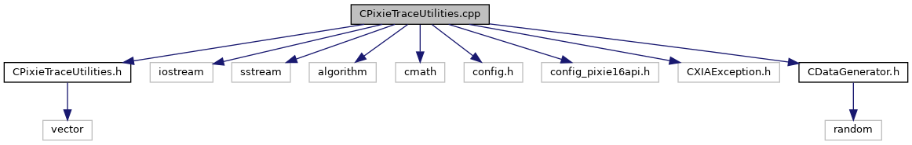

do not remove this div, it is closed by doxygen! 
|  |
| --- |
| NSCL DDAS12.1-001Support for XIA DDAS at FRIB |

 end header part 
 Generated by Doxygen 1.9.1 

 window showing the filter options 

 iframe showing the search results (closed by default) 

- [[dir_6514a8425036055b37d1cc9ce7dc44e6]]
- [[dir_9334a42c99d1a98f3e5901fa69a667c5]]

 top 
CPixieTraceUtilities.cpp File Reference

header
Implementation of the trace utilities class.  
[More...](#details)

`#include "CPixieTraceUtilities.h"`  

`#include <iostream>`  

`#include <sstream>`  

`#include <algorithm>`  

`#include <cmath>`  

`#include <config.h>`  

`#include <config_pixie16api.h>`  

`#include <CXIAException.h>`  

`#include "CDataGenerator.h"`

Include dependency graph for CPixieTraceUtilities.cpp:

## Detailed Description

Implementation of the trace utilities class.

 contents 
 start footer part 

---

Generated by  1.9.1
