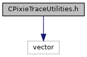
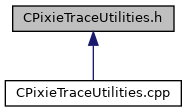

do not remove this div, it is closed by doxygen! 
|  |
| --- |
| NSCL DDAS12.1-001Support for XIA DDAS at FRIB |

 end header part 
 Generated by Doxygen 1.9.1 

 window showing the filter options 

 iframe showing the search results (closed by default) 

- [[dir_6514a8425036055b37d1cc9ce7dc44e6]]
- [[dir_9334a42c99d1a98f3e5901fa69a667c5]]

 top 
[Classes](#nested-classes) |
[Functions](#func-members)

CPixieTraceUtilities.h File Reference

header
Defines a class for trace management and a ctypes interface for the class.  
[More...](#details)

`#include <vector>`

Include dependency graph for CPixieTraceUtilities.h:

This graph shows which files directly or indirectly include this file:

[[CPixieTraceUtilities_8h_source]]

|  |  |
| --- | --- |
| Classes |
| class | CPixieTraceUtilities |
|  | A class to read and fetch trace data from Pixie-16 modules.More... |
|  |

|  |  |
| --- | --- |
| Functions |
| CPixieTraceUtilities* | CPixieTraceUtilities_new() |
|  | Wrapper for the class constructor.More... |
|  |
| int | CPixieTraceUtilities_ReadTrace(CPixieTraceUtilities*utils, int mod, int chan) |
|  | Wrapper for reading a validated trace.More... |
|  |
| int | CPixieTraceUtilities_ReadFastTrace(CPixieTraceUtilities*utils, int mod, int chan) |
|  | Wrapper for reading an unvalidated trace.More... |
|  |
| unsigned short * | CPixieTraceUtilities_GetTraceData(CPixieTraceUtilities*utils) |
|  | Wrapper to get trace data.More... |
|  |
| void | CPixieTraceUtilities_SetUseGenerator(CPixieTraceUtilities*utils, bool mode) |
|  | Wrapper to set generator use.More... |
|  |
| void | CPixieTraceUtilities_delete(CPixieTraceUtilities*utils) |
|  | Wrapper for the class destructor.More... |
|  |

## Detailed Description

Defines a class for trace management and a ctypes interface for the class.

## Function Documentation

## [◆](#a25b6d2dca8975bfd6454f21cca1e7e1c)CPixieTraceUtilities_delete()

|  |  |  |  |  |  |
| --- | --- | --- | --- | --- | --- |
| void CPixieTraceUtilities_delete | ( | CPixieTraceUtilities* | utils | ) |  |

Wrapper for the class destructor.

## [◆](#ac7c3896e2a06f5de2d4c93e6e4449ba2)CPixieTraceUtilities_GetTraceData()

|  |  |  |  |  |  |
| --- | --- | --- | --- | --- | --- |
| unsigned short* CPixieTraceUtilities_GetTraceData | ( | CPixieTraceUtilities* | utils | ) |  |

Wrapper to get trace data.

## [◆](#a0a18d90019ae6d7320fe957248a95f3a)CPixieTraceUtilities_new()

|  |  |  |  |  |
| --- | --- | --- | --- | --- |
| CPixieTraceUtilities* CPixieTraceUtilities_new | ( |  | ) |  |

Wrapper for the class constructor.

## [◆](#a3451c39b042dce477b997849c5160689)CPixieTraceUtilities_ReadFastTrace()

|  |  |  |  |
| --- | --- | --- | --- |
| int CPixieTraceUtilities_ReadFastTrace | ( | CPixieTraceUtilities* | utils, |
|  |  | int | mod, |
|  |  | int | chan |
|  | ) |  |  |

Wrapper for reading an unvalidated trace.

## [◆](#a87b9fe56f84b48968ff362f8089c2cf5)CPixieTraceUtilities_ReadTrace()

|  |  |  |  |
| --- | --- | --- | --- |
| int CPixieTraceUtilities_ReadTrace | ( | CPixieTraceUtilities* | utils, |
|  |  | int | mod, |
|  |  | int | chan |
|  | ) |  |  |

Wrapper for reading a validated trace.

## [◆](#a991cf9affe51e217480503e0795dd47b)CPixieTraceUtilities_SetUseGenerator()

|  |  |  |  |
| --- | --- | --- | --- |
| void CPixieTraceUtilities_SetUseGenerator | ( | CPixieTraceUtilities* | utils, |
|  |  | bool | mode |
|  | ) |  |  |

Wrapper to set generator use.

 contents 
 start footer part 

---

Generated by  1.9.1
