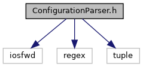
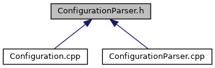

do not remove this div, it is closed by doxygen! 
|  |
| --- |
| NSCL DDAS12.1-001Support for XIA DDAS at FRIB |

 end header part 
 Generated by Doxygen 1.9.1 

 window showing the filter options 

 iframe showing the search results (closed by default) 

- [[dir_6514a8425036055b37d1cc9ce7dc44e6]]
- [[dir_1ad96cec73befb7849da500ecefc5069]]

 top 
[Classes](#nested-classes) |
[Namespaces](#namespaces)

ConfigurationParser.h File Reference

header
Define a class to parse the contents of the cfgPixie16.txt file.  
[More...](#details)

`#include <iosfwd>`  

`#include <regex>`  

`#include <tuple>`

Include dependency graph for ConfigurationParser.h:

This graph shows which files directly or indirectly include this file:

[[ConfigurationParser_8h_source]]

|  |  |
| --- | --- |
| Classes |
| class | DAQ::DDAS::ConfigurationParser |
|  | A class to parse the contents of the cfgPixie16.txt file.More... |
|  |

|  |  |
| --- | --- |
| Namespaces |
|  | DAQ |
|  |
|  | DAQ::DDAS |
|  |

## Detailed Description

Define a class to parse the contents of the cfgPixie16.txt file.

 contents 
 start footer part 

---

Generated by  1.9.1
