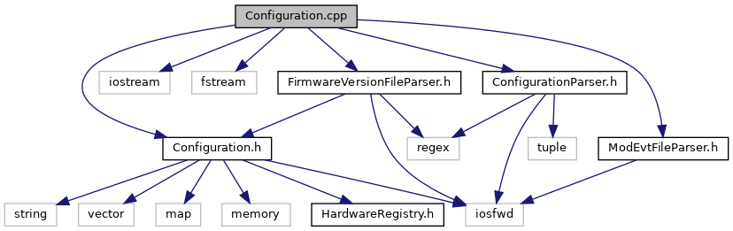

do not remove this div, it is closed by doxygen! 
|  |
| --- |
| NSCL DDAS12.1-001Support for XIA DDAS at FRIB |

 end header part 
 Generated by Doxygen 1.9.1 

 window showing the filter options 

 iframe showing the search results (closed by default) 

- [[ddas|https://github.com/FRIBDAQ/docs/tree/main/ddas-12.1-001/dir_6514a8425036055b37d1cc9ce7dc44e6.md]]
- [[configuration|https://github.com/FRIBDAQ/docs/tree/main/ddas-12.1-001/dir_1ad96cec73befb7849da500ecefc5069.md]]

 top 
Configuration.cpp File Reference

header
Implementation of the system storage configuration.  
[More...](#details)

`#include "Configuration.h"`  

`#include <iostream>`  

`#include <fstream>`  

`#include "FirmwareVersionFileParser.h"`  

`#include "ConfigurationParser.h"`  

`#include "ModEvtFileParser.h"`

Include dependency graph for Configuration.cpp:

## Detailed Description

Implementation of the system storage configuration.

 contents 
 start footer part 

---

Generated by  1.9.1
