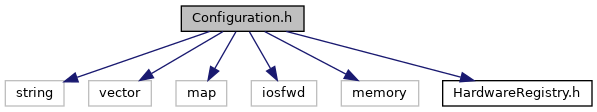
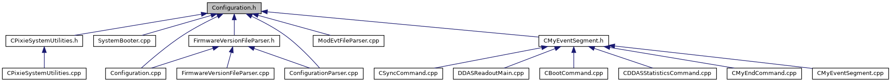

do not remove this div, it is closed by doxygen! 
|  |
| --- |
| NSCL DDAS12.1-001Support for XIA DDAS at FRIB |

 end header part 
 Generated by Doxygen 1.9.1 

 window showing the filter options 

 iframe showing the search results (closed by default) 

- [[dir_6514a8425036055b37d1cc9ce7dc44e6]]
- [[dir_1ad96cec73befb7849da500ecefc5069]]

 top 
[Classes](#nested-classes) |
[Namespaces](#namespaces) |
[Typedefs](#typedef-members)

Configuration.h File Reference

header
Defines a class for storing system configuration information.  
[More...](#details)

`#include <string>`  

`#include <vector>`  

`#include <map>`  

`#include <iosfwd>`  

`#include <memory>`  

`#include "HardwareRegistry.h"`

Include dependency graph for Configuration.h:

This graph shows which files directly or indirectly include this file:

[[Configuration_8h_source]]

|  |  |
| --- | --- |
| Classes |
| struct | DAQ::DDAS::FirmwareConfiguration |
|  | Storage for hardware-type firmware/settings paths.More... |
|  |
| class | DAQ::DDAS::Configuration |
|  | Store the system configuration information needed by Readout.More... |
|  |

|  |  |
| --- | --- |
| Namespaces |
|  | DAQ |
|  |
|  | DAQ::DDAS |
|  |

|  |  |
| --- | --- |
| Typedefs |
| typedef std::map< int, FirmwareConfiguration > | DAQ::DDAS::FirmwareMap |
|  | A map of firmware configurations keyed by the hardware type defined inHardwareRegistry.h.More... |
|  |

## Detailed Description

Defines a class for storing system configuration information.

 contents 
 start footer part 

---

Generated by  1.9.1
